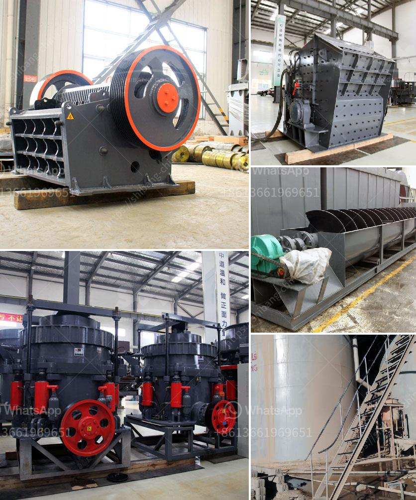

<h3>How to adjust impact crusher? 7 key steps</h3>
An impact crusher is a versatile machine that can be used to break down materials such as rock, ore, sand, and concrete. As its name suggests, it relies on the force of impacts to break and reduce the size of the material. In order to adjust the impact crusher properly, it's important to follow a few key steps. This article will outline these steps, providing you with a comprehensive guide.

To adjust an impact crusher, first, it's crucial to understand how it operates. The basic principle involves a rotor rotating at high speed, with hammers attached. These hammers strike the material, causing it to break into smaller pieces. The size of the crushed material can be controlled by adjusting the gap between the hammers and the impact plates.

Before adjusting the crusher, inspect the impact plates for any wear or damage. If they are worn out or damaged, they should be replaced to ensure an efficient crushing process.

Next, inspect the hammers for any signs of wear or damage. Replace any worn-out or damaged hammers promptly to maintain the optimal performance of the crusher.

To adjust the impact crusher properly, it's important to set the right gap between the impact plates and hammers. This gap determines the size of the crushed material. To adjust the gap, loosen the bolts that secure the impact plates and use a feeler gauge to measure the gap. Tighten or loosen the bolts accordingly until the desired gap is achieved.

During the adjustment process, it's crucial to ensure that the impact plates and hammers are properly aligned. Misalignment can result in uneven wear and reduced efficiency. Use a straight edge or a level to check the alignment and make any necessary adjustments.

After adjusting the crusher, monitor the output size of the crushed material. This can be done by regularly sampling and measuring the size of the crushed material. If the output size is not within the desired range, re-adjust the crusher accordingly.

Lastly, to ensure the optimal performance and longevity of the impact crusher, it's important to perform regular maintenance and inspection. This includes cleaning and lubricating the machine, checking for any loose or damaged parts, and replacing any worn-out components.

In conclusion, adjusting an impact crusher involves several key steps. Firstly, understanding the operating principle is crucial. Then, inspecting and replacing any worn-out or damaged components is necessary. Properly adjusting the gap between the impact plates and hammers and ensuring their alignment is essential. Monitoring the output size and performing regular maintenance and inspection will help maintain the crusher's efficiency and performance. By following these steps, you'll be able to adjust an impact crusher effectively and achieve the desired crushing results.
<h3>Contact us</h3><ul><li><strong>Whatsapp:&nbsp;<a href="https://wa.me/8613661969651">+8613661969651</a></strong></li><li><a href="https://swt.shibang-china.com/?git&amp;zhl&amp;How to adjust impact crusher 7 key steps"><strong>Online Service(chat now)</strong></a></li></ul><h3>Related</h3><ul><li><a href='How to motorize a small conveyor belt .md'>How to motorize a small conveyor belt ?</a></li><li><a href='How to build a granite crushing plant？.md'>How to build a granite crushing plant？</a></li><li><a href='How to replace the hammer of a hammer crusher.md'>How to replace the hammer of a hammer crusher?</a></li><li><a href='how to limit excess fines in crushing .md'>how to limit excess fines in crushing ?</a></li><li><a href='How to choose a motor for a ball mill.md'>How to choose a motor for a ball mill?</a></li></ul>