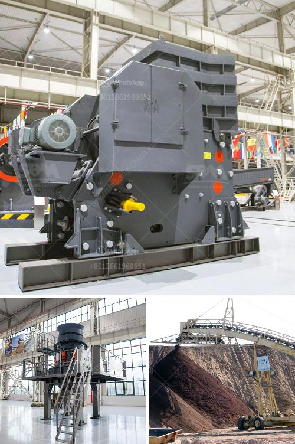

<h3>How to adjust marble crushers?</h3>
Marble crushers are heavy-duty machines that are used to crush marble rocks into smaller and more manageable sizes. These crushers play a vital role in the marble processing industry as they help in shaping and grinding marble stones for further use. However, over time, the settings of these crushers may need to be adjusted to ensure optimal performance and productivity. In this article, we will discuss how to adjust marble crushers effectively.

1. Understand the crusher operation: Before attempting to adjust a marble crusher, it is essential to have a good understanding of its operation. Read the manufacturer's manual thoroughly to familiarize yourself with the machine's specifications, functions, and limitations. This knowledge will help you assess what adjustments are needed and how to make them correctly.

2. Check the discharge setting: The discharge setting refers to the size of the crushed material that exits the crusher. If you notice that the crushed marble stones are not achieving the desired size or if the output is too coarse, it may be necessary to adjust the discharge setting. This can typically be done by changing the gap between the rotor and the impact plates. Refer to the manufacturer's instructions for specific guidance.

3. Monitor the feed size: The feed size is another crucial factor that affects the performance of marble crushers. If the feed size is too large, the crusher may become overwhelmed and not deliver the desired results. Conversely, if the feed size is too small, the crusher may experience unnecessary strain, leading to premature wear and tear. Ensure that the feed size is within the manufacturer's recommended limits and make adjustments as necessary.

4. Check the rotor speed: The speed at which the rotor rotates also plays a significant role in the crushing process. Different rotor speeds can affect the productivity and fineness of the crushed material. If you find that the crusher is producing too many fines or the output is not consistent, consider adjusting the rotor speed. Again, consult the manufacturer's manual for guidance on how to change the rotor speed.

5. Regularly inspect and maintain the crusher: Proper maintenance is essential for the prolonged and efficient operation of marble crushers. Regularly inspect the crusher for any signs of wear or damage and address them promptly. Ensure that all components, such as the hammers, impact plates, and bearings, are well-lubricated and in good working condition. When necessary, replace worn-out parts to maintain optimal crushing performance.

In conclusion, adjusting marble crushers is an important task that should not be overlooked. By understanding the machine's operation, checking and adjusting the discharge setting, monitoring the feed size, and maintaining the crusher regularly, you can ensure its optimal performance and productivity. Remember to always follow the manufacturer's instructions and consult a professional if you are unsure about any adjustments. Proper maintenance and adjustments will not only extend the lifespan of the crusher but also improve the quality of the crushed marble stones.
<h3>Contact us</h3><ul><li><strong>Whatsapp:&nbsp;<a href="https://wa.me/8613661969651">+8613661969651</a></strong></li><li><a href="https://swt.shibang-china.com/?git&amp;zhl&amp;How to adjust marble crushers"><strong>Online Service(chat now)</strong></a></li></ul><h3>Related</h3><ul><li><a href='how to load cone crusher .md'>how to load cone crusher ?</a></li><li><a href='how to run a quarry business ？.md'>how to run a quarry business ？</a></li><li><a href='How to build a gravel crusher.md'>How to build a gravel crusher?</a></li><li><a href='How to electrify a ball mill.md'>How to electrify a ball mill?</a></li><li><a href='How to remove calcium oxide from manganese ore.md'>How to remove calcium oxide from manganese ore?</a></li></ul>