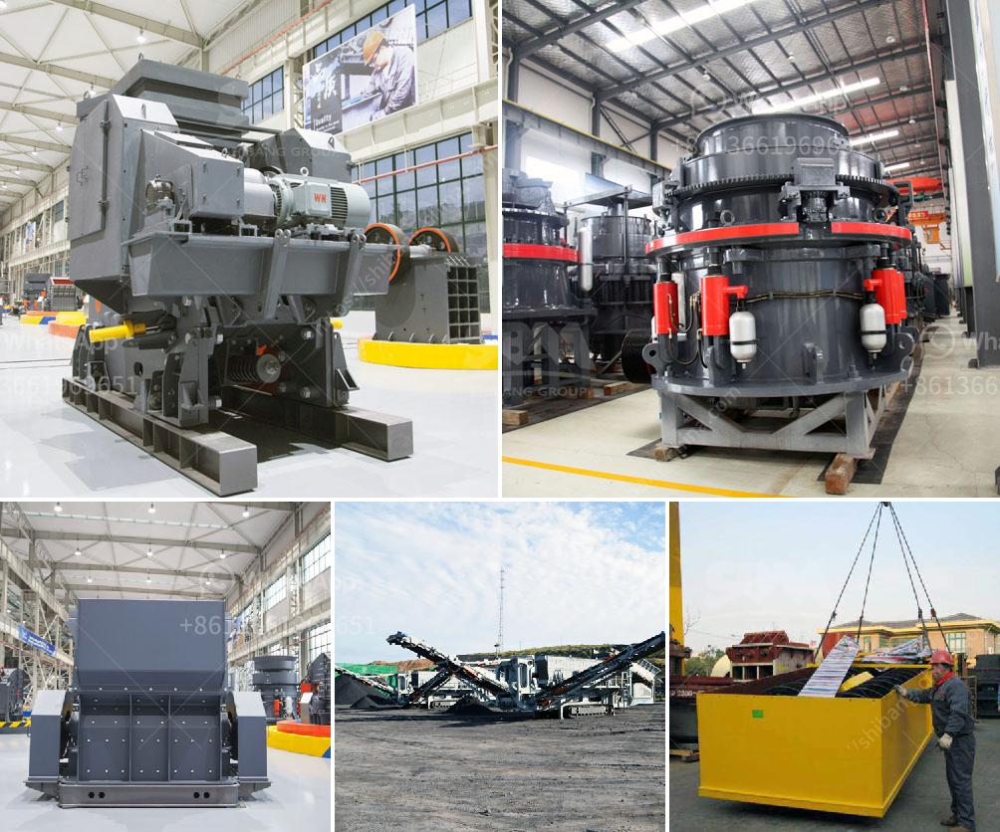

<h3>How to adjust rotary kiln support rollers?</h3>
Rotary kiln support rollers play a vital role in the smooth functioning of the kiln. They help ensure that the rotary kiln rotates in a balanced and stable manner, enhancing its efficiency and prolonging its lifespan. However, over time, support rollers may become misaligned or lose their proper axial positioning, leading to issues such as uneven wear, increased energy consumption, and even kiln failure. Therefore, it is crucial to regularly adjust and maintain these support rollers. In this article, we will discuss how to adjust rotary kiln support rollers effectively.

Before starting the adjustment process, it is essential to conduct a thorough inspection of the kiln's support rollers and related components. Look for any signs of wear, cracks, or damage to the rollers, girth gear, or trunnion wheels. Ensure that the alignment of both the girth gear and the drive gear is within acceptable parameters. Additionally, check if the support rollers are parallel to the central kiln axis and if the bases of the rollers are securely mounted to the kiln shell.

1. Shutdown the kiln: Before making any adjustments, make sure to shut down the rotary kiln completely. This will prevent any accidents or injuries during the maintenance process.

2. Find the adjustment bolts: Locate the adjustment bolts on each support roller. These bolts usually have lock nuts and are positioned at equal distances around the roller. The number of bolts may vary depending on the kiln design.

3. Loosen the lock nuts: Using an appropriate tool, loosen the lock nuts on each adjustment bolt. Ensure not to damage the bolt threads or the nuts in the process.

4. Adjust the rollers: Start with the roller that requires adjustment. Gradually turn each adjustment bolt, preferably in a crisscross pattern, to evenly distribute the load. Monitor the roller's movement by referring to alignment reference lines or using measurement tools. Adjust the bolt until the roller is realigned with the desired axial position. Repeat the process for all support rollers.

5. Re-tighten the lock nuts: Once the adjustment is complete, re-tighten the lock nuts on each bolt. Ensure that they are securely fastened, preventing any unintentional change in roller positioning.

6. Test the kiln: After adjusting the support rollers, restart the kiln and perform a test run. Observe the kiln's functioning, paying attention to any vibrations, unusual noises, or temperature fluctuations. These could indicate the need for further adjustments or maintenance.

Regularly scheduled inspections and adjustments of the support rollers are crucial for the optimal operation of a rotary kiln. Depending on the kiln's usage and condition, adjustments may be required monthly, quarterly, or annually. Adequate lubrication of the support rollers is also necessary to reduce friction and wear.

In conclusion, adjusting rotary kiln support rollers is an essential maintenance practice that ensures the kiln operates smoothly and efficiently. If performed correctly and in a timely manner, these adjustments can extend the lifespan of the kiln, enhance its performance, and prevent costly repairs. By following the steps outlined in this article, operators and maintenance personnel can effectively adjust the support rollers and maintain the kiln's satisfactory functioning.
<h3>Contact us</h3><ul><li><strong>Whatsapp:&nbsp;<a href="https://wa.me/8613661969651">+8613661969651</a></strong></li><li><a href="https://swt.shibang-china.com/?git&amp;zhl&amp;How to adjust rotary kiln support rollers"><strong>Online Service(chat now)</strong></a></li></ul><h3>Related</h3><ul><li><a href='How much does a mobile crusher plant cost.md'>How much does a mobile crusher plant cost?</a></li><li><a href='How to install impact crusher .md'>How to install impact crusher ?</a></li><li><a href='How to design a belt feed bin .md'>How to design a belt feed bin ?</a></li><li><a href='How to beneficiate pyrolusite manganese ore.md'>How to beneficiate pyrolusite manganese ore?</a></li><li><a href='How to crush feldspar with impact crusher ？.md'>How to crush feldspar with impact crusher ？</a></li></ul>