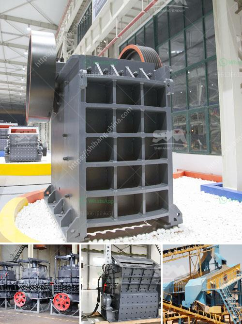

<h3>How to adjust the discharge opening of a spring cone crusher?</h3>
A spring cone crusher is a type of crushing machinery that uses spring-loaded concave liners to help compress and crush rocks that are fed into the crusher. The adjusting mechanism of this type of crusher allows for the adjustment of the discharge opening to control the size of the crushed material.

Properly adjusting the discharge opening of a spring cone crusher is crucial to achieving optimal crushing results. In this article, we will discuss the steps to take to adjust the discharge opening of the crusher.

Before adjusting the discharge opening, it is essential to determine the desired size of the crushed material. This will depend on the specific requirements of the project or application. The size can be determined by considering factors such as the end-use of the crushed material and the desired particle size distribution.

To begin adjusting the discharge opening, the crusher should be stopped and the spring tension should be released. This can be achieved by turning the adjusting nut counterclockwise until the spring is no longer under tension.

Next, the main shaft nut that holds the mantle in place must be removed. This nut is typically located on top of the main shaft and can be loosened with a wrench or spanner.

With the main shaft nut removed, the mantle can now be raised or lowered to adjust the discharge opening size. To raise the mantle, insert a device such as a wooden block into the opening and use a crowbar or similar tool to pry the mantle upwards. To lower the mantle, simply push it downwards.

Once the desired discharge opening size has been achieved, the main shaft nut should be securely tightened to hold the mantle in place. This can be done by turning the nut clockwise until it is firmly secured.

To ensure that the discharge opening has been properly adjusted, it is recommended to perform a test run. Start the crusher and observe the crushed material output. If the desired size is obtained, the adjustment was successful. If not, repeat the adjustment process until the desired results are achieved.

Properly adjusting the discharge opening of a spring cone crusher is essential to achieve the desired crushed material size. Following the steps outlined above will help ensure that the crusher operates efficiently and delivers optimal crushing performance.

In conclusion, adjusting the discharge opening of a spring cone crusher involves determining the desired size, releasing the spring tension, removing the main shaft nut, adjusting the opening size, securing the main shaft nut, and testing the adjustment. It is important to follow these steps carefully to achieve the best crushing results.
<h3>Contact us</h3><ul><li><strong>Whatsapp:&nbsp;<a href="https://wa.me/8613661969651">+8613661969651</a></strong></li><li><a href="https://swt.shibang-china.com/?git&amp;zhl&amp;How to adjust the discharge opening of a spring cone crusher"><strong>Online Service(chat now)</strong></a></li></ul><h3>Related</h3><ul><li><a href='How to separate the gold from the powdered sand .md'>How to separate the gold from the powdered sand ?</a></li><li><a href='How to improve coal crusher hammer life .md'>How to improve coal crusher hammer life ?</a></li><li><a href='How to fit a jaw crusher flywheel.md'>How to fit a jaw crusher flywheel?</a></li><li><a href='How to process ore in crusher with sticky soil .md'>How to process ore in crusher with sticky soil ?</a></li><li><a href='how to own quarry in nigeria.md'>how to own quarry in nigeria?</a></li></ul>