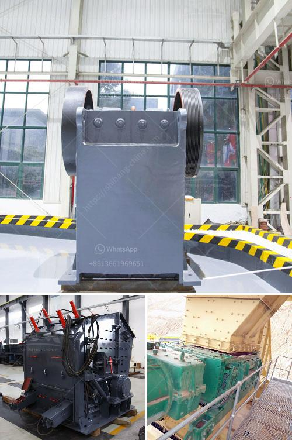

<h3>How to adjust the discharge opening of an impact crusher?</h3>
An impact crusher is a widely-used machine in the mining industry. It is characterized by its high efficiency, high reduction ratio, and low energy consumption. However, adjusting the discharge opening of an impact crusher can sometimes be a challenge depending on the size of the material being crushed. In this article, we will explore the various methods used to adjust the discharge opening of an impact crusher.

One of the simplest methods is adjusting the distance between the impact rack and the rotor rack. This adjustment can be made by moving the position of the rack and adjusting the gap between the rotor and the impact rack. By increasing or decreasing the distance between the impact rack and the rotor rack, the size of the crushed material can be adjusted.

Another method of adjusting the discharge opening is by replacing the impact plate. In order to adjust the impact plate, the lower part of the impact plate can be loosened and the upper part can be lifted. This will change the position of the impact plate and consequently adjust the discharge opening. This method is commonly used when crushing large size materials with high hardness.

Furthermore, the use of different types of impact plates can also help adjust the discharge opening. There are three main types of impact plates: reversible impact plates, adjustable impact plates, and fixed impact plates. Reversible impact plates, as the name suggests, can be flipped and used on both sides, increasing the lifespan of the impact plate. Adjustable impact plates can be adjusted horizontally to increase or decrease the size of the discharge opening. Fixed impact plates, on the other hand, cannot be adjusted and are best suited for materials with a consistent size.

In addition, the speed of the rotor can also affect the discharge opening of an impact crusher. Generally, a higher rotor speed will result in a smaller discharge opening, while a lower rotor speed will produce a larger discharge opening. Therefore, to adjust the discharge opening, the speed of the rotor can be adjusted accordingly.

Lastly, it is important to note that adjusting the discharge opening should be done gradually in order to avoid any damage to the machine. It is recommended to start with a smaller adjustment and gradually increase or decrease it until the desired size is achieved. Additionally, it is important to always refer to the manufacturer's instructions for specific guidance on adjusting the discharge opening of an impact crusher.

In conclusion, adjusting the discharge opening of an impact crusher is a delicate and important task. It can be achieved through various methods such as adjusting the distance between the impact rack and the rotor rack, replacing the impact plate, using different types of impact plates, adjusting the rotor speed, and following the manufacturer's instructions. By properly adjusting the discharge opening, the impact crusher can effectively crush different sizes of materials, resulting in a more efficient and productive mining process.
<h3>Contact us</h3><ul><li><strong>Whatsapp:&nbsp;<a href="https://wa.me/8613661969651">+8613661969651</a></strong></li><li><a href="https://swt.shibang-china.com/?git&amp;zhl&amp;How to adjust the discharge opening of an impact crusher"><strong>Online Service(chat now)</strong></a></li></ul><h3>Related</h3><ul><li><a href='How to Calibrate Coal Mill Feeders.md'>How to Calibrate Coal Mill Feeders?</a></li><li><a href='How to determine the size of the conveyor belt in mining？.md'>How to determine the size of the conveyor belt in mining？</a></li><li><a href='How to select a Highquality sand making machine.md'>How to select a High-quality sand making machine?</a></li><li><a href='how to choose a portable crusher plant ？.md'>how to choose a portable crusher plant ？</a></li><li><a href='How to build your own shaker wash plant.md'>How to build your own shaker wash plant?</a></li></ul>