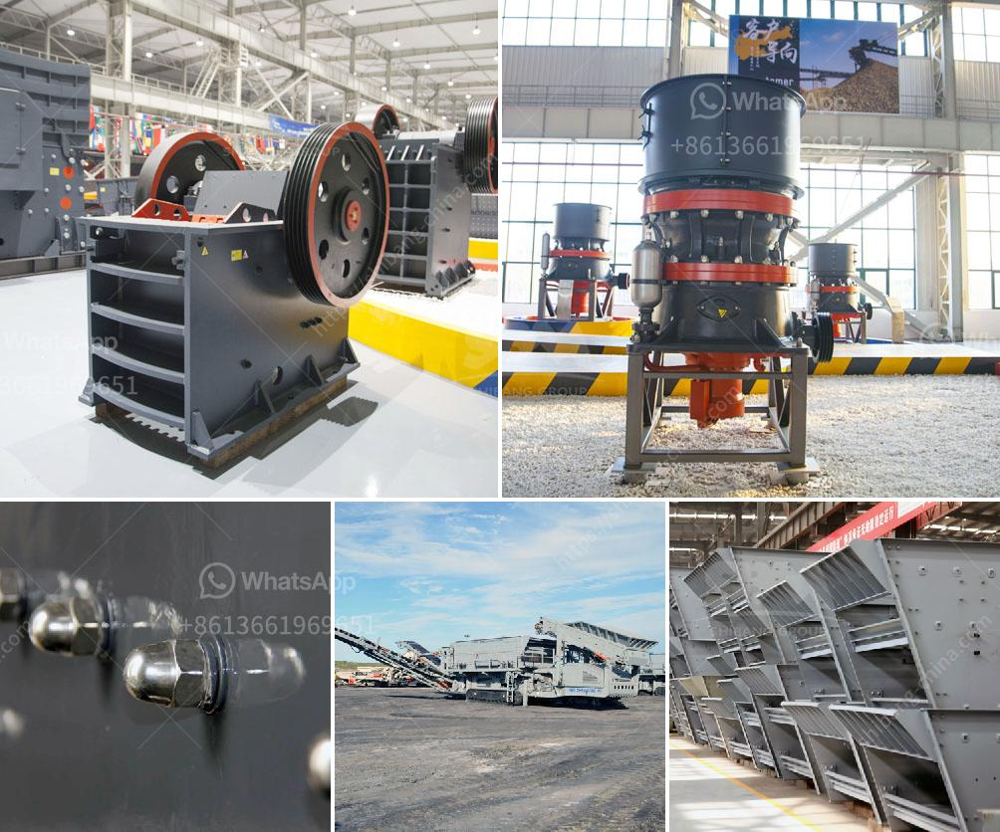

<h3>How to adjust the discharge port of stone cone crusher ？</h3>
Stone cone crusher is a commonly used mining equipment, which is widely used in mineral processing, construction, metallurgy, and various industries. It plays an important role in the crushing and processing of raw materials. However, sometimes the discharge port of the stone cone crusher is not adjusted properly, which results in excessive particle size variation of the crushed materials. This article will introduce the method to adjust the discharge port of the stone cone crusher.

Firstly, we need to understand the structure of the stone cone crusher. The discharge port is the part of the cone crusher that directly affects the particle size of the crushed materials. In the production process, the crushing cavity shape needs to be closely matched with the discharge port shape to achieve the required particle size of the crushed materials. Therefore, adjusting the discharge port is crucial to ensure the quality of the final product.

1. Measure the particle size distribution of the feed. Before adjusting the discharge port, it is necessary to know the particle size distribution of the raw materials. This can be achieved by using a particle size analyzer or conducting a sieve analysis. By understanding the initial particle size distribution, we can determine the suitable range for the discharge port adjustment.

2. Adjust the discharge port according to the desired particle size. The discharge port of the stone cone crusher can be adjusted by three methods: adjusting screw, adjusting hydraulic cylinder, and adjusting wedge. The specific method used depends on the manufacturer's design and the actual situation of the equipment. For example, if the stone cone crusher is equipped with a hydraulic cylinder, the hydraulic cylinder can be adjusted to achieve the desired particle size.

3. Check the adjustment after a period of operation. After adjusting the discharge port, it is important to check the particle size distribution of the crushed materials. This can be done by conducting regular sampling and testing. If the particle size distribution is not within the desired range, further adjustments may be necessary.

In addition to adjusting the discharge port, there are other factors that can affect the particle size distribution of the crushed materials. For example, the eccentricity of the cone crusher, the speed of the crusher, the feed rate, and the different crushing cavity designs can all impact the final product. Therefore, it is important to consider these factors when adjusting the discharge port.

In conclusion, adjusting the discharge port of the stone cone crusher is a key factor to ensure the quality of the final product. By understanding the structure of the cone crusher and following the steps mentioned above, operators can effectively adjust the discharge port and achieve the desired particle size distribution of the crushed materials. This will not only improve the efficiency of the crushing process but also enhance the overall performance of the stone cone crusher.
<h3>Contact us</h3><ul><li><strong>Whatsapp:&nbsp;<a href="https://wa.me/8613661969651">+8613661969651</a></strong></li><li><a href="https://swt.shibang-china.com/?git&amp;zhl&amp;How to adjust the discharge port of stone cone crusher ？"><strong>Online Service(chat now)</strong></a></li></ul><h3>Related</h3><ul><li><a href='How does the operation of crusher plants work.md'>How does the operation of crusher plants work?</a></li><li><a href='How is mill used in the copper ore mining process.md'>How is mill used in the copper ore mining process?</a></li><li><a href='How industry crush graphite.md'>How industry crush graphite?</a></li><li><a href='How to setting up of stone crusher unit in maharashtra and order there of .md'>How to setting up of stone crusher unit in maharashtra and order there of ?</a></li><li><a href='How to choose a hightechnology and correct mine sand washing machine.md'>How to choose a high-technology and correct mine sand washing machine?</a></li></ul>