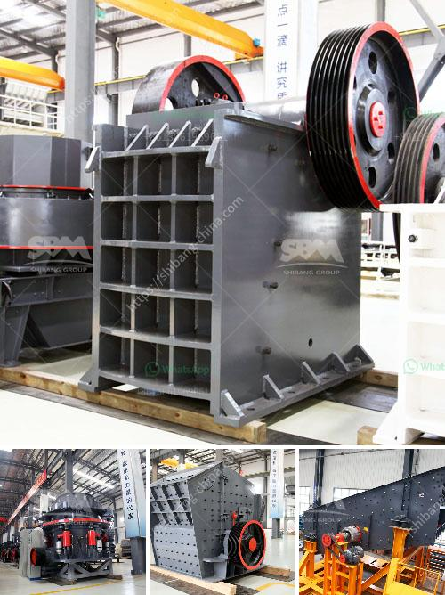

<h3>How to adjust the eccentric spindle of a cone crusher?</h3>
Cone crushers are used in various industries, including mining and aggregate processing, to reduce the size of ore from large chunks to smaller pieces. As the name suggests, a cone crusher has a cone-shaped crushing mechanism that provides a crushing cavity and an adjustable eccentric spindle.

The eccentric spindle of a cone crusher plays a crucial role in the crushing process as it determines the efficiency and productivity of the crusher. However, over time, the eccentric spindle may experience wear or misalignment, which can affect the overall performance of the cone crusher. Therefore, it is important to know how to adjust the eccentric spindle to ensure optimal crusher operation.

1. Shut down the crusher: Before adjusting the eccentric spindle, it is essential to shut down the crusher and ensure that all components are properly locked out to prevent any accidental injuries.

2. Access the eccentric spindle: Locate the eccentric spindle, which is typically located at the lower end of the crusher. This is where the mantle and the concave intersect. Remove any guards or covers that may be obstructing access to the eccentric spindle.

3. Measure the eccentricity: To determine if the eccentric spindle needs adjustment, measure the gap between the concave and the mantle. Using a feeler gauge or a laser measurement device, measure the distance between the two surfaces at several points around the circumference of the crusher. If the measurements vary significantly, it indicates that the eccentric spindle needs adjustment.

4. Adjusting the eccentric spindle: To adjust the eccentric spindle, use the appropriate tools, such as a wrench or a hydraulic jack, to turn the eccentric shaft. This will move the concave closer or farther away from the mantle, thus changing the gap between them. The adjustment should be done gradually and evenly to avoid any uneven wear or excessive stress on the crusher components.

5. Verify the adjustment: After making the necessary adjustments, remeasure the gap between the concave and the mantle to ensure that it is within the acceptable range. If needed, repeat the adjustment process until the desired gap is achieved. It is important to follow the manufacturer's guidelines or consult a professional if unsure about the proper gap specifications.

6. Test the crusher: Once the eccentric spindle has been adjusted, start the crusher and monitor its performance. Observe the crusher's feed and discharge size, as well as its operating temperature and power consumption. These parameters will help determine if the adjustment was successful and if any further fine-tuning is required.

In conclusion, adjusting the eccentric spindle of a cone crusher is a critical step in maintaining optimal crusher performance. By following the proper procedures and using the appropriate tools, operators can ensure that the crusher operates efficiently, reduces downtime, and maximizes productivity. Regular maintenance and inspection can help detect any wear or misalignment early on, preventing costly repairs or breakdowns.
<h3>Contact us</h3><ul><li><strong>Whatsapp:&nbsp;<a href="https://wa.me/8613661969651">+8613661969651</a></strong></li><li><a href="https://swt.shibang-china.com/?git&amp;zhl&amp;How to adjust the eccentric spindle of a cone crusher"><strong>Online Service(chat now)</strong></a></li></ul><h3>Related</h3><ul><li><a href='How to replace the hammer of a hammer crusher.md'>How to replace the hammer of a hammer crusher?</a></li><li><a href='How do we crush cobaltite.md'>How do we crush cobaltite?</a></li><li><a href='How to Grind Manganese Ores Using a Ball Mill.md'>How to Grind Manganese Ores Using a Ball Mill?</a></li><li><a href='How much does a stone crusher of 150 tonnes cost.md'>How much does a stone crusher of 150 tonnes cost?</a></li><li><a href='How to ensure the efficient operation of impact crusher.md'>How to ensure the efficient operation of impact crusher?</a></li></ul>