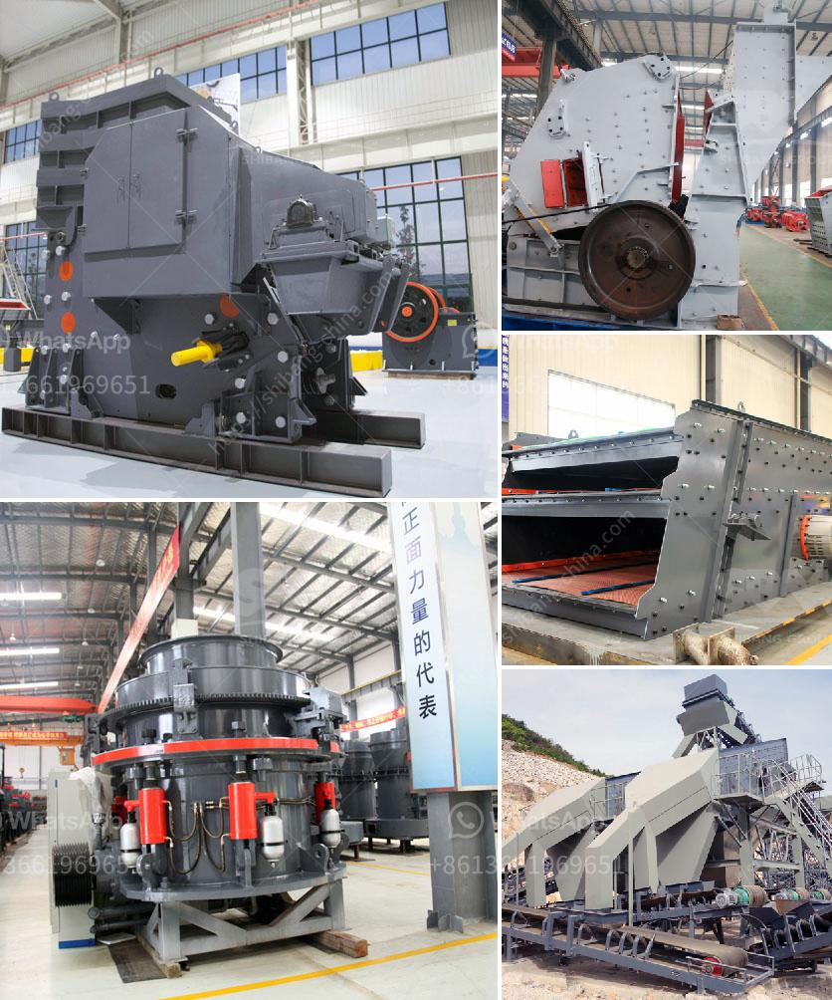

<h3>How to analyze the critical frequency of a vibrating screen?</h3>
The critical frequency of a vibrating screen is an important parameter to understand as it determines the resonant frequency of the equipment. This frequency is essential to be aware of, as it impacts the performance and efficiency of the vibrating screen. By analyzing the critical frequency, operators and engineers can optimize the design and operation of the screen for optimal results.

1. Understand the basic concept: The critical frequency, also known as the resonant frequency or natural frequency, is the frequency at which a system vibrates with the least external force applied. In the case of a vibrating screen, the critical frequency is the lowest frequency at which it starts to vibrate without the addition of any external force. This frequency is significant as it affects the stability and performance of the screen.

2. Gather necessary information: Before analyzing the critical frequency, gather information about the vibrating screen, such as its dimensions, material properties, and operating parameters. This information will be crucial in the subsequent calculations.

3. Calculate the natural frequency: The critical frequency can be calculated using the formula: f = 1 / (2 * π * √(k/m)), where f is the critical frequency, k is the stiffness of the screen, and m is the mass of the screen. The stiffness can be determined by evaluating the material and structural properties of the screen, while the mass can be obtained from the weight and dimensions of the screen.

4. Consider structural constraints: It is important to take into account any structural constraints that might affect the vibrating screen's critical frequency. For example, if the screen is supported by a frame or other structures, their stiffness and natural frequencies should be considered when analyzing the critical frequency. Any resonance between the screen and the supporting structures should be avoided.

5. Optimize the design: Based on the calculated critical frequency, designers and engineers can analyze the vibrating screen's structural design and make adjustments to optimize its performance. For example, if the critical frequency is too close to the operating frequency range, modifications can be made to increase stiffness or reduce mass to avoid resonance.

6. Monitor and adjust during operation: Once the vibrating screen is in use, it is essential to continuously monitor its performance and adjust if necessary. Changes in material feed or operating conditions can impact the critical frequency. Regular maintenance and inspection can help identify any deviations that may require adjustments to ensure optimal performance and avoid premature failures.

In conclusion, analyzing the critical frequency of a vibrating screen is crucial to understand its inherent resonant frequency. By calculating the critical frequency and considering the screen's design and structural constraints, engineers and operators can optimize the equipment's performance for maximum efficiency and longevity. Continuous monitoring and adjustments during operation are also essential to maintain the vibrating screen's optimal performance. Understanding and managing the critical frequency will lead to better productivity and cost-effectiveness in vibrating screen applications.
<h3>Contact us</h3><ul><li><strong>Whatsapp:&nbsp;<a href="https://wa.me/8613661969651">+8613661969651</a></strong></li><li><a href="https://swt.shibang-china.com/?git&amp;zhl&amp;How to analyze the critical frequency of a vibrating screen"><strong>Online Service(chat now)</strong></a></li></ul><h3>Related</h3><ul><li><a href='how to calculate the processing capacity of the mill .md'>how to calculate the processing capacity of the mill ?</a></li><li><a href='How to reduce VSI crusher noise.md'>How to reduce VSI crusher noise?</a></li><li><a href='how to use jaw and impact crusher.md'>how to use jaw and impact crusher</a></li><li><a href='How to choose the model of jaw crusher ？.md'>How to choose the model of jaw crusher ？</a></li><li><a href='How to Install a crusher equipment ？.md'>How to Install a crusher equipment ？</a></li></ul>