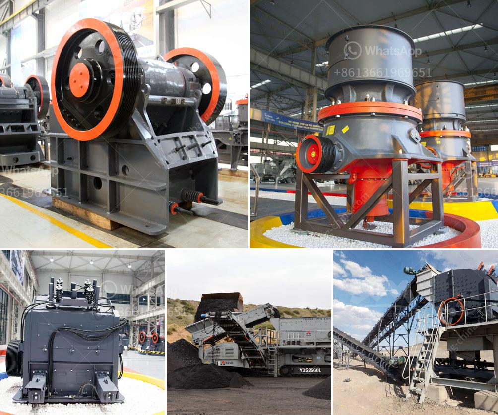

<h3>How to balance cement mill fans?</h3>
Cement mill fans are one of the essential equipment used in cement plants. These fans provide a vital function of ensuring proper circulation and ventilation of the air in the cement mill. The fans move the cement product through the mill and also remove exhaust gases generated during the grinding process. Therefore, it is crucial to balance these fans to ensure smooth and efficient operation. In this article, we will discuss the steps involved in balancing cement mill fans.

The first step in balancing cement mill fans is to identify the specific fans that require balancing. Cement mill fans consist of various types, including raw mill fans, preheater fans, kiln ID fans, and cooler exhaust fans. Each fan has a different role to play in the cement manufacturing process, and thus, different fans may require balancing. Regular maintenance and inspection can help identify fans that are unbalanced.

Once the unbalanced fans are identified, the next step is to determine the cause of the imbalance. Imbalances in fans can occur due to various reasons, such as misalignment, worn-out bearings, bent shafts, or accumulated dirt and debris. It is crucial to identify and address the root cause of the imbalance to prevent any further damage or operational issues.

After identifying the cause of imbalance, the third step is to bring the fan back into balance. Balancing involves adding or removing weight from the fan rotor to ensure that it rotates smoothly and without any vibration. There are two primary methods of balancing cement mill fans – static balancing and dynamic balancing.

Static balancing is a method that involves adding or removing weight from the fan rotor using correction weights. The correction weights are strategically placed on different parts of the rotor until the fan is in balance. This method is relatively simple and can be done without the need for specialized equipment.

Dynamic balancing, on the other hand, is a more advanced method that requires specialized equipment such as vibration analyzers or balancing machines. This method involves measuring the vibration levels of the fan and determining the unbalanced components. Correction weights are then added or removed from the rotor based on the measurement data. Dynamic balancing provides more accurate results and is often preferred for critical fans where precision is essential.

Balancing cement mill fans should be carried out by skilled professionals who have knowledge and experience in fan balancing techniques. It is essential to follow safety protocols and guidelines during the balancing process to prevent accidents or injuries.

In conclusion, balancing cement mill fans is crucial for ensuring smooth and efficient operation in cement plants. It involves identifying the unbalanced fans, determining the cause of imbalance, and then bringing the fan back into balance using either static or dynamic balancing methods. Regular maintenance and inspection are key to identifying fans that require balancing. By maintaining a balanced fan system, cement plants can optimize their production processes and minimize downtime due to fan-related issues.
<h3>Contact us</h3><ul><li><strong>Whatsapp:&nbsp;<a href="https://wa.me/8613661969651">+8613661969651</a></strong></li><li><a href="https://swt.shibang-china.com/?git&amp;zhl&amp;How to balance cement mill fans"><strong>Online Service(chat now)</strong></a></li></ul><h3>Related</h3><ul><li><a href='How to start a stone quarry business.md'>How to start a stone quarry business?</a></li><li><a href='How to determine the size of the conveyor belt in mining？.md'>How to determine the size of the conveyor belt in mining？</a></li><li><a href='How to increase productivity in ball mill.md'>How to increase productivity in ball mill?</a></li><li><a href='How to use the impact crusher ？.md'>How to use the impact crusher ？</a></li><li><a href='How to move a mobile screen crusher.md'>How to move a mobile screen crusher?</a></li></ul>