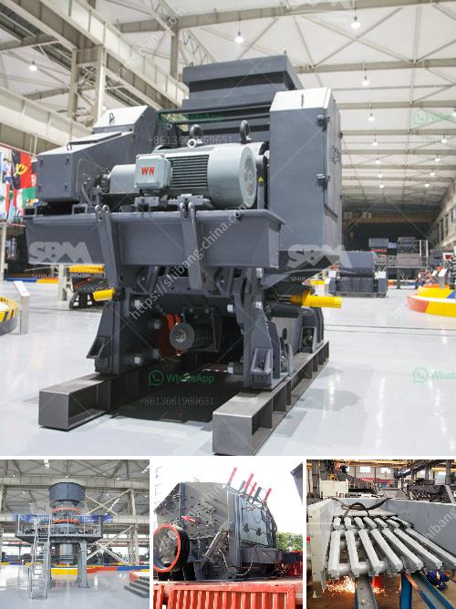

<h3>How to become a large mineral processing equipment supplier?</h3>
The mineral processing industry plays a crucial role in extracting and refining valuable minerals from raw ores. As the demand for minerals continues to grow, so does the need for reliable and efficient mineral processing equipment suppliers. If you aspire to become a large supplier in this industry, here are some key steps to help you achieve your goal.

Before venturing into the mineral processing equipment business, it is essential to thoroughly understand the market and industry trends. Stay updated with the latest advancements in technology, regulations, and environmental sustainability practices. Research market demands, including which minerals are in high demand and what processing equipment is required to extract and refine them.

One of the critical factors determining success in the mineral processing equipment industry is offering a diverse range of products. Invest in research and development to innovate and expand your product line to meet the evolving needs of your customers. Some essential equipment categories to consider include crushers, screens, mills, separators, and flotation machines.

Quality and reliability are of utmost importance in the mineral processing industry. Customers rely on the durability and efficiency of their equipment to ensure uninterrupted production. Invest in advanced manufacturing processes, use high-quality materials, and perform rigorous testing to ensure your equipment meets or exceeds industry standards. Maintain a robust quality assurance program to continually improve your products.

To become a large mineral processing equipment supplier, it is crucial to establish strong partnerships with key suppliers. Collaborate with reputable suppliers of raw materials, components, and spare parts to ensure a steady supply chain. Build long-term relationships based on trust, reliability, and mutual growth. Negotiate favorable terms for bulk purchases, prompt deliveries, and technical support.

Delivering excellent customer support and after-sales service is vital to building a reputable mineral processing equipment supply business. Ensure that your team is readily available to address customer inquiries, provide technical assistance, and offer maintenance and repair services. Develop a robust spare parts inventory management system to minimize equipment downtime for your customers.

Marketing and promotion play a crucial role in establishing your brand as a reliable mineral processing equipment supplier. Invest in digital marketing strategies such as website optimization, content creation, social media marketing, and search engine advertising. Attend industry-specific trade shows, conferences, and exhibitions to showcase your products and capabilities.

Constantly invest in research and development to stay ahead of the competition. Seek opportunities to improve the efficiency, environmental sustainability, and automation capabilities of your equipment. Work closely with your customers to understand their evolving requirements and collaborate on customized solutions to meet their specific processing needs.

Becoming a large mineral processing equipment supplier requires in-depth market knowledge, a diverse product range, a focus on quality and reliability, strong partnerships, comprehensive customer support services, and continuous investment in research and development. By following these steps and adapting to the ever-changing industry dynamics, you can position your business as a trusted leader in the mineral processing equipment industry.
<h3>Contact us</h3><ul><li><strong>Whatsapp:&nbsp;<a href="https://wa.me/8613661969651">+8613661969651</a></strong></li><li><a href="https://swt.shibang-china.com/?git&amp;zhl&amp;How to become a large mineral processing equipment supplier"><strong>Online Service(chat now)</strong></a></li></ul><h3>Related</h3><ul><li><a href='how to set up screening and crushing plant .md'>how to set up screening and crushing plant ?</a></li><li><a href='How to set up a stone crusher plant.md'>How to set up a stone crusher plant?</a></li><li><a href='How to Start a Quarry Crushing Plant in Nigeria Need those crushing machines.md'>How to Start a Quarry Crushing Plant in Nigeria? Need those crushing machines?</a></li><li><a href='How to grind bentonite clay .md'>How to grind bentonite clay ?</a></li><li><a href='How to choose a limestone hammer mill ？.md'>How to choose a limestone hammer mill ？</a></li></ul>