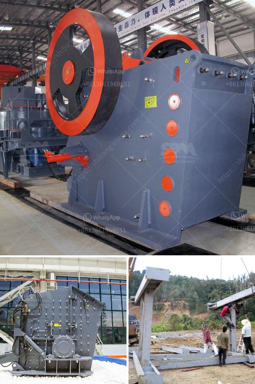

<h3>How to beneficiate pyrolusite manganese ore?</h3>
Pyrolusite is a naturally occurring mineral consisting of manganese dioxide (MnO2) and is the most important ore mineral of manganese. It is widely used in various industries due to its high manganese content. Beneficiation of pyrolusite ore is an essential step towards producing high-quality manganese products using efficient methods.

The process of beneficiation involves crushing, grinding, and separation of manganese ores to obtain desirable particle sizes for further processing. Here are some steps to beneficiate pyrolusite manganese ore effectively:

1. Crushing: The first step in the beneficiation process is to crush the mined pyrolusite ore into small particles. This can be achieved through various crushing equipment such as jaw crushers, cone crushers, or impact crushers. The aim is to reduce the ore size for subsequent grinding operations.

2. Grinding: After the initial crushing, the ore particles are further ground into finer sizes using grinding mills. The choice of the grinding equipment depends on the type of ore and desired particle size. Ball mills and rod mills are commonly used for grinding pyrolusite manganese ore.

3. Magnetic separation: Magnetic separation is a crucial step in pyrolusite ore beneficiation. It utilizes magnetic differences between minerals to separate valuable manganese minerals from gangue minerals. Strong magnetic separators, such as drum or roll-type separators, are commonly used for this purpose.

4. Gravity separation: Gravity separation methods are applied for coarse-grained pyrolusite manganese ore. In this step, the heavier manganese-rich particles are separated from lighter gangue minerals using the principle of gravity. Techniques like jigging, shaking tables, or centrifugal concentrators can be employed for gravity separation.

5. Flotation: Flotation is used to separate fine-grained pyrolusite manganese ore from gangue minerals. It relies on the ability of certain chemicals to selectively attach to the manganese minerals, allowing them to be separated from the rest of the ore. Froth flotation is the most commonly used method for manganese ore flotation.

6. Dewatering: After the beneficiation process, the concentrate containing manganese minerals needs to be dewatered to reduce moisture content. Various dewatering techniques such as filtration, centrifugation, or thermal drying can be employed for this purpose.

7. Smelting and refining: Once the pyrolusite ore has been beneficiated, it can be used for smelting and refining processes to obtain high-quality manganese products. Smelting involves the reduction of manganese ores using carbon sources, such as coke or coal, in the presence of fluxes. The resulting alloy, known as ferromanganese, is then refined to remove impurities and adjust the manganese content as per the desired specifications.

Overall, beneficiation of pyrolusite manganese ore is a complex process that requires careful planning and selection of appropriate methods. By applying the steps mentioned above, the quality of the manganese products can be improved, resulting in enhanced value and utility across various industries.
<h3>Contact us</h3><ul><li><strong>Whatsapp:&nbsp;<a href="https://wa.me/8613661969651">+8613661969651</a></strong></li><li><a href="https://swt.shibang-china.com/?git&amp;zhl&amp;How to beneficiate pyrolusite manganese ore"><strong>Online Service(chat now)</strong></a></li></ul><h3>Related</h3><ul><li><a href='How to calculate the balls needed in a ball mill.md'>How to calculate the balls needed in a ball mill?</a></li><li><a href='how to calculate the production capacity of cone crusher .md'>how to calculate the production capacity of cone crusher ?</a></li><li><a href='How to remove iron from zinc ore.md'>How to remove iron from zinc ore?</a></li><li><a href='How does a rock crusher work.md'>How does a rock crusher work?</a></li><li><a href='How to plan to build a rock crusher production line.md'>How to plan to build a rock crusher production line?</a></li></ul>