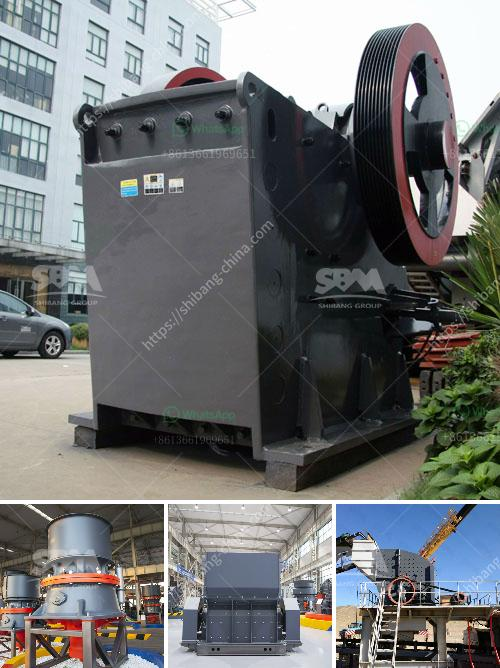

<h3>How to beneficiation tungsten ore?</h3>
Tungsten ore, also known as wolframite, is one of the most abundant minerals on the Earth's crust. It is known for its excellent industrial properties, including heat resistance, hardness, and high melting point. Due to these characteristics, tungsten has become a crucial material in various industries, such as aerospace, electronics, and automotive.

However, extracting and processing tungsten ore is a complex and challenging process. To obtain valuable tungsten concentrates, a series of beneficiation steps are needed. Beneficiation is the process of separating and removing impurities from ore to improve its quality and yield. In the case of tungsten ore, beneficiation methods can vary depending on the type and mineralogy of the ore.

The first step in tungsten ore beneficiation is crushing and grinding. Ore is crushed into small pieces to facilitate the separation process. Grinding is then performed to further reduce the size of the ore particles and expose the tungsten minerals for beneficiation. This step is usually carried out using ball mills or rod mills.

After crushing and grinding, the tungsten ore undergoes gravity separation. Gravity separation is based on the differences in density and particle size of the valuable minerals and gangue. Various techniques, such as jigging, spiral concentration, and shaking tables, can be used to achieve gravity separation. The tungsten concentrate is usually recovered as a heavy mineral concentrate.

Flotation is another commonly used method for tungsten ore beneficiation. It relies on the differences in the surface properties of minerals to separate them. In the case of tungsten ore,  sodium silicates and fatty acids are often used as flotation collectors. These collectors selectively adhere to the tungsten minerals, allowing them to be separated from the gangue.

Magnetic separation can also be employed for tungsten ore beneficiation, especially for magnetic minerals such as ferberite. The ore is passed through a magnetic separator, where magnetic particles are attracted and separated from non-magnetic material.

In addition to these primary beneficiation methods, other techniques can be applied depending on the specific ore characteristics. These include electrostatic separation, hydrometallurgical processes, and bioleaching. Each method has its advantages and limitations, and the selection of beneficiation methods depends on factors such as ore grade, mineralogy, and economic feasibility.

After beneficiation, the tungsten concentrate is further processed to obtain the desired tungsten product. This may involve additional steps such as roasting, leaching, and chemical processing to remove impurities and produce high-purity tungsten products.

In conclusion, the beneficiation of tungsten ore involves a series of steps to extract and purify the valuable tungsten minerals. These steps include crushing, grinding, gravity separation, flotation, magnetic separation, and other specialized techniques. The selection of beneficiation methods depends on the ore characteristics and desired end products. With the advancement in technology and increasing demand for tungsten, further research and innovation in ore beneficiation methods are essential to meet the industry's requirements efficiently.
<h3>Contact us</h3><ul><li><strong>Whatsapp:&nbsp;<a href="https://wa.me/8613661969651">+8613661969651</a></strong></li><li><a href="https://swt.shibang-china.com/?git&amp;zhl&amp;How to beneficiation tungsten ore"><strong>Online Service(chat now)</strong></a></li></ul><h3>Related</h3><ul><li><a href='How to change the toggle plate and toggle seat in a jaw crusher.md'>How to change the toggle plate and toggle seat in a jaw crusher?</a></li><li><a href='How to crush the very hard iron ore magnetite.md'>How to crush the very hard iron ore magnetite?</a></li><li><a href='How to determine hp for aggregate conveyor .md'>How to determine hp for aggregate conveyor ?</a></li><li><a href='How to operate aggregate crushing plant.md'>How to operate aggregate crushing plant?</a></li><li><a href='how to work cone crusher ？.md'>how to work cone crusher ？</a></li></ul>