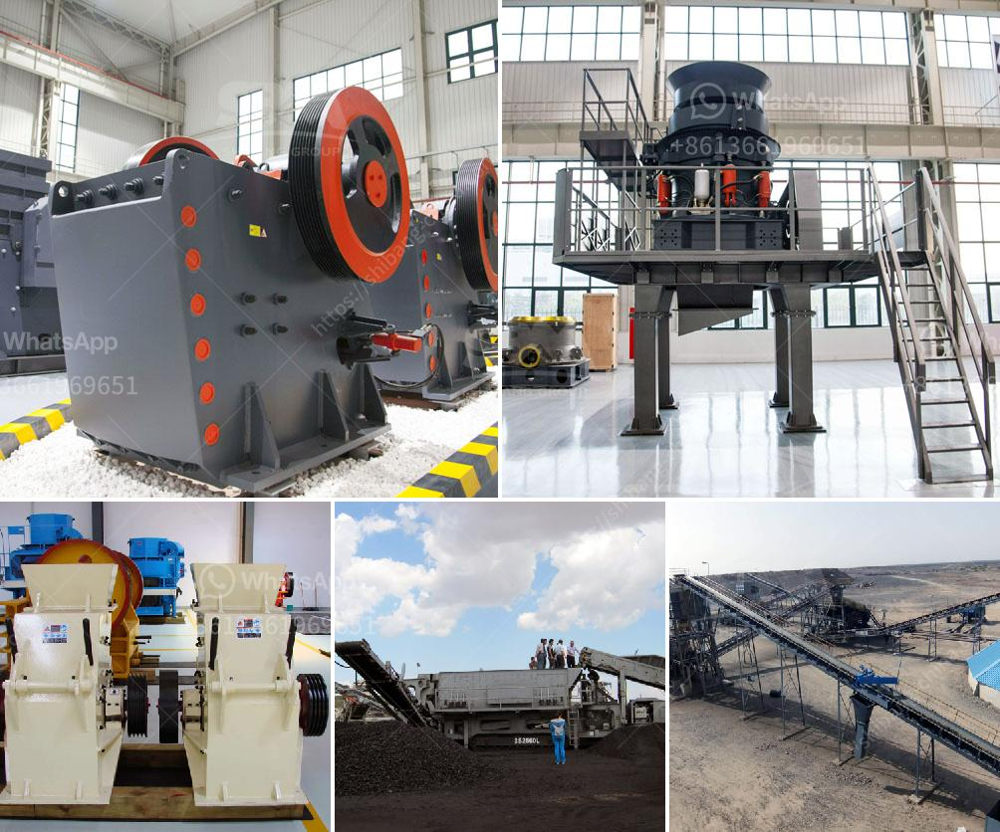

<h3>How to break down a copper ore?</h3>
Copper, one of the most valuable metals known to humankind, has been used for thousands of years due to its excellent electrical conductivity and corrosion resistance. The metal is primarily obtained through the extraction process from copper ore, a mineral found in various parts of the world. Breaking down copper ore involves a series of steps that can be executed using a variety of methods, depending on the type of ore and the desired end product. In this article, we will discuss the general process of breaking down a copper ore and highlight some commonly used techniques.

Before breaking down copper ore, it is essential to locate a viable deposit. Extensive geological surveys and exploratory drilling help determine the size and quality of the copper deposit. Once a suitable location is identified, mining operations begin. There are two primary mining methods used for copper ore extraction: open-pit mining and underground mining. Open-pit mining involves extracting the ore from the surface using large excavation machinery, while underground mining involves tunneling underground to access the ore.

After the ore is mined, it undergoes a crushing and grinding process to break it down into smaller pieces. This is done to increase the surface area of the ore, making it easier to extract the copper. Crushing reduces the ore to a manageable size, typically less than one inch in diameter. Various crushers, such as jaw crushers or cone crushers, are used for this purpose. The ore is then further ground using ball mills or rod mills to produce a fine powder.

The copper content in the crushed and ground ore is relatively low, often less than 1%. Concentration is then required to increase the copper content. Various techniques, such as froth flotation, smelting, or leaching, can be employed to separate the copper from unwanted impurities. Froth flotation, the most commonly used method, involves mixing the powdered ore with water and chemical reagents. The mixture is agitated, creating bubbles that selectively attach to the copper particles, allowing them to be separated from the rest of the ore.

Once copper has been concentrated, it still contains impurities that must be removed to obtain high-purity copper. Refining processes, such as electrorefining or fire refining, are used to eliminate impurities. Electrorefining involves passing an electric current through the copper to remove impurities, while fire refining involves heating the copper to high temperatures to burn off impurities. These processes result in high-quality copper suitable for various applications.

In conclusion, breaking down a copper ore involves a series of steps starting with exploration and mining, followed by crushing and grinding the ore to increase surface area, concentrating the copper content and finally refining the copper to remove impurities. The techniques and methods used in each step may vary depending on the type of ore and specific requirements. Copper, a versatile and valuable metal, continues to play a crucial role in numerous industries, from electronics to construction, making the process of breaking down copper ore essential for its extraction.
<h3>Contact us</h3><ul><li><strong>Whatsapp:&nbsp;<a href="https://wa.me/8613661969651">+8613661969651</a></strong></li><li><a href="https://swt.shibang-china.com/?git&amp;zhl&amp;How to break down a copper ore"><strong>Online Service(chat now)</strong></a></li></ul><h3>Related</h3><ul><li><a href='How to increase the output of stone milling machine？.md'>How to increase the output of stone milling machine？</a></li><li><a href='How is quartz mined and processed.md'>How is quartz mined and processed?</a></li><li><a href='How to make sand from rocks.md'>How to make sand from rocks?</a></li><li><a href='How much does a mobile crusher plant cost.md'>How much does a mobile crusher plant cost?</a></li><li><a href='How to choose a stone crusher station .md'>How to choose a stone crusher station ?</a></li></ul>