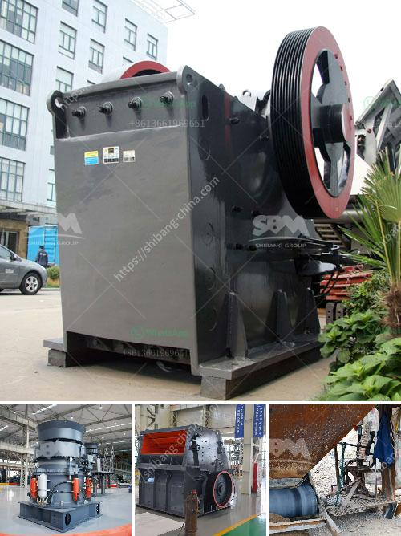

<h3>How to break granite rocks in a double toggle jaw crusher?</h3>
Granite is a unique and highly durable natural stone that is commonly used for construction purposes. Its strength and durability make it an ideal material for various applications, including countertops, flooring, and walls. However, breaking granite rocks into smaller pieces can be a challenging task, as the hardness of the stone poses a significant hurdle. One effective method to break granite rocks is by using a double toggle jaw crusher.

A double toggle jaw crusher is much larger, heavier, and more capable than a single toggle jaw crusher. The double toggle design provides a few key advantages over a single toggle design, notably increased throughput capacity and improved crushing motion. Additionally, the double toggle jaw crusher is more effective at crushing hard and abrasive materials, including granite rocks.

1. Prepare the granite rocks: Before breaking granite rocks in a double toggle jaw crusher, it is important to ensure that the rocks are properly prepared. This includes removing any loose debris, dirt, or other materials that may interfere with the crushing process. It is also recommended to inspect the rocks for any cracks or weak points that could potentially cause a safety hazard during crushing.

2. Set up the double toggle jaw crusher: Position the double toggle jaw crusher on a stable and flat surface. Ensure that the crusher is securely anchored to prevent any movement during operation. Connect the crusher to a reliable power source, and ensure that all safety devices and components are in working order.

3. Adjust the jaw crusher settings: The next step involves adjusting the settings of the double toggle jaw crusher to accommodate the desired size of the crushed granite rocks. Depending on the specific model of the crusher, this may involve adjusting the closed side setting (CSS), jaw angle, or discharge opening. Consult the manufacturer's instructions or seek guidance from a qualified professional to ensure proper adjustment.

4. Feed the granite rocks into the crusher: Carefully feed the prepared granite rocks into the double toggle jaw crusher. Ensure a steady and continuous feed rate to prevent overloading the crusher, as this can cause damage and reduce efficiency. Use a conveyor or other mechanical means to maintain a consistent feed rate, if necessary.

5. Operate the double toggle jaw crusher: Once the granite rocks are in the crusher, start the crushing process. Activate the double toggle jaw crusher by pressing the appropriate switch or lever. Keep a close eye on the crusher to ensure that the rocks are being crushed effectively without any blockages or other issues.

6. Monitor and maintain the crusher: Throughout the crushing process, monitor the performance and condition of the double toggle jaw crusher. Regularly inspect the crusher for any signs of wear or damage, and promptly address any maintenance or repair needs. Staying proactive in maintaining the crusher will help ensure optimal performance and reduce the risk of unexpected breakdowns.

In conclusion, breaking granite rocks in a double toggle jaw crusher requires careful preparation, proper setup, and regular maintenance. By following the steps outlined above, you can effectively break granite rocks and obtain the desired size for your construction projects. Remember to prioritize safety and consult with professionals, if needed, to ensure a successful and efficient crushing operation.
<h3>Contact us</h3><ul><li><strong>Whatsapp:&nbsp;<a href="https://wa.me/8613661969651">+8613661969651</a></strong></li><li><a href="https://swt.shibang-china.com/?git&amp;zhl&amp;How to break granite rocks in a double toggle jaw crusher"><strong>Online Service(chat now)</strong></a></li></ul><h3>Related</h3><ul><li><a href='How to repair a damaged ball mill shaft.md'>How to repair a damaged ball mill shaft?</a></li><li><a href='How to open a crusher plant in Fujairah.md'>How to open a crusher plant in Fujairah?</a></li><li><a href='How is mill used in the copper ore mining process.md'>How is mill used in the copper ore mining process?</a></li><li><a href='how to choose mobile rock crusher machines？.md'>how to choose mobile rock crusher machines？</a></li><li><a href='How is nickel extracted from its ore.md'>How is nickel extracted from its ore?</a></li></ul>