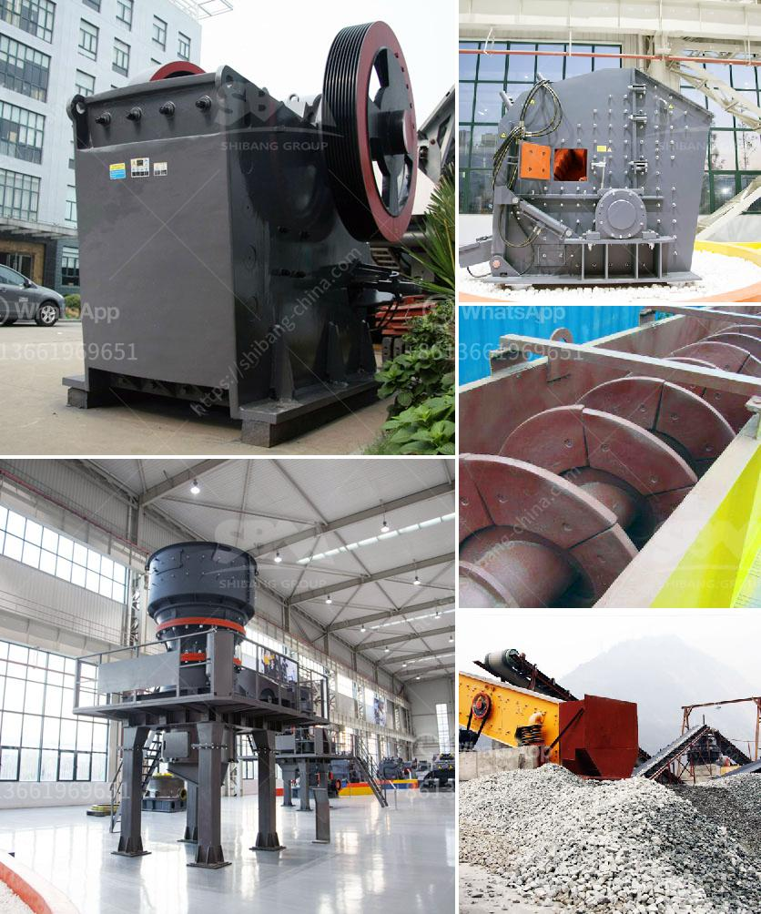

<h3>How to break material using a hammer crusher?</h3>
A hammer crusher is a versatile machine that is commonly used for breaking down various materials for recycling or industrial purposes. A hammer crusher is typically made of a horizontal rotor with hammers attached to its spinning disc. The material is fed into the crusher and impacted or shattered by the repeated hammer impacts. However, breaking material using a hammer crusher requires some caution and proper techniques to ensure efficient and safe operation. In this article, we will discuss how to break material using a hammer crusher.

Firstly, it is essential to select the appropriate hammer crusher for the specific material you want to break. Different materials have different hardness levels, so choosing the right crusher with appropriate hammer design and rotor speed is crucial for good performance. Consult the crusher manufacturer or expert advice to ensure the right equipment selection.

Before operating the hammer crusher, it is essential to inspect the machine thoroughly. Check for any loose parts or worn-out components that may affect its performance. Make sure all safety guards are in place and functioning correctly.

Once the crusher is ready for operation, the material to be crushed should be loaded evenly into the feed hopper. It is important to ensure a consistent and uniform flow of material into the crusher to optimize crushing efficiency. Large or oversized material should be removed before feeding into the crusher to prevent any blockages, which can lead to equipment damage.

When operating the hammer crusher, it is crucial to maintain a steady and controlled feed rate. Feeding the material too quickly may cause the hammers to become overloaded, reducing their efficiency. On the other hand, feeding the material too slowly may result in poor utilization of the hammers' kinetic energy.

During the crushing process, it is advisable to monitor the crusher's performance regularly. This can be done by checking the crushed product size, power consumption, and the condition of the hammers. If the crushed product size is not within the desired range, it may indicate a need for adjusting the crusher settings or replacing the hammers.

If the material being crushed is known to be abrasive or contains hard particles, it is recommended to use wear-resistant hammers. These hammers are specially designed to withstand high-impact forces and extended service life. Regularly inspect and replace any worn-out or damaged hammers to maintain optimum crushing efficiency.

Finally, proper maintenance and lubrication of the hammer crusher are vital for its longevity and reliable performance. Follow the manufacturer's recommended maintenance schedule and ensure that all lubrication points are adequately lubricated. Regularly check for any loose bolts or vibration issues and address them promptly.

In conclusion, breaking material using a hammer crusher requires careful consideration of the material properties, appropriate equipment selection, controlled feed rate, and regular maintenance. By following these guidelines, you can ensure efficient and safe operation of your hammer crusher, leading to optimal results in breaking down materials for recycling or industrial purposes.
<h3>Contact us</h3><ul><li><strong>Whatsapp:&nbsp;<a href="https://wa.me/8613661969651">+8613661969651</a></strong></li><li><a href="https://swt.shibang-china.com/?git&amp;zhl&amp;How to break material using a hammer crusher"><strong>Online Service(chat now)</strong></a></li></ul><h3>Related</h3><ul><li><a href='How to crush calcium carbonate.md'>How to crush calcium carbonate?</a></li><li><a href='How to Build a Limestone Crusher ？.md'>How to Build a Limestone Crusher ？</a></li><li><a href='How to install limestone sand washing machine ？.md'>How to install limestone sand washing machine ？</a></li><li><a href='How can I get more production out of my impact crusher.md'>How can I get more production out of my impact crusher?</a></li><li><a href='How to improve the output of stone crushing plant .md'>How to improve the output of stone crushing plant ?</a></li></ul>