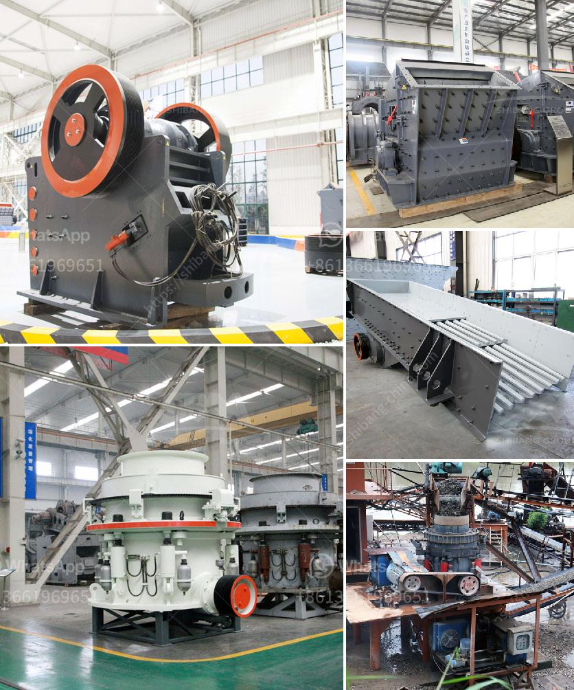

<h3>How to build a 600TPH mobile cone crusher?</h3>
Mobile cone crushers are widely used in the mining industry and recycle applications. Cone crushers are equipped with a hydraulic setting adjustment system that allows the adjustment of the crusher settings to match the material size, capacity, and shape requirements. One of the crucial factors to consider when designing a mobile cone crusher is the production capacity.

Building a 600TPH mobile cone crusher involves multiple steps and various considerations. Here is a step-by-step guide on how to build a 600TPH mobile cone crusher:

1. Determine the specifications: The first step is to determine the specifications of the mobile cone crusher. This includes the required capacity, discharge setting, feed size, and the type of material being crushed. These specifications will serve as a basis for the entire design process.

2. Select the suitable type of cone crusher: There are various types of cone crushers available, including hydraulic cone crushers, spring cone crushers, and multi-cylinder cone crushers. The suitable type of cone crusher should be selected based on the specific requirements of the project. Factors such as the hardness of the material, feed size, and desired particle size should be considered during this selection process.

3. Design the overall structure: The next step is to design the overall structure of the mobile cone crusher. This includes determining the appropriate size and shape of the chassis, the positioning of the cone crusher, and the arrangement of the feeding and discharging systems. The design should ensure optimal efficiency and accessibility for maintenance.

4. Select the appropriate components: Once the structure is designed, the next step is to select the appropriate components for the mobile cone crusher. This includes components such as the motor, hydraulic system, control panel, belts, and conveyors. The selected components should be reliable, high-quality, and suitable for the specific requirements of the project.

5. Assembly and testing: With the components selected, the next step is to assemble the mobile cone crusher. This involves connecting and integrating all the different components to form a complete and functional unit. Once assembled, the unit should undergo thorough testing to ensure it functions properly and meets the required specifications.

6. Fine-tune and optimize: After assembly and testing, the mobile cone crusher should be fine-tuned and optimized. This involves adjusting the settings, such as the crusher's speed and eccentric throw, to achieve the desired capacity, particle size, and shape. Fine-tuning may also involve adjusting the feeding and discharging systems to ensure optimal performance.

7. Final inspection and delivery: Lastly, the mobile cone crusher should undergo a final inspection to ensure all components are properly installed and functioning. Once the final inspection is completed, the mobile cone crusher can be delivered to the respective site for operation.

Building a 600TPH mobile cone crusher requires attention to detail, extensive planning, and expertise in the field of crushing technology. By following a step-by-step process, it is possible to build a mobile cone crusher that efficiently meets the required specifications and provides reliable performance. Proper maintenance and regular inspections should also be carried out to ensure the longevity and optimal performance of the mobile cone crusher.
<h3>Contact us</h3><ul><li><strong>Whatsapp:&nbsp;<a href="https://wa.me/8613661969651">+8613661969651</a></strong></li><li><a href="https://swt.shibang-china.com/?git&amp;zhl&amp;How to build a 600TPH mobile cone crusher"><strong>Online Service(chat now)</strong></a></li></ul><h3>Related</h3><ul><li><a href='How does investing in a cone crusher benefit.md'>How does investing in a cone crusher benefit?</a></li><li><a href='How to change the HP cone crusher mantle.md'>How to change the HP cone crusher mantle?</a></li><li><a href='How to cut costs for a quarry.md'>How to cut costs for a quarry?</a></li><li><a href='how to maintainance stone cone crusher.md'>how to maintainance stone cone crusher?</a></li><li><a href='How to adjust the eccentric spindle of a cone crusher.md'>How to adjust the eccentric spindle of a cone crusher?</a></li></ul>