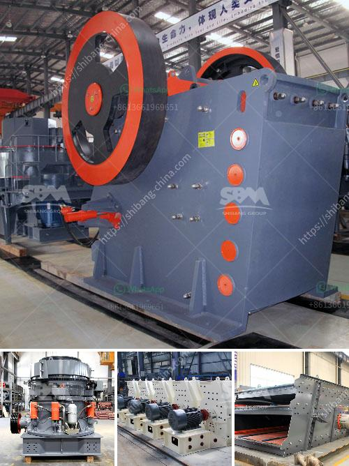

<h3>How to build a ball mill?</h3>
Ball mills are a fundamental part of many industrial processes, especially in the mining industry. As such, they can be subjected to a lot of wear and tear. If not properly maintained, they can lead to very costly repairs. However, looking at how a ball mill works, it is important to note that the lining inside the mill plays a vital role in ensuring its proper functioning. Therefore, it is essential to build a ball mill with the best possible materials to ensure its long-term operation.

When building a ball mill, it is important to choose the right materials for the mill's interior and exterior. Materials such as rubber, steel, and ceramic are essential to the grinding process to ensure the best possible results. It is also important to think about the purpose of the ball mill, whether it will perform a batch or continuous grinding function.

1. Obtain the necessary materials. Consist of a motor, pulleys, belts, bearings, grinding balls, containers, and the necessary tools.

2. Design the ball mill. Decide on the dimensions and specifications of the mill, considering the desired grinding capacity and selecting suitable materials.

3. Prepare the base. The base of the ball mill should be solid and strong, preferably concrete. The concrete base anchors the mill and ensures its stability while grinding.

4. Assemble the mill. Attach the motor to the base using belts and pulleys, and mount the mill container on top.

5. Install the grinding media. Depending on the desired size and material to be ground, choose the appropriate grinding balls. These balls should be homogeneous in size and weight to ensure effective grinding.

6. Run a test. Before introducing the material to be ground, run a test with an empty mill to check for any potential issues or defects.

7. Load the material. Add the material to be ground into the mill container. It is essential to fill the mill container to an appropriate level to ensure efficient grinding.

8. Start grinding. Switch on the motor and let the mill run for the desired duration. Keep an eye on the mill's performance and check for any signs of wear or damage.

9. Clean and maintain. After each use, clean the ball mill thoroughly to remove any grinding residue. Regularly inspect the mill's components for signs of wear and replace any worn-out parts immediately.

Building a ball mill requires careful planning and attention to detail. By selecting the right materials and properly maintaining the mill, it can serve as a reliable and efficient tool for various grinding applications.
<h3>Contact us</h3><ul><li><strong>Whatsapp:&nbsp;<a href="https://wa.me/8613661969651">+8613661969651</a></strong></li><li><a href="https://swt.shibang-china.com/?git&amp;zhl&amp;How to build a ball mill"><strong>Online Service(chat now)</strong></a></li></ul><h3>Related</h3><ul><li><a href='How to select a site for aggregate quarry in kenya .md'>How to select a site for aggregate quarry in kenya ?</a></li><li><a href='how ores are classified .md'>how ores are classified ?</a></li><li><a href='how to load cone crusher .md'>how to load cone crusher ?</a></li><li><a href='How to wash clay out of bauxite.md'>How to wash clay out of bauxite?</a></li><li><a href='How to Build a Marble Mill ？.md'>How to Build a Marble Mill ？</a></li></ul>