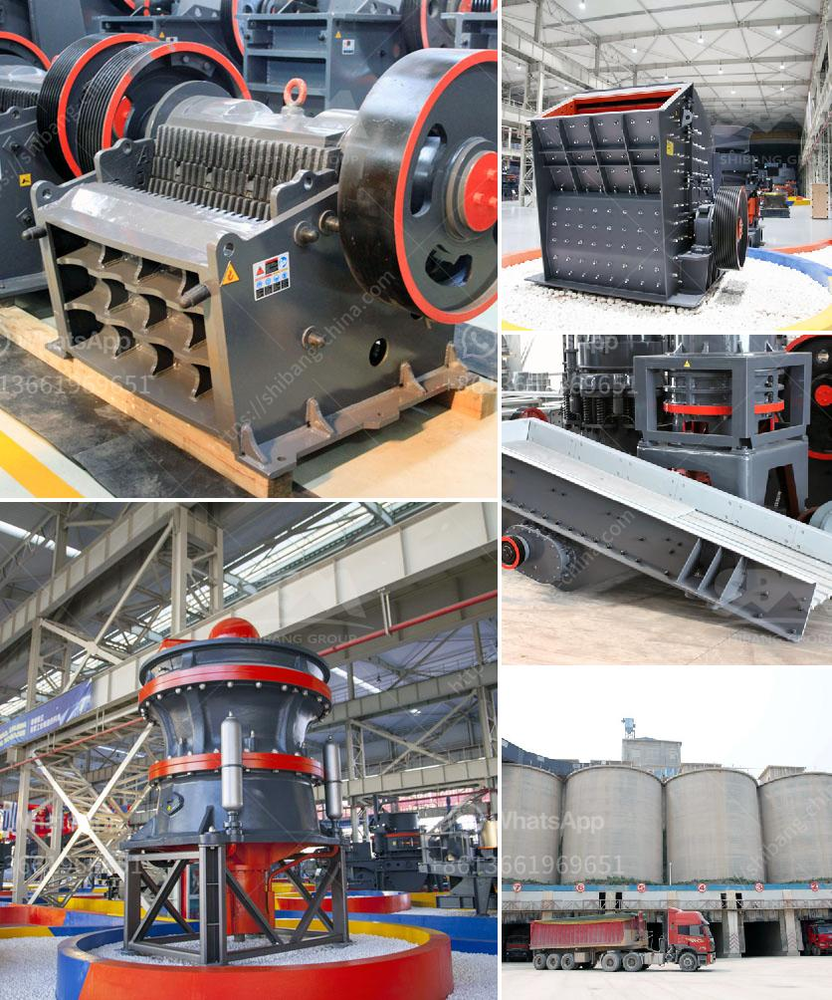

<h3>How to build a barrel type rock crusher ?</h3>
Rock crushers are an essential piece of equipment for many industries, including mining, construction, and demolition. However, finding a crusher that works for your specific needs can be challenging. If you have a barrel type rock crusher in mind, you're in luck! Building one is a feasible project that can save you money and provide a reliable crushing solution. This article will guide you through the process of building a barrel type rock crusher, step-by-step.

Before you start building your rock crusher, it's essential to have a clear plan. Determine the size and dimensions, taking into account the types of rocks you will be crushing. Consider safety precautions as well. Sketch your design on paper, listing all the necessary materials and tools you will need.

Once you have your design and plan, it's time to gather the required materials and tools. Here's a list of the essential items you'll need:

Start by cutting open one end of the metal barrel to create an opening through which rocks can be fed. Ensure that the opening is wide enough for the largest rocks you plan to crush. Attach metal plates around the opening to reinforce the barrel's structure. Weld or secure the plates tightly using bolts, nuts, and washers.

The crushers' crushing mechanism consists of metal rods or pipes positioned inside the barrel. These rods should span the length of the barrel and be evenly spaced throughout. Weld or secure them tightly to the barrel's walls using a welding machine or industrial adhesive. The crushing mechanism should be strong enough to withstand the force of rocks being crushed.

To ensure effective rock crushing, you need to install a solid and durable crushing surface. Metal plates with ridges or teeth work well for this purpose. Weld or secure these plates evenly along the inside walls of the barrel. Each plate should be spaced according to the size of the rocks you plan to crush. Make sure the plates are securely attached to prevent movement during operation.

Before using your newly constructed rock crusher, carefully inspect all welds and connections to ensure they are secure. Test the mechanism to ensure it is functioning correctly. If any adjustments or repairs need to be made, address them promptly. Finally, apply a protective coating to the entire structure to prevent rusting and ensure longevity.

Implementing these steps will help you build a barrel type rock crusher that meets your specific requirements. Remember to prioritize safety, take accurate measurements, and follow the proper welding procedures. Once completed, your rock crusher will be ready to crush rocks efficiently, saving you time and money in the long run.
<h3>Contact us</h3><ul><li><strong>Whatsapp:&nbsp;<a href="https://wa.me/8613661969651">+8613661969651</a></strong></li><li><a href="https://swt.shibang-china.com/?git&amp;zhl&amp;How to build a barrel type rock crusher "><strong>Online Service(chat now)</strong></a></li></ul><h3>Related</h3><ul><li><a href='How to replace the belt on the crushing machinery ？.md'>How to replace the belt on the crushing machinery ？</a></li><li><a href='How to choose the suitable jaw crusher model.md'>How to choose the suitable jaw crusher model?</a></li><li><a href='How to build a quartz crusher.md'>How to build a quartz crusher?</a></li><li><a href='How to improve the performance of a coal crusher.md'>How to improve the performance of a coal crusher?</a></li><li><a href='How to buy rock crusher in Sri Lanka .md'>How to buy rock crusher in Sri Lanka ?</a></li></ul>