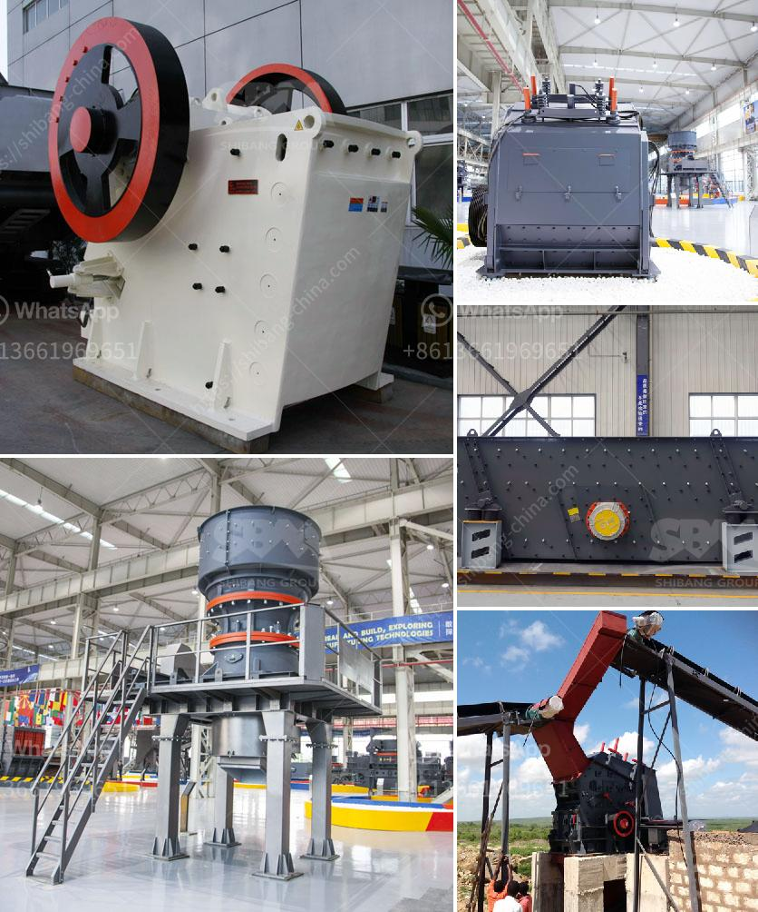

<h3>How to build a granite crushing plant？</h3>
Granite is a hard rock with a saturated uniaxial ultimate compressive strength greater than 30 MPa. For this type of rock, the crushing process is usually more complicated and requires a lot of equipment. A granite crushing plant can be a really profitable business but it is important for you to make the right choice when it comes to design of granite crushing plant.

You need to know everything about this business in order to make money and choosing the right design is extremely important. In this article, we will discuss how you should go about the design of granite crushing plant.

Before starting a granite crushing plant, you should have a good understanding of the geological conditions of your mine site. The geological survey determines the level of rock fragmentation in the quarry area. Therefore, preparing geological survey beforehand is crucial.

The crushing plant design largely depends on the feeding size and output requirements. These factors determine the type of crusher used and the rock screen made. Most crushing plants are built around closed-circuit configurations, with a screen and crusher combined on the same chassis.

The main factor limiting the crushing plant design is the production rate requirement. It is important to balance the need for a high production rate with the level of rock fragmentation. This will help in selecting the right crusher and screen combination for the project.

The main objective of any primary crusher is to reduce the size of the material being processed by crushing it into smaller pieces. This is achieved by feeding the rock into the crusher's chamber through a hopper, and the material is crushed between the eccentrically rotating crusher cone and the fixed outer concave.

Once the rock has been processed through the primary stage, it is ready to be sent through the secondary stage of the crushing process. The secondary crusher breaks down the rock into smaller pieces before being conveyed to the tertiary stage.

The tertiary crushers are used to further refine the shape of the final product. They are typically used to produce a fine product and can handle quarried materials, as well as recycled concrete and asphalt.

Building a granite crushing plant is not something you can do overnight, but with the right planning, patience, and hard work, it can be a lucrative business. While it is important to consider all aspects of the project from start to finish, one of the most critical factors will be the design of the crushing plant. By conducting a thorough geological survey, considering production rate requirements, and selecting the appropriate crushers, you can ensure the success of your granite crushing plant.
<h3>Contact us</h3><ul><li><strong>Whatsapp:&nbsp;<a href="https://wa.me/8613661969651">+8613661969651</a></strong></li><li><a href="https://swt.shibang-china.com/?git&amp;zhl&amp;How to build a granite crushing plant？"><strong>Online Service(chat now)</strong></a></li></ul><h3>Related</h3><ul><li><a href='How to choose a cone crusher equipment manufacturer .md'>How to choose a cone crusher equipment manufacturer ?</a></li><li><a href='How does investing in a cone crusher benefit.md'>How does investing in a cone crusher benefit?</a></li><li><a href='How to make talcum powder.md'>How to make talcum powder?</a></li><li><a href='How to maintain stone grinding machine？.md'>How to maintain stone grinding machine？</a></li><li><a href='How to Adjust a Cone Crusher ？.md'>How to Adjust a Cone Crusher ？</a></li></ul>