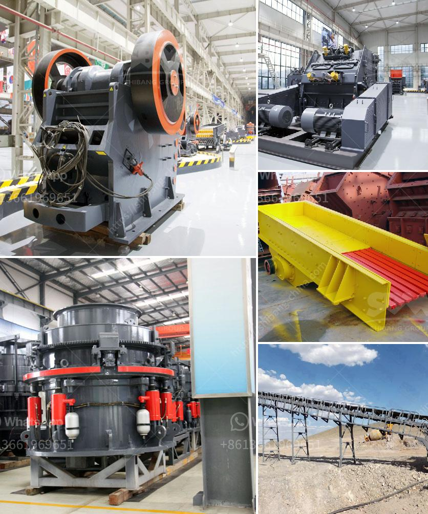

<h3>How to build a gravel crusher?</h3>
Crushing rock into gravel is an essential process in many industries such as construction, landscaping, and more. Gravel crushers are machines that are employed to break down larger rocks into smaller pieces. Creating a gravel crusher requires basic knowledge of electricity and welding skills, but with some effort and creativity, you can build your own gravel crusher from scratch.

1. Design your crusher: Before you start manufacturing, you need to design a plan that suits your needs. Sketch your ideas on paper and determine dimensions for the frame, base, movable jaw, and crushing mechanism. The design will vary depending on the size and complexity you want for your gravel crusher.

2. Gather materials and tools: Once you have the design, make a list of necessary materials and tools. You will need steel plates, metal rods, welding equipment, a power source, hammers, and chisels. A trip to your local hardware store should provide you with most of the materials needed for building your gravel crusher.

3. Build the frame: Using the steel plates, construct a sturdy frame to support the entire crusher. Weld the plates together to form the main body of the structure. Ensure that the frame is strong enough to withstand the crushing force and vibrations generated during the crushing process.

4. Add the crushing mechanism: Determine the best way to attach the movable jaw to the frame. You can use metal rods or chains to create the crushing mechanism. Weld the rods or chains to the frame and create hinges to allow the jaw to move up and down. Ensure the movement is smooth and secure by using sturdy welding techniques.

5. Add a handle or motor: Depending on the design, you can add a handle for manual operation or a motor for automated crushing. If you choose a motor, ensure that it provides enough power to crush the rocks effectively. Connect the motor to the crushing mechanism and test its efficiency before proceeding.

6. Test and adjust: After completing the construction, it's time to test the crusher. Load some rocks into the crusher and observe its crushing capacity. If necessary, make adjustments to the design or the crushing mechanism to optimize the crusher's performance.

7. Safety precautions: When building your gravel crusher, always prioritize safety. Wear protective gear such as gloves and goggles throughout the construction process. Ensure that the crusher is placed on a stable surface to prevent accidents or injuries.

Building a gravel crusher can be a fulfilling project that allows you to create a useful tool while enhancing your skills. The process requires patience, precision, and a basic understanding of mechanical principles. With the right materials and tools, anyone can build their own gravel crusher and contribute to various industries that rely on crushed rock materials. Remember to be cautious and seek professional advice if needed to ensure the crusher operates safely and efficiently.
<h3>Contact us</h3><ul><li><strong>Whatsapp:&nbsp;<a href="https://wa.me/8613661969651">+8613661969651</a></strong></li><li><a href="https://swt.shibang-china.com/?git&amp;zhl&amp;How to build a gravel crusher"><strong>Online Service(chat now)</strong></a></li></ul><h3>Related</h3><ul><li><a href='How to build iron ore crushing line in Malaysia .md'>How to build iron ore crushing line in Malaysia ?</a></li><li><a href='How can we reduce the amount of fines generated from a coal double roll crusher.md'>How can we reduce the amount of fines generated from a coal double roll crusher?</a></li><li><a href='How does a line ball mill working.md'>How does a line ball mill working?</a></li><li><a href='How to choose a supplier of stone crushers.md'>How to choose a supplier of stone crushers?</a></li><li><a href='how to run an impact jaw crusher.md'>how to run an impact jaw crusher?</a></li></ul>