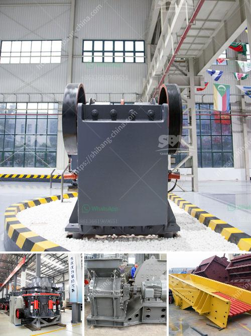

<h3>How to build a manganese ore concentrator? What crushing machinery do you need?</h3>
Manganese ore is an important raw material for the manufacturing sector, especially in the production of steel. Therefore, building a manganese ore concentrator plays a vital role in ensuring a steady supply of this essential mineral. In this article, we will discuss the process of building a manganese ore concentrator and the crushing machinery required for the operation.

The first step in building a manganese ore concentrator is to locate a suitable site. The site should have access to water, electricity, and transportation. It should also be close to the manganese ore deposits to minimize transportation costs. Once a site is selected, the necessary permits and licenses must be obtained from the local authorities.

The next step is to design the concentrator. The concentrator is a facility that processes the raw manganese ore to extract the desired concentrate. The design of the concentrator will depend on various factors, including the size of the deposit, the ore grade, and the market requirements.

The primary machinery required for a manganese ore concentrator is the crushing machinery. The ore needs to be crushed into smaller pieces to facilitate further processing. The crushing machinery required will depend on the initial size of the ore and the desired final product size.

One commonly used crushing machinery for manganese ore is a jaw crusher. A jaw crusher is a heavy-duty machine that compresses the ore between a fixed jaw and a moving jaw. The moving jaw is mounted on an eccentric shaft that generates a reciprocating motion, crushing the ore against the fixed jaw.

Another crushing machinery option is a cone crusher. A cone crusher works by squeezing the ore between an eccentrically gyrating cone and a stationary outer crushing wall. The ore is crushed by the compression and bending forces exerted by the cone.

In addition to jaw and cone crushers, impact crushers can also be used for crushing manganese ore. An impact crusher uses the principle of impact to crush the ore. The ore is fed into a chamber where it is struck by hammers attached to a rotor. The crushed ore then exits through an adjustable gap between the rotor and the impact wall.

It is worth mentioning that the choice of crushing machinery should consider factors such as the hardness and abrasiveness of the ore, the desired final product size, and the overall production capacity of the concentrator.

Once the ore is crushed, it can undergo further processing steps like screening, grinding, and magnetic separation to produce the desired manganese concentrate.

In conclusion, building a manganese ore concentrator requires careful planning and the selection of suitable crushing machinery. The choice of machinery depends on various factors such as the size of the deposit, the ore grade, and the market requirements. The primary crushing machinery options include jaw crushers, cone crushers, and impact crushers. The right combination of machinery and processes will result in a successful manganese ore concentrator capable of supplying the required concentrate for steel production.
<h3>Contact us</h3><ul><li><strong>Whatsapp:&nbsp;<a href="https://wa.me/8613661969651">+8613661969651</a></strong></li><li><a href="https://swt.shibang-china.com/?git&amp;zhl&amp;How to build a manganese ore concentrator What crushing machinery do you need"><strong>Online Service(chat now)</strong></a></li></ul><h3>Related</h3><ul><li><a href='how do you process of gold in south africa.md'>how do you process of gold in south africa</a></li><li><a href='How to establish a powdered calcium carbonate plant .md'>How to establish a powdered calcium carbonate plant ?</a></li><li><a href='How to use the impact crusher ？.md'>How to use the impact crusher ？</a></li><li><a href='How to build your own shaker wash plant.md'>How to build your own shaker wash plant?</a></li><li><a href='How to develope stone quarry .md'>How to develope stone quarry ?</a></li></ul>