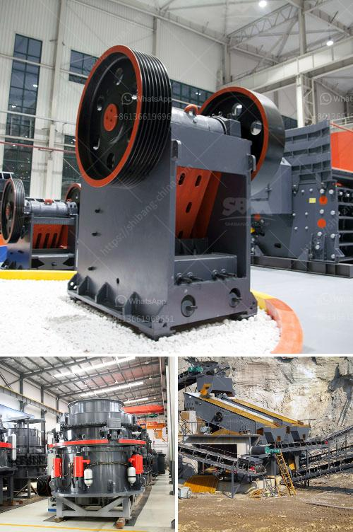

<h3>How to build a quartz crusher?</h3>
Quartz is a mineral that is commonly found in many rocks. It is classified as a form of silica and is known for its hardness. The process of crushing quartz to extract its values is a common practice for prospectors and hobbyists alike. Whether you're just starting out or already have experience in mining, building your own quartz crusher can be a great way to save costs and ensure the quality of the material you are using.

2. Choose the appropriate size: Consider the intended use of your quartz crusher to determine the size you need. If you plan to crush large quantities of quartz, a larger mortar and pestle will be necessary. However, if you only need small amounts for your project, a smaller size may suffice.

3. Build the base: Start by securing the metal plate or sheet to the base. This will provide stability and ensure that the crusher remains in place during operation. Use bolts, washers, and nuts to fasten the plate securely.

4. Construct the pestle: Take a solid metal cylinder, either purchased or crafted, to serve as the mortar. Attach a handle to the top of the cylinder using an adhesive or by welding. Wood or metal can both be used for the handle, depending on personal preference. Make sure the handle is securely attached to the cylinder.

5. Test the crusher: Once the base and pestle are constructed, test the crusher to ensure everything is in working order. Place a few quartz rocks inside the mortar and use the pestle to crush them. If the process is smooth and the rocks are crushed to the desired consistency, your quartz crusher is ready for use.

6. Crushing quartz: When using the crusher, apply pressure to the handle while rotating the pestle in a circular motion. This will crush the quartz rocks into smaller particles. Be careful not to apply too much force, as it may cause the rocks to fly out of the mortar.

7. Collect the crushed quartz: After crushing the rocks, remove the crushed quartz from the mortar using a brush or scraper. The crushed quartz can be used in various projects, such as jewelry making, gardening, or even as decorative fill for landscaping.

Building your own quartz crusher can be a rewarding project that allows you to customize the size and quality of the crushed material. By following these steps and using the appropriate materials, you can create a durable and efficient crusher that will meet your needs. Always prioritize safety and wear protective equipment, such as gloves and goggles, when crushing quartz or working with any other rocks.
<h3>Contact us</h3><ul><li><strong>Whatsapp:&nbsp;<a href="https://wa.me/8613661969651">+8613661969651</a></strong></li><li><a href="https://swt.shibang-china.com/?git&amp;zhl&amp;How to build a quartz crusher"><strong>Online Service(chat now)</strong></a></li></ul><h3>Related</h3><ul><li><a href='How to make quartz powder grinding mill in Kenya ？.md'>How to make quartz powder grinding mill in Kenya ？</a></li><li><a href='how to maintainance stone cone crusher.md'>how to maintainance stone cone crusher?</a></li><li><a href='How to crush limestone.md'>How to crush limestone?</a></li><li><a href='How to build a small crusher production line ？.md'>How to build a small crusher production line ？</a></li><li><a href='How to build a quartz crusher.md'>How to build a quartz crusher?</a></li></ul>