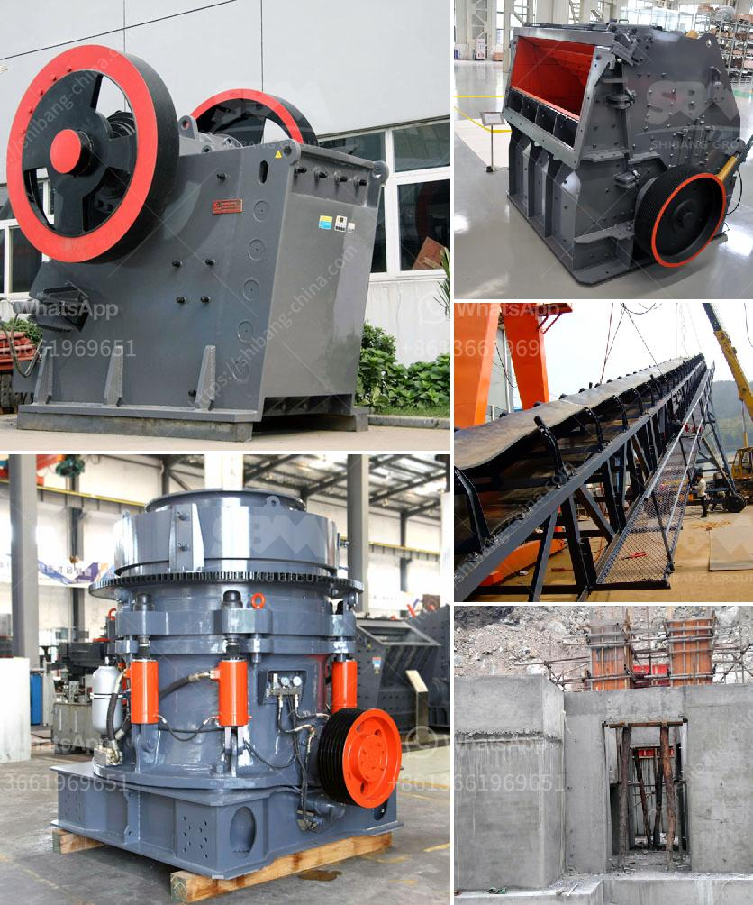

<h3>How to build a rock crusher for gold mining?</h3>
Gold mining is a lucrative endeavor that helps to enrich our economy and provide employment opportunities for those who are willing to take on the challenge. However, one of the key requirements in this line of business is the ability to extract gold from the rocks that are typically found deep within the earth. Building a rock crusher for gold mining is not an easy task, but it is something that anyone with a little knowledge and determination can do.

The first thing that you will need to have if you want to build a rock crusher for gold mining is a sturdy metal container. The idea behind the container is to trap the rock that you pulverize so that you can extract gold from it. This is done by crushing the rock into small pieces and then using a process called cyanidation to release the gold particles from the rock. This process is not only effective, but it is also environmentally friendly, as it does not require the use of toxic chemicals.

Once you have your metal container, the next step is to make a base for your rock crusher. This can be done by using thick lumber or even metal tubing. The idea is to create a solid foundation that will support the weight of the machine and ensure that it remains stable during the crushing process. You may also want to consider adding rubber feet to the bottom of the base to provide extra stability.

The next step in building a rock crusher for gold mining is to attach the jaw crusher to the motor. This can be done by placing the jaws of the crusher onto a flat surface and using a clamp or similar tool to hold them in place temporarily. Once the jaws are in place, you can use screws or similar fasteners to attach the motor to the crusher. Make sure that the motor is securely attached, as this is what will provide the power needed to crush the rocks.

After the jaw crusher is securely attached to the motor, the final step is to attach the pulley system and belts. This will provide the necessary rotational force to power the crusher and crush the rocks. Make sure that the belts are tight and properly aligned to avoid any slipping or loss of power.

With all of the components in place, you are now ready to test your rock crusher for gold mining. It is advisable to start with a small amount of rocks first to ensure that everything is working properly. Gradually increase the amount of rocks as you become more confident in the performance of your machine.

Building a rock crusher for gold mining may seem like a daunting task, but it is actually quite manageable if you have the right tools and knowledge. With a little determination and patience, you can turn your rocks into a valuable resource and make a significant contribution to the gold mining industry.
<h3>Contact us</h3><ul><li><strong>Whatsapp:&nbsp;<a href="https://wa.me/8613661969651">+8613661969651</a></strong></li><li><a href="https://swt.shibang-china.com/?git&amp;zhl&amp;How to build a rock crusher for gold mining"><strong>Online Service(chat now)</strong></a></li></ul><h3>Related</h3><ul><li><a href='How to calculate the cemnet grinding aid requirement for cement .md'>How to calculate the cemnet grinding aid requirement for cement ?</a></li><li><a href='How to extract iron efficiently from silica.md'>How to extract iron efficiently from silica?</a></li><li><a href='How to adjust marble crushers.md'>How to adjust marble crushers?</a></li><li><a href='How to repair a crack in the trunnion of a ball mill.md'>How to repair a crack in the trunnion of a ball mill?</a></li><li><a href='How does a coal mill work.md'>How does a coal mill work?</a></li></ul>