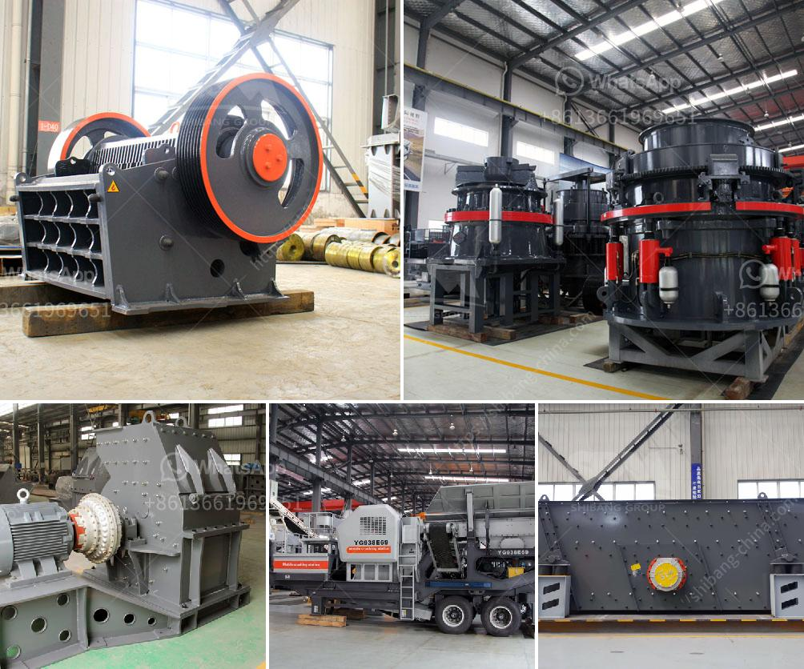

<h3>How to build a sand washing plant?</h3>
A sand washing plant is a facility designed to remove impurities such as dust, clay, and silt from sand and make it suitable for use in construction. It requires significant investment and expertise to set up and maintain a sand washing plant, but it can prove to be a profitable venture.

1. Site selection: The first step in setting up a sand washing plant is to identify a suitable location. It should have adequate space for the plant, stockpiles, and a settling pond if required. The site should also have access to water sources, such as rivers or wells, as water is an essential component in the washing process.

2. Permits and regulatory compliance: Before starting the construction, it is crucial to obtain all necessary permits and comply with the local regulations. This ensures that the operation does not harm the environment and meets all safety standards.

3. Plant design and layout: Once the site is finalized, the design and layout of the sand washing plant need to be determined. This includes deciding on the type and size of equipment required, such as crushers, screens, sand washers, and conveyors. It is important to consult with experts or engineering firms specializing in mineral processing to ensure an efficient and cost-effective design.

4. Construction and installation: After the design is finalized, the construction and installation process can begin. It involves preparing the site, leveling the ground, pouring concrete foundations, and erecting the structures. Each piece of equipment must be installed and connected correctly to ensure smooth operation.

5. Water management system: Since water is integral to the sand washing process, a comprehensive water management system is essential. This includes water tanks, settling ponds, sludge thickening tanks, and recycling systems. The aim is to minimize water usage and maintain the highest possible clarity for recycling.

6. Electrical and automation systems: Proper electrical and automation systems are necessary for smooth plant operation. It involves the installation of power panels, wiring, switches, and control systems. Automation allows for remote monitoring and control of the plant, improving efficiency and reducing the manual workload.

7. Testing and commissioning: Once the plant is constructed and all systems are installed, thorough testing and commissioning must be carried out to ensure that everything is functioning correctly. This includes checking for any leaks, calibrating equipment, and adjusting parameters to achieve the desired sand quality.

8. Operation and maintenance: After successful testing and commissioning, the sand washing plant can start operations. Regular maintenance is crucial to keep the plant running efficiently and extend its lifespan. This includes cleaning, lubricating, inspecting, and replacing worn-out parts.

Building a sand washing plant requires careful planning, sufficient investment, and expert knowledge. However, when properly set up and maintained, it can prove to be a profitable endeavor. By following the steps mentioned above, one can ensure the construction of a sand washing plant that meets the required specifications and produces high-quality sand for various construction applications.
<h3>Contact us</h3><ul><li><strong>Whatsapp:&nbsp;<a href="https://wa.me/8613661969651">+8613661969651</a></strong></li><li><a href="https://swt.shibang-china.com/?git&amp;zhl&amp;How to build a sand washing plant"><strong>Online Service(chat now)</strong></a></li></ul><h3>Related</h3><ul><li><a href='how to realize the feeding control of raymond mill .md'>how to realize the feeding control of raymond mill ?</a></li><li><a href='How to choose the best mining equipment.md'>How to choose the best mining equipment?</a></li><li><a href='How to Start a South African Manganese Ore Processing Plant ？.md'>How to Start a South African Manganese Ore Processing Plant ？</a></li><li><a href='How to do the maintenance of crushing screening plant.md'>How to do the maintenance of crushing screening plant?</a></li><li><a href='How does a sand washing machine work.md'>How does a sand washing machine work?</a></li></ul>