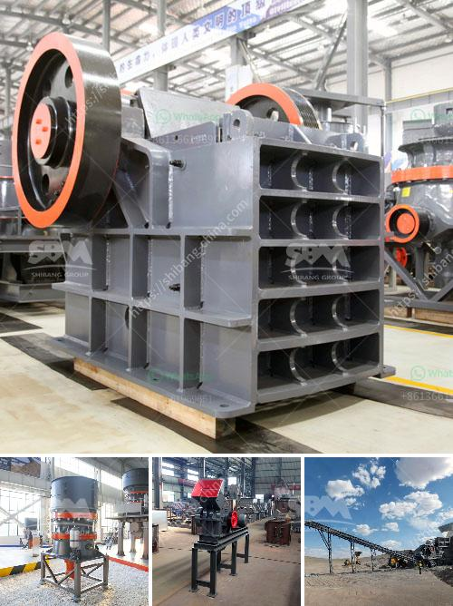

<h3>How to build a small crusher production line ？</h3>
A small crusher production line is an important asset for any business. With the rapid growth of various industries, it is essential to invest in a crusher production line that meets the demands of your business. Building a small crusher production line can be a challenging task, but with the right knowledge and tools, it can be done efficiently and effectively. In this article, we will discuss the steps to build a small crusher production line.

1. Determine your production requirements: Before starting the construction of a crusher production line, it is crucial to determine your specific production requirements. Consider the type of material you will be processing, the desired output size, and the production capacity needed. This will help you choose the right size and type of crusher for your line.

2. Select an appropriate location: The location of your crusher production line plays a significant role in its success. Ensure that the location is easily accessible for transportation of materials and equipment. Also, consider environmental factors such as noise and dust emissions. It is advisable to choose a location away from residential areas to minimize any disturbances.

3. Acquire the necessary equipment: Once you have determined your production requirements and selected a location, it is time to acquire the necessary equipment. This may include crushers, conveyors, vibrating screens, and other auxiliary equipment. It is important to choose high-quality, reliable equipment that meets your specific needs.

4. Design the layout: Designing a proper layout for your crusher production line is crucial for efficient operation. Consider factors such as material flow, accessibility for maintenance, and safety. Consult with experts or use software tools to create a detailed layout plan.

5. Install and connect equipment: Once you have the necessary equipment and a layout plan, it is time to install and connect the equipment. Ensure that the installation is done according to the manufacturer's guidelines and safety regulations. Properly connect and calibrate all the equipment to ensure smooth operation.

6. Test and adjust: Before starting full-scale production, it is important to test and adjust the crusher production line. Conduct trial runs to identify any issues or inefficiencies. Fine-tune the equipment settings and processes to optimize the performance of your line.

7. Train your staff: Building a crusher production line also involves training your staff. Ensure that your employees are well-trained on the operation and maintenance of the equipment. Provide them with the necessary safety training to prevent accidents and injuries.

8. Monitor and optimize: Once your small crusher production line is up and running, it is important to continuously monitor and optimize its performance. Regularly inspect the equipment, check the production rate, and identify any bottlenecks or maintenance needs. Make necessary adjustments and improvements to maximize efficiency and productivity.

Building a small crusher production line requires careful planning, investment, and execution. By following the steps mentioned above, you can successfully build and operate a crusher production line that meets the demands of your business. Remember to prioritize safety, quality, and continuous improvement in your production processes.
<h3>Contact us</h3><ul><li><strong>Whatsapp:&nbsp;<a href="https://wa.me/8613661969651">+8613661969651</a></strong></li><li><a href="https://swt.shibang-china.com/?git&amp;zhl&amp;How to build a small crusher production line ？"><strong>Online Service(chat now)</strong></a></li></ul><h3>Related</h3><ul><li><a href='How to install tunnel feeders in a crushing plant.md'>How to install tunnel feeders in a crushing plant?</a></li><li><a href='how to build stone crushing machine .md'>how to build stone crushing machine ?</a></li><li><a href='how to grinder calcium carbonate stone crusher machine.md'>how to grinder calcium carbonate stone crusher machine?</a></li><li><a href='how to install a crusher in a quarry ？.md'>how to install a crusher in a quarry ？</a></li><li><a href='how is aluminium made from its ore .md'>how is aluminium made from its ore ?</a></li></ul>