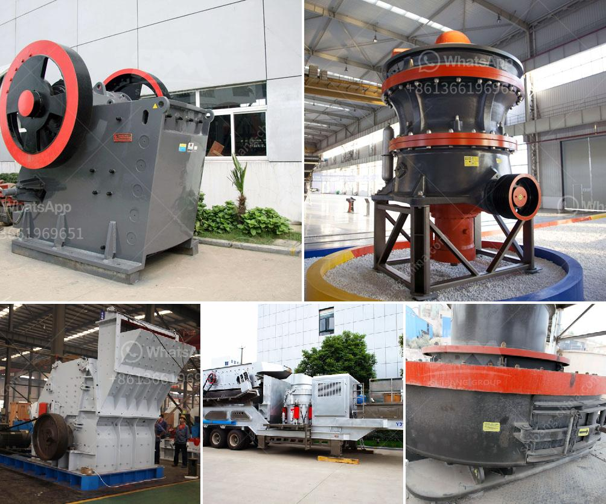

<h3>How to build a small limestone mill production line？</h3>
Limestone is a common non-metallic mineral and a valuable resource with a wide range of applications. In recent years, the demand for limestone powder has been increasing, which has led to the development of limestone milling industry. Building a small limestone mill production line is a wise investment choice for those who want to have a steady income.

Choosing the right location to build your limestone mill production line is crucial. Look for a place with abundant limestone resources and convenient transportation. It is also essential to ensure a stable power supply and sufficient water source for the smooth operation of the production line.

Limestone needs to be crushed into small particles before being processed into powder. A primary crusher, such as a jaw crusher or impact crusher, can be used for this purpose. The crusher should have a large crushing ratio and high production efficiency to maximize the output of limestone.

After crushing, the limestone needs to go through a grinding process to become limestone powder. A small limestone mill, such as a Raymond mill or high-pressure grinding mill, can be used for this stage. These mills have a higher grinding efficiency and lower energy consumption compared to traditional mills.

The crushed and ground limestone powder needs to be classified to obtain the desired particle size distribution. A powder classifier, such as a powder concentrator or a cyclone collector, can be used for this purpose. It separates the powdered limestone into different sizes, ensuring the consistency of the final product.

The final step in building a small limestone mill production line is packaging the limestone powder for sale. An automatic packaging machine can be used to pack the powder in bags of a specified weight. It is essential to choose a packaging machine with high precision and efficiency to minimize errors and improve productivity.

When building a limestone mill production line, safety should always be a priority. Proper ventilation and dust removal facilities should be in place to prevent the accumulation of dust, which can be harmful to workers' health. It is also crucial to equip the production line with fire prevention and explosion-proof equipment to minimize the risk of accidents.

In conclusion, building a small limestone mill production line requires careful planning and consideration. Proper site selection, efficient crushing and grinding equipment, powder classification, and packaging machines are key elements to ensure the success of the production line. Additionally, implementing safety measures is of utmost importance to protect workers and prevent accidents. With these guidelines in mind, anyone can successfully build and operate a small limestone mill production line.
<h3>Contact us</h3><ul><li><strong>Whatsapp:&nbsp;<a href="https://wa.me/8613661969651">+8613661969651</a></strong></li><li><a href="https://swt.shibang-china.com/?git&amp;zhl&amp;How to build a small limestone mill production line？"><strong>Online Service(chat now)</strong></a></li></ul><h3>Related</h3><ul><li><a href='How to install impact crusher .md'>How to install impact crusher ?</a></li><li><a href='How to set up a quarry plant in India.md'>How to set up a quarry plant in India?</a></li><li><a href='How to Start a Quarry Crushing Plant in Nigeria Need those crushing machines.md'>How to Start a Quarry Crushing Plant in Nigeria? Need those crushing machines?</a></li><li><a href='how to rebuild cone crusher .md'>how to rebuild cone crusher ?</a></li><li><a href='how to choose a crushing machine .md'>how to choose a crushing machine ?</a></li></ul>