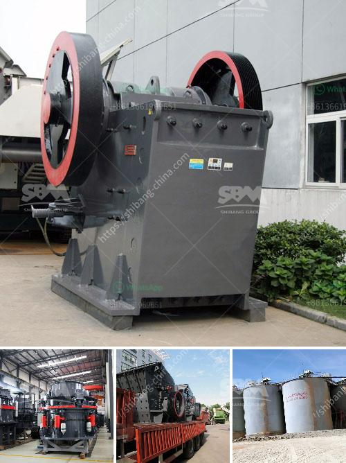

<h3>How to build a small rock crusher?</h3>
Building a small rock crusher is an essential piece of equipment for many professionals and contractors alike, particularly those who undertake construction projects. However, as an individual, you can also benefit from building your own rock crusher at home to perform various tasks around your property. By following a few simple steps, you can build a small rock crusher that will serve your needs and save you time and money.

The first step in building a rock crusher is gathering the necessary materials. This includes a metal container such as a tin can or a 5-gallon bucket, an old hammerhead or piece of steel, a 2-inch thick piece of lumber, and some screws. You will also need a drill, a saw, a welding machine, and some safety equipment such as gloves and goggles.

Next, determine the size of the rock crusher you want to build. Consider what type of rocks you will be crushing, as well as the desired output size. This will help you determine the appropriate size and design of your rock crusher.

Start by attaching the metal container to the base of the wooden board. Use screws to secure it in place. Ensure that the container is securely fixed and stable.

Next, take the piece of steel or hammerhead and attach it to the metal container using screws or welding. Make sure it is centered and securely attached. This piece will act as the crushing surface for the rocks.

Now, using a drill, make holes in the wooden board for the axles to pass through. These holes will allow the axles to rotate freely and provide the necessary movement to crush the rocks. Place the axles through the drilled holes and secure them in place using nuts and bolts.

To power your rock crusher, you will need a source of power. This can be an electric motor or a diesel engine. Depending on your preference and availability, choose the most suitable option. Attach the motor or engine to the wooden board and connect it to the crushing surface using a belt or chain.

Before using your rock crusher, ensure that all the connections and components are securely fastened. Test the crusher by placing rocks of various sizes inside and operating the machine. If everything is functioning as expected, start feeding rocks into the crusher using a shovel or other suitable tool.

As the rocks enter the crusher, they will be crushed and broken into smaller pieces. The crushed rocks can be used for various purposes, such as landscaping, road base, or construction projects.

Building your own rock crusher can be a rewarding and cost-effective endeavor. With a little bit of planning and some basic tools, you can create a machine that will serve you for years to come. Not only will it save you money, but it will also provide you with a sense of satisfaction and accomplishment knowing that you built it yourself. So, why not give it a try and build your own rock crusher today?
<h3>Contact us</h3><ul><li><strong>Whatsapp:&nbsp;<a href="https://wa.me/8613661969651">+8613661969651</a></strong></li><li><a href="https://swt.shibang-china.com/?git&amp;zhl&amp;How to build a small rock crusher"><strong>Online Service(chat now)</strong></a></li></ul><h3>Related</h3><ul><li><a href='How much does it cost to hire a mini stone crusher.md'>How much does it cost to hire a mini stone crusher?</a></li><li><a href='How to fit water pipes on vibrating screen in sand washing plant.md'>How to fit water pipes on vibrating screen in sand washing plant?</a></li><li><a href='How to crush calcite lumps.md'>How to crush calcite lumps?</a></li><li><a href='How to start stone crushing business in Ghana .md'>How to start stone crushing business in Ghana ?</a></li><li><a href='How to separate gold ore from rock.md'>How to separate gold ore from rock?</a></li></ul>