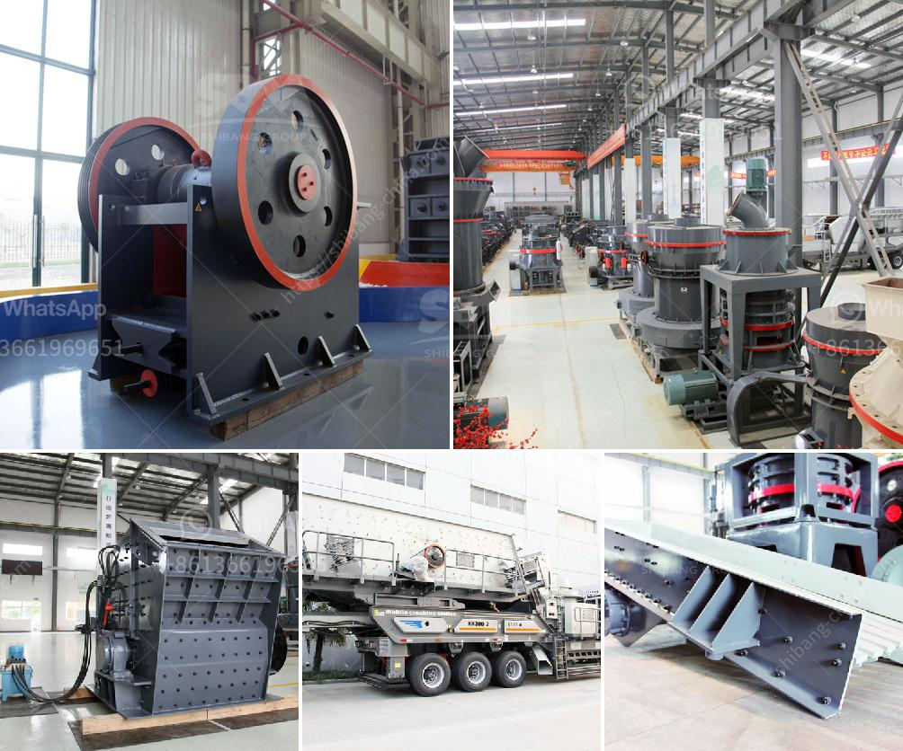

<h3>How to build crushing plant foundation ?</h3>
Building a solid foundation is essential for any construction project, including setting up a crushing plant. The foundation determines the stability and longevity of the plant, ensuring its efficient operation for years to come. By following a few simple steps, you can ensure that your crushing plant foundation is well-built and capable of withstanding the demanding conditions of the crushing process.

1. Seek expert advice: Before attempting to build a crushing plant foundation, it is essential to consult with experienced professionals or engineers. Their expertise will help you understand the specific requirements and potential challenges associated with your project, ensuring that you make informed decisions right from the start.

2. Assess the ground conditions: Understanding the soil composition and determining its load-bearing capacity is crucial for designing a robust foundation. Conduct a geotechnical investigation to identify potential issues such as soft spots, groundwater, or unstable soil that may compromise the stability of your foundation. This investigation will help you choose the appropriate foundation type that suits your project's needs.

3. Select an appropriate foundation type: Based on the ground conditions and the weight of the crushing plant, you can choose from different types of foundations, including isolated footing, strip footing, or mat footing. Each type has its advantages and is suitable for different situations. Consider factors such as load distribution, stability, and cost efficiency while selecting the foundation type that best suits your needs.

4. Ensure proper drainage: Adequate drainage is essential to prevent water accumulation around the foundation, which can lead to soil erosion and instability. Evaluate the site's topography and install proper drainage systems to redirect water away from the foundation. This will help maintain the structural integrity of the foundation and reduce the risk of long-term damage.

5. Use quality materials: Select high-quality materials for constructing the foundation, such as concrete or reinforced concrete, depending on the load-bearing requirements of your crushing plant. Ensure that all materials meet the necessary specifications and standards to guarantee durability and strength over time.

6. Employ skilled labor: Building a solid foundation requires skilled labor to ensure that the construction is carried out accurately and precisely. Make sure to hire experienced contractors who have prior expertise in constructing foundations for similar projects. This will help avoid costly mistakes and ensure a strong and stable foundation for your crushing plant.

7. Periodic inspection and maintenance: After completing the foundation construction, it is essential to regularly inspect it for any signs of damage or instability. Conducting routine inspections and maintenance will help identify and address any issues early on, preventing further damage and ensuring the long-term viability of your crushing plant.

Building a crushing plant foundation is a critical step in the construction process. By seeking expert advice, assessing ground conditions, selecting an appropriate foundation type, ensuring proper drainage, using quality materials, employing skilled labor, and conducting regular inspections, you can ensure a strong and long-lasting foundation for your crushing plant. Investing time and effort in constructing a solid foundation will pay off in terms of better plant performance, reduced downtime, and increased operational efficiency.
<h3>Contact us</h3><ul><li><strong>Whatsapp:&nbsp;<a href="https://wa.me/8613661969651">+8613661969651</a></strong></li><li><a href="https://swt.shibang-china.com/?git&amp;zhl&amp;How to build crushing plant foundation "><strong>Online Service(chat now)</strong></a></li></ul><h3>Related</h3><ul><li><a href='how much power does a 50 tph crusher need ？.md'>how much power does a 50 tph crusher need ？</a></li><li><a href='How to install a stone crusher production line ？.md'>How to install a stone crusher production line ？</a></li><li><a href='how to limit excess fines in crushing .md'>how to limit excess fines in crushing ?</a></li><li><a href='How to maintain stone crushing plant.md'>How to maintain stone crushing plant?</a></li><li><a href='How to extract iron efficiently from silica.md'>How to extract iron efficiently from silica?</a></li></ul>