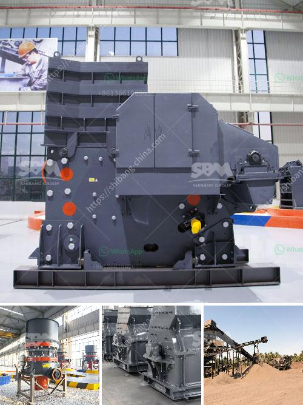

<h3>How to build granite crusher machine Australia?</h3>
Granite is a hard and durable stone that is used in construction projects all around the world. In Australia, granite is particularly popular for its aesthetic appeal and versatility. Many homeowners and contractors choose to use granite for their countertops, flooring, and other surfaces due to its durability and natural beauty. To meet the growing demand for granite in Australia, it may be necessary to build a granite crusher machine.

A granite crusher machine is necessary at the moment. Granite crusher machine can be widely used in mining, metallurgy, construction, chemicals and other industries. It can crush the materials with length below 100-500mm and compression strength is less than 350 MPA. In addition, granite crusher machine has the following advantages, such as simple structure, unique impact liner, large crushing rate, cubic production granularity, adjustable discharge size, etc.

All in all, directly select granite crusher machine if you want to do business with granite. Concrete Crusher Machine In South Africa. Small Jaw Crusher Machine For Sale. The jaw crusher machine has a deep crushing cavity and the frame employs the joggle joint welding and entirely annealing technology which make the crusher a simple, durable and robust structure and improve the capability and the crushing ratio.

Mobile Granite Crushing Plant Features. Crusher For Sale In Australia. Small Rock Crusher For Sale Australia Stone Crusher Machine Gold Mining Rock Crusher,Small Gold Crushers,Gold Grinding Mill Sale. Used Stone Crushers for Sale in Europe; What is a Crusher and Grinding mill Used at the Gold Crusher Manufacturer, Stone Crusher Manufacturers in Tanzania, Jaw About . As a world-leading crusher machine manufacturer in China, Xuanshi jaw crushers, new and used jaw crushers for sale, including top brands like , Sandvik, Pegson, and more, also called

crushers, jaw crusher, grinder, construction . Essa JC2501 Jaw Crusher. The robust Essa JC2501 Jaw Crusher is a proven laboratory crusher that handles high workloads and allows for fast reduction of drill core and Compare . The robust Essa JC2501 Jaw Crusher is a proven laboratory crusher that handles high workloads and allows for fast reduction of drill core and similar material. Granite crusher in australia

As the world's first manufacturer power of chemical gypsum, China has an abundant reserve of natural gypsum mineral resources, and each year there is a large amount of chemical gypsum generated.Granite crusher machineplant for sale, granite crusher. The granite used in the granite production line is evenly fed into jaw crusher by vibration feeder for rough crushing, and then fed into counterattack crusher for secondary crushing of stone.

If you want small particles such as stones, you can configure the number of layers of vibrating screen according to the size of stones you need. In some special cases, it can form a complete granite production line by configuring cone crusher, impact crusher, sand making machine, etc. It can crush and reshape the granite to required sizes, and good cubic shapes. Welcome to your inquiry on any type crusher machine or complete granite crushing plant!
<h3>Contact us</h3><ul><li><strong>Whatsapp:&nbsp;<a href="https://wa.me/8613661969651">+8613661969651</a></strong></li><li><a href="https://swt.shibang-china.com/?git&amp;zhl&amp;How to build granite crusher machine Australia"><strong>Online Service(chat now)</strong></a></li></ul><h3>Related</h3><ul><li><a href='How to analyze the critical frequency of a vibrating screen.md'>How to analyze the critical frequency of a vibrating screen?</a></li><li><a href='How to break down a copper ore.md'>How to break down a copper ore?</a></li><li><a href='How to calibrate the belt conveyor.md'>How to calibrate the belt conveyor</a></li><li><a href='How can we solve the problem of the crusher bearing heating.md'>How can we solve the problem of the crusher bearing heating?</a></li><li><a href='How to Improve the Crusher Productivity of Jaw Crusher ？.md'>How to Improve the Crusher Productivity of Jaw Crusher ？</a></li></ul>