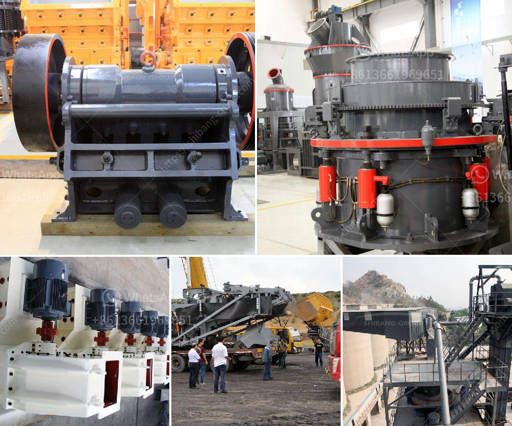

<h3>How to build iron ore crushing line in Malaysia ?</h3>
Malaysia is rich in iron ore resources and it is one of the top ten iron ore producers in the world. Malaysia has abundant iron ore resources and its iron ore reserves are estimated to be 1.5 billion tons, ranking among the top six countries in the world. Iron ore is an important raw material for the steel industry, and its crushing and processing are key links in the iron ore production line.

Building an iron ore crushing line in Malaysia requires careful planning, comprehensive feasibility studies, and scientific and technological support from various aspects. Here are some steps to help you build an efficient and cost-effective iron ore crushing line in Malaysia.

1. Site Selection: Choose a suitable site for the iron ore crushing line based on geological conditions, transportation convenience, and environmental factors. Consider factors such as land availability, topography, and proximity to raw material sources and transportation routes.

2. Feasibility Studies: Conduct comprehensive feasibility studies to evaluate the technical, economic, and environmental feasibility of the project. Assess the ore quality, mineral composition, and market demand for the crushed iron ore. Determine the scale of the crushing line and the required investment.

3. Equipment Selection: Select appropriate crushing equipment based on the characteristics of the iron ore and the production requirements. Commonly used equipment includes jaw crushers, cone crushers, impact crushers, and vibrating screens. Consider factors such as crushing capacity, particle size requirements, and energy consumption.

4. Process Design: Develop a rational and efficient process flow design for the iron ore crushing line. Determine the number and sequence of the crushing equipment, as well as the required size reduction ratio and capacity. Consider factors such as the nature of the ore, the hardness, and the final product requirements.

5. Infrastructure Construction: Build the necessary infrastructure for the iron ore crushing line, including the foundation, buildings, roads, and electrical facilities. Ensure that the infrastructure meets the safety and operational requirements.

6. Installation and Commissioning: Install and commission the crushing equipment in accordance with the design and technical specifications. Conduct performance tests and ensure that the equipment operates smoothly and meets the production requirements.

7. Operation and Maintenance: Develop a comprehensive operation and maintenance plan for the iron ore crushing line. Train operators and maintenance personnel on equipment operation and maintenance procedures. Regularly inspect and maintain the equipment to ensure its normal operation.

8. Environmental Protection: Take measures to minimize environmental impacts during the construction and operation of the iron ore crushing line. Implement dust control measures, install noise reduction devices, and properly handle waste materials to protect the environment and comply with relevant regulations.

Building an iron ore crushing line in Malaysia requires careful planning, advanced technology, and efficient operation. By following these steps and seeking professional guidance, you can successfully build an iron ore crushing line that meets the production requirements, maximizes efficiency, and minimizes costs. With the abundant iron ore resources in Malaysia, building a high-quality crushing line will not only promote local economic development but also contribute to the global iron and steel industry.
<h3>Contact us</h3><ul><li><strong>Whatsapp:&nbsp;<a href="https://wa.me/8613661969651">+8613661969651</a></strong></li><li><a href="https://swt.shibang-china.com/?git&amp;zhl&amp;How to build iron ore crushing line in Malaysia "><strong>Online Service(chat now)</strong></a></li></ul><h3>Related</h3><ul><li><a href='How to operate a coal crusher machine.md'>How to operate a coal crusher machine?</a></li><li><a href='how to intall a jaw crusher ？.md'>how to intall a jaw crusher ？</a></li><li><a href='How to crush calcite lumps.md'>How to crush calcite lumps?</a></li><li><a href='How to check the stone crusher and daily maintenance？.md'>How to check the stone crusher and daily maintenance？</a></li><li><a href='How to build a ball mill.md'>How to build a ball mill?</a></li></ul>