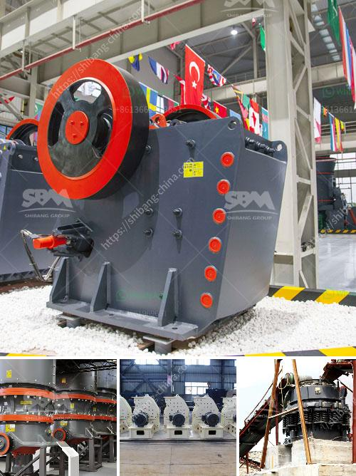

<h3>How to build sand and gravel wash plant?</h3>
Building a sand and gravel wash plant is an essential process to cleanse and separate natural debris and sedimentation from the quicksand. This intricate process requires thorough planning, knowledge of mechanical engineering, and continuous operational supervision. Below, we will delve into the step-by-step procedure to construct an efficient sand and gravel wash plant.

1. Site selection: The first step is to carefully choose the location for the wash plant. It should ideally be situated close to the source of sand and gravel to minimize transportation costs. The site should also have adequate space for the necessary equipment and allow for convenient access.

2. Equipment selection: Procure the necessary machinery and equipment based on the size and capacity requirements of the wash plant. Essential equipment includes a feeder, a spiral sand washer, a dewatering screen, and a hydrocyclone system. These components work together to remove impurities and achieve the desired level of cleanliness.

3. Constructing the feeder: Begin the construction of the wash plant by building the feeder, which transports the raw material (sand and gravel) from the source to the wash plant. The feeder should have a large capacity to handle a continuous flow of material effectively.

4. Assembling the spiral sand washer: The spiral sand washer is a critical component of the wash plant, as it removes debris and sediment from the sand. Assemble the sand washer according to the manufacturer's instructions, ensuring that all connections are secure and that water flow is properly directed to facilitate effective washing.

5. Installing the dewatering screen: The dewatering screen removes excess water from the washed sand, ensuring it meets the required specifications. Install the screen in a position where it can be easily accessed for maintenance and adjustments. Connect the necessary pipes to ensure proper drainage.

6. Setting up the hydrocyclone system: The hydrocyclone assists in separating the finer particles from the sand and gravel mixture. Follow the manufacturer's instructions to assemble and install the hydrocyclone system. Ensure that the connections are watertight and the flow rate is adjusted according to the desired level of sand cleaning.

7. Establishing a water supply: A consistent water supply is crucial for the wash plant's operation. Install piping, valves, and pumps to deliver the required amount of water to the wash plant. Consider using a recycle system to conserve water and minimize wastage.

8. Ensuring proper electrical connections: Safely and accurately connect the electrical components of the wash plant, including motors, control panels, and lighting. Employ certified electricians to carry out this task, adhering to all safety guidelines and local electrical codes.

9. Operational supervision: Creating an efficient sand and gravel wash plant requires constant monitoring and maintenance. Assign trained personnel to oversee operations and address any maintenance requirements promptly. Regularly inspect the machinery, check for leaks or blockages, and optimize the process to maximize efficiency.

In conclusion, building a sand and gravel wash plant involves careful planning, the use of appropriate equipment, and consistent operational supervision. Adhering to this step-by-step guide will result in an efficient wash plant that separates debris and sedimentation from sand and gravel, ensuring a high-quality and clean end product.
<h3>Contact us</h3><ul><li><strong>Whatsapp:&nbsp;<a href="https://wa.me/8613661969651">+8613661969651</a></strong></li><li><a href="https://swt.shibang-china.com/?git&amp;zhl&amp;How to build sand and gravel wash plant"><strong>Online Service(chat now)</strong></a></li></ul><h3>Related</h3><ul><li><a href='How to start stone crushing business in Ghana .md'>How to start stone crushing business in Ghana ?</a></li><li><a href='How to determine the value of a rock quarry.md'>How to determine the value of a rock quarry?</a></li><li><a href='How to adjust rotary kiln support rollers.md'>How to adjust rotary kiln support rollers?</a></li><li><a href='how to install stone crusher plant ？.md'>how to install stone crusher plant ？</a></li><li><a href='How to wash manufacturing sand .md'>How to wash manufacturing sand ?</a></li></ul>