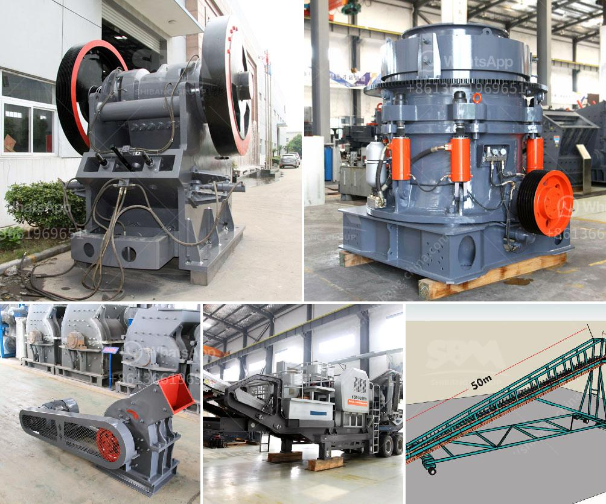

<h3>How to build your own shaker wash plant?</h3>
If you're an avid explorer, treasure seeker, or simply looking to engage in a fun and rewarding DIY project, building your own shaker wash plant can be a fulfilling endeavor. A shaker wash plant is a type of equipment used to extract gold particles from placer soils by rapidly shaking and separating materials. In this article, we will guide you through the process of building your own shaker wash plant.

1. Sturdy metal frame: Choose a lightweight yet durable metal frame that can withstand the vigorous shaking. Aluminum or steel frames are common choices.

2. Screen mesh: Depending on the size of gold particles you aim to extract, choose a screen mesh with appropriate openings. A 1/8-inch mesh size is ideal for capturing fine gold particles, while a ¼-inch mesh suits larger ones.

3. Feeding device: An effective feeding mechanism allows for consistent material flow into the shaker wash plant. Consider using a hopper or sluice chute for this purpose.

4. Water source: Ensure access to a reliable water source for washing the soil and sluicing the materials.

5. Gold recovery equipment: Equip your wash plant with appropriate gold recovery equipment, such as sluice boxes or concentrators, to efficiently capture the separated gold particles.

1. Frame Assembly: Begin by assembling the metal frame to provide structural support for the wash plant. Follow the manufacturer's instructions or use welding or nuts and bolts to securely join the frame components.

2. Screen Mounting: Attach the chosen screen mesh to the frame securely. Ensure that the screen is taut and evenly stretched across the frame to provide efficient separation.

3. Feeding Mechanism: Install the feeding mechanism to allow a consistent flow of soil into the wash plant. Connect the hopper or sluice chute securely to the frame, ensuring that the material throughput is controlled and uniform.

4. Water Supply: Design a system that delivers water evenly to the wash plant. This may involve setting up a water pump connected to a hose or using gravity-fed systems.

5. Gold Recovery Setup: Integrate the necessary gold recovery equipment, such as sluice boxes or concentrators, into the wash plant. Connect these devices correctly to enable the collection of separated gold particles effectively.

1. Excavate soil or placer deposits into the feeding mechanism, ensuring a consistent and controlled material flow.

3. Regularly inspect and clean the screen mesh to prevent clogging and maximize separation efficiency.

Building your own shaker wash plant presents an exciting opportunity to engage in a hands-on project while potentially uncovering valuable gold particles. By following the construction process outlined above and practicing regular maintenance, you'll be well on your way to enjoying the rewards of your own handmade shaker wash plant. Happy prospecting!
<h3>Contact us</h3><ul><li><strong>Whatsapp:&nbsp;<a href="https://wa.me/8613661969651">+8613661969651</a></strong></li><li><a href="https://swt.shibang-china.com/?git&amp;zhl&amp;How to build your own shaker wash plant"><strong>Online Service(chat now)</strong></a></li></ul><h3>Related</h3><ul><li><a href='How to maintain a coal crusher.md'>How to maintain a coal crusher?</a></li><li><a href='How does a coal mill work.md'>How does a coal mill work?</a></li><li><a href='How to control the dust of stone crusher .md'>How to control the dust of stone crusher ?</a></li><li><a href='How to maintenance coal mill.md'>How to maintenance coal mill?</a></li><li><a href='7 Tips on how to maintain an impact crusher.md'>7 Tips on how to maintain an impact crusher?</a></li></ul>