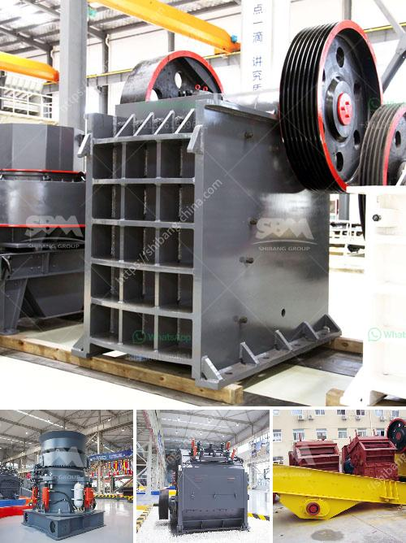

<h3>How to buy a cone crusher?</h3>
A cone crusher is an essential equipment in the mining and construction industry. It helps to break down larger rocks which can be further processed to extract valuable minerals. So, when it comes to purchasing a cone crusher, it is crucial to consider various factors to ensure you choose the right one for your needs. Below are some important tips on how to buy a cone crusher.

1. Determine your requirements: Before starting your search for a cone crusher, you need to identify your specific requirements. Consider factors such as the type of material you need to crush, the desired output size, and the production capacity you require. These parameters will help you determine the cone crusher that suits your needs best.

2. Research different models: Once you have identified your requirements, thoroughly research different cone crusher models available in the market. Take a look at their specifications, features, and performance to understand which models meet your requirements. It is also beneficial to read reviews and seek advice from industry professionals to gain insights into the performance and reliability of different models.

3. Consider the brand and reputation: Choosing a renowned and reputable brand is essential when buying a cone crusher. Well-established brands have a track record of producing high-quality and reliable equipment. They also provide excellent after-sales service, including spare parts availability and technical support. Research the brand's reputation to ensure you invest in a cone crusher that will serve you well for years to come.

4. Evaluate the technical specifications: Pay close attention to the technical specifications of the cone crusher you are considering. Look for details such as the feed opening size, crushing capacity, motor power, and discharge size range. These specifications will determine the crusher's performance and its ability to handle the specific materials and production requirements you have.

5. Assess safety features: Safety should be a top priority when purchasing any machinery, including cone crushers. Check if the model you are considering has essential safety features such as protective guards, emergency stop buttons, and advanced hydraulic systems to prevent damage in case of overload or foreign object ingress.

6. Compare prices and warranties: Compare the prices of different cone crusher models and consider the overall value they offer in relation to their features and specifications. However, it is important not to compromise on quality for the sake of cost. Additionally, check the warranty and support offered by the manufacturer to ensure you are covered in case of any defects or issues with the equipment.

7. Seek professional advice: If you are unsure about the technical aspects or which model to choose, it is recommended to seek advice from industry professionals or consulting firms. These experts can provide valuable guidance based on their experience and knowledge, helping you make an informed decision.

In conclusion, purchasing a cone crusher requires careful consideration of various factors. By determining your requirements, researching different models, evaluating technical specifications, considering safety features, comparing prices, and seeking professional advice, you can ensure that you invest in the right cone crusher that will meet your needs and provide long-term value.
<h3>Contact us</h3><ul><li><strong>Whatsapp:&nbsp;<a href="https://wa.me/8613661969651">+8613661969651</a></strong></li><li><a href="https://swt.shibang-china.com/?git&amp;zhl&amp;How to buy a cone crusher"><strong>Online Service(chat now)</strong></a></li></ul><h3>Related</h3><ul><li><a href='How to install a cone crusher.md'>How to install a cone crusher?</a></li><li><a href='how to pulverized limestone crusher ？.md'>how to pulverized limestone crusher ？</a></li><li><a href='How to build a granite crushing plant？.md'>How to build a granite crushing plant？</a></li><li><a href='How to start gold ball mill unit.md'>How to start gold ball mill unit?</a></li><li><a href='How does bauxite crushers work.md'>How does bauxite crushers work?</a></li></ul>