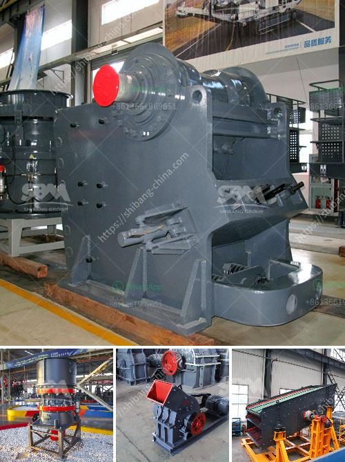

<h3>How to buy a stone crusher machine in Africa</h3>
Stone crusher machine production line is mostly applied in the cement industry and mining industry. It aims to help customers produce high-quality sand and gravel aggregate in the process. In recent years, with the gradual expansion of the scale of mining, the stone crusher machine market has gradually become a hotspot in Africa.

If you want to invest in a stone crusher machine, you should make a comprehensive inspection. Before buying the stone crusher machine, you should pay attention to the following points.

The quality of the crusher machine determines the strength of its crushing capacity. The quality of the crusher machine can directly influence the production efficiency and even the performance of the entire production line. Thus, you need to ensure the quality of the crusher machine when purchasing it. You can inspect the body, frame, lining plate, rotor, hammer, and other important parts of the crusher machine. It is recommended that you choose a reliable and experienced manufacturer to avoid counterfeit products.

The production capacity of the crusher machine is an important factor to consider when purchasing. You should choose a crusher machine with the appropriate capacity according to your actual needs. If the production capacity is too small, it will affect the normal operation of the production line and even result in downtime. On the other hand, if the production capacity is too large, it will lead to waste of resources and high production costs. Therefore, it is necessary to have a clear understanding of your production needs and choose the appropriate crusher machine accordingly.

The service life of the crusher machine is closely related to its quality and daily maintenance. When purchasing a crusher machine, you should not only pay attention to its initial performance but also consider its long-term service life. You should choose a crusher machine made of high-quality materials and equipped with advanced manufacturing technology, which can ensure its longer service life and reduce maintenance costs. In addition, regular maintenance and inspection of the crusher machine can prolong its service life.

The price of the crusher machine is also an important factor to consider. You should compare the prices of different manufacturers and different models of crusher machines. Taking into account your budget and the quality and performance of the crusher machine, you can make a more reasonable purchase. It is worth noting that a lower price does not necessarily mean a good quality machine. You should take various factors into consideration and make a comprehensive judgment.

In conclusion, buying a stone crusher machine in Africa requires a thorough inspection and consideration. You should pay attention to the quality, production capacity, service life, and price of the crusher machine. By choosing a reliable manufacturer, you can ensure the purchase of high-quality and cost-effective equipment that meets your production needs.
<h3>Contact us</h3><ul><li><strong>Whatsapp:&nbsp;<a href="https://wa.me/8613661969651">+8613661969651</a></strong></li><li><a href="https://swt.shibang-china.com/?git&amp;zhl&amp;How to buy a stone crusher machine in Africa"><strong>Online Service(chat now)</strong></a></li></ul><h3>Related</h3><ul><li><a href='How does a stone crushing plant work.md'>How does a stone crushing plant work?</a></li><li><a href='How does a raw mill work in a cement plant.md'>How does a raw mill work in a cement plant?</a></li><li><a href='How to Build a Limestone Crusher ？.md'>How to Build a Limestone Crusher ？</a></li><li><a href='How big is a 100 tph rock crushing plant.md'>How big is a 100 tph rock crushing plant</a></li><li><a href='How to crush limestone.md'>How to crush limestone?</a></li></ul>