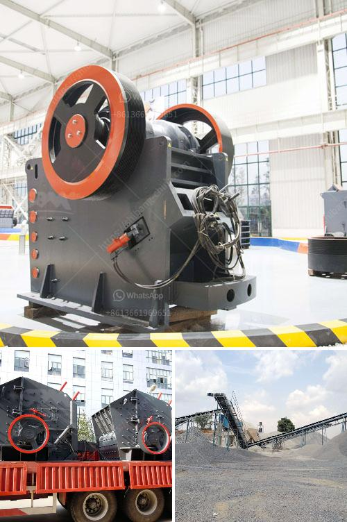

<h3>How to buy a stone crusher?</h3>
Stone crusher is a machine used to crush large stones into smaller sizes or gravel. It can also be used to reduce the size of waste materials as well. The stone crusher is quite popular in many industries, such as mining, metallurgy, building materials, road, railway, water conservancy, chemical industry, etc.

There are various types of stone crushers including jaw crusher, impact crusher, cone crusher, vertical shaft impact crusher, and mobile crusher. Let's briefly understand their respective advantages.

Jaw crusher is a popular primary crushing equipment in the mining industry due to its simple structure, large crushing ratio, and high efficiency. It is widely used in mining, smelting, building materials, highways, railways, water conservancy, chemical industry, and other industries.

Impact crusher is a new type of high-efficiency crushing equipment characterized by small size, simple structure, large crushing ratio, low energy consumption, large capacity, uniform particle size, and selective crushing effect. It is very promising equipment.

Cone crusher, also known as compound crusher, is a traditional crushing equipment suitable for crushing various ores and rocks. It is often used as a secondary or tertiary crusher.

Vertical shaft impact crusher is mainly used for crushing hard and brittle materials, such as rock, grinding material, refractory material, cement clinker, quartzite, iron ore, concrete aggregate, etc. It is an ideal choice for crushing and shaping.

Mobile crusher is an integrated crusher equipped with vibrating screen, feeder, belt conveyor, and other equipment. It is cost-effective, flexible, and can meet various requirements of users according to different materials, sizes, and requirements.

When purchasing a stone crusher, you should consider several factors to ensure its performance, efficiency, and durability.

1. What kind of stone do you need to crush? Different stone crushers have different working principles and crushing capacities. Choose the one that can meet your production requirements.

2. Consider the size and shape of the raw material. The size and shape of the raw material determine the type and model of the crusher. If the raw material is large and hard, a jaw crusher or impact crusher is more suitable. If the raw material is small and brittle, a cone crusher or vertical shaft impact crusher may be a better choice.

3. Consider the production capacity. The production capacity of the stone crusher determines the output of the entire production line. Choose a stone crusher with a suitable production capacity to ensure the smooth operation of the production line.

4. Consider the price. The price of a stone crusher varies greatly depending on the brand, model, and supplier. Choose a supplier with a good reputation and a competitive price to ensure the quality and cost-effectiveness of the equipment.

5. Consider after-sales service. After-sales service is an important factor to consider when buying a stone crusher. A reliable supplier should provide professional technical support, installation guidance, and regular maintenance service.

In conclusion, buying a stone crusher is not a simple task, but it is not an impossible one either. As long as you follow the above-mentioned factors, you can successfully purchase a suitable stone crusher that meets your requirements.
<h3>Contact us</h3><ul><li><strong>Whatsapp:&nbsp;<a href="https://wa.me/8613661969651">+8613661969651</a></strong></li><li><a href="https://swt.shibang-china.com/?git&amp;zhl&amp;How to buy a stone crusher"><strong>Online Service(chat now)</strong></a></li></ul><h3>Related</h3><ul><li><a href='How to choose the suitable location of crusher in open pit mining.md'>How to choose the suitable location of crusher in open pit mining?</a></li><li><a href='How to choose a supplier of stone crushers.md'>How to choose a supplier of stone crushers?</a></li><li><a href='How to service a coal crusher.md'>How to service a coal crusher?</a></li><li><a href='How to work with a Raymond Mill.md'>How to work with a Raymond Mill?</a></li><li><a href='How to operate a calcite crusher plant.md'>How to operate a calcite crusher plant?</a></li></ul>