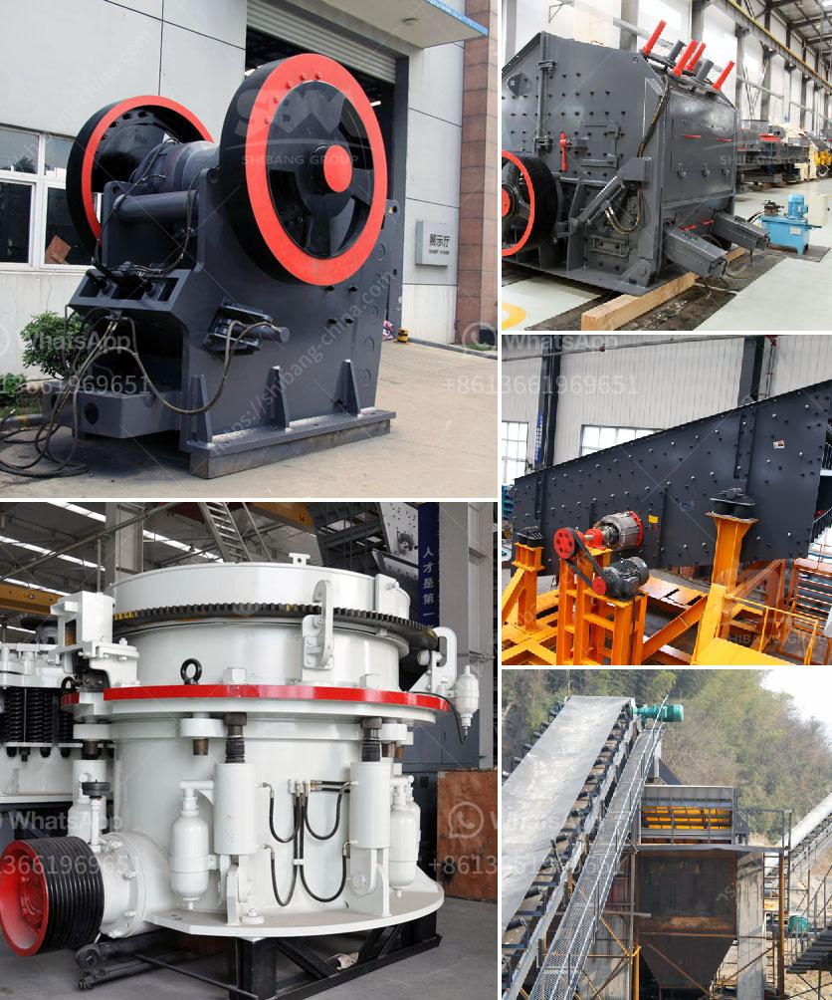

<h3>How to buy mobile crusher ?</h3>
In today's fast-paced world, mobile crushers have become an essential tool for construction companies and quarry operators. They provide a cost-effective solution for crushing various types of materials, making them highly sought after in the market. However, buying a mobile crusher is not as simple as walking into a store and picking one off the shelf. It requires careful consideration and research to ensure that you make the right purchase. Here is a complete guide on how to buy a mobile crusher:

Before diving into the purchase process, it is crucial to understand your specific needs. Consider the type of materials you will be crushing, the required output capacity, and the desired final product size. This will help you determine the size and specifications of the mobile crusher that will best suit your requirements.

Once you have defined your requirements, start researching different models available in the market. Look for reputable manufacturers known for producing high-quality crushers. Read online reviews and seek recommendations from industry experts to get a better understanding of the various options available.

Mobile crushers come in a wide range of prices, depending on their size, capacity, and features. It is essential to set a budget beforehand to ensure that you don't overspend. Consider both the upfront cost and long-term maintenance expenses when assessing the affordability of a particular model.

One of the main advantages of mobile crushers is their mobility. Assess the mobility features of different models, such as track-mounted or wheel-mounted options. If you anticipate frequent relocation of the crusher, a track-mounted unit may be more suitable.

Durability is crucial when buying a mobile crusher, as it will be subjected to harsh operational conditions. Look for crushers made from high-quality materials and with robust construction to ensure longevity. Inspect the welds, joints, and overall build quality to assess the durability of the machine.

Safety should be a top priority when buying any heavy-duty equipment. Look for mobile crushers that come equipped with essential safety features, such as emergency stop buttons, safety guards, and automatic overload protection systems.

When buying a mobile crusher, it is essential to consider the after-sales support provided by the manufacturer or supplier. Look for companies that offer reliable technical assistance, spare parts availability, and warranties to ensure uninterrupted operation and minimize downtime.

Before making a final decision, test different models to assess their performance and capabilities. Take advantage of demo units or visit construction sites to see the machines in action. Additionally, make direct comparisons between different models based on performance, maintenance requirements, and overall ease of use.

By following these steps, you can ensure that you make an informed decision when buying a mobile crusher. Research, planning, and careful consideration of your specific needs will go a long way in helping you choose the right crusher that meets your requirements, offers value for money, and maximizes productivity on your construction or quarry site.
<h3>Contact us</h3><ul><li><strong>Whatsapp:&nbsp;<a href="https://wa.me/8613661969651">+8613661969651</a></strong></li><li><a href="https://swt.shibang-china.com/?git&amp;zhl&amp;How to buy mobile crusher "><strong>Online Service(chat now)</strong></a></li></ul><h3>Related</h3><ul><li><a href='How to manage a limestone quarry.md'>How to manage a limestone quarry?</a></li><li><a href='How to choose the right primary crusher for your plant.md'>How to choose the right primary crusher for your plant?</a></li><li><a href='How much is the copper ore separation machine.md'>How much is the copper ore separation machine?</a></li><li><a href='How to replace the belt on the crushing machinery ？.md'>How to replace the belt on the crushing machinery ？</a></li><li><a href='How to extend the working life of a jaw crushing plate.md'>How to extend the working life of a jaw crushing plate?</a></li></ul>