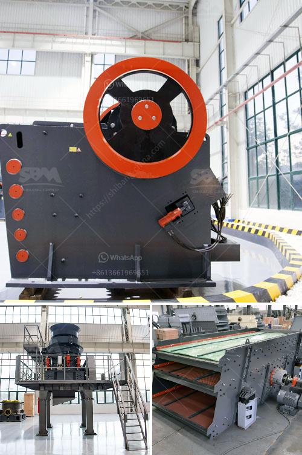

<h3>How to buy rock crusher in Sri Lanka ?</h3>
Sri Lanka is blessed with a beautiful coastline and pristine beaches that attract tourists from around the world. Additionally, the country is rich in natural resources such as gemstones, graphite, and limestone. The demand for construction materials, including aggregates, has been rising rapidly with the growth of infrastructure projects and the booming construction industry in Sri Lanka. As a result, there is a high demand for rock crushers, which are essential for producing aggregates for construction purposes. If you are planning to buy a rock crusher in Sri Lanka, this article will provide you with some tips to help you make an informed decision.

1. Determine your requirements: Before buying a rock crusher, it is important to determine your specific requirements. Consider factors such as the size and type of rocks you need to crush, the desired output size, and the capacity of the machine. Understanding your requirements will help you choose the right type of rock crusher that meets your needs.

2. Research and compare: Once you have determined your requirements, spend some time researching different rock crusher models available in Sri Lanka. Look for reputable manufacturers or suppliers who have a good track record in producing high-quality crushers. Compare the features, specifications, and prices of different models to narrow down your options.

3. Consider the after-sales service: Buying a rock crusher is not just a one-time purchase; it also involves a long-term relationship with the manufacturer or supplier. Consider the after-sales service offered by the company and ensure that they have a reliable technical support team, availability of spare parts, and a warranty on the machine. Good after-sales service is crucial to ensure the smooth operation and maintenance of your rock crusher.

4. Visit the supplier or manufacturer: If possible, try to visit the supplier or manufacturer before making the purchase. This will give you an opportunity to inspect the machine personally, understand its features, and ask any questions you may have. Additionally, you can assess the company's credibility and reliability by visiting their facility.

5. Seek recommendations and reviews: Reach out to people who have previously purchased rock crushers in Sri Lanka and seek their recommendations and feedback. Online forums and review websites can also provide valuable insights into the reliability and performance of different rock crusher models.

6. Consider your budget: Lastly, consider your budget when buying a rock crusher. Determine the maximum amount you are willing to spend and try to find a machine that fits within your budget without compromising on quality. However, keep in mind that investing in a high-quality rock crusher can result in better performance and durability, saving you money in the long run.

In conclusion, buying a rock crusher in Sri Lanka requires careful consideration of your specific requirements, researching and comparing different models, considering after-sales service, visiting the supplier or manufacturer, seeking recommendations, and considering your budget. By following these tips, you can make a well-informed decision and find a rock crusher that meets your needs and delivers the desired results.
<h3>Contact us</h3><ul><li><strong>Whatsapp:&nbsp;<a href="https://wa.me/8613661969651">+8613661969651</a></strong></li><li><a href="https://swt.shibang-china.com/?git&amp;zhl&amp;How to buy rock crusher in Sri Lanka "><strong>Online Service(chat now)</strong></a></li></ul><h3>Related</h3><ul><li><a href='How to build granite crusher machine Australia.md'>How to build granite crusher machine Australia?</a></li><li><a href='How does bauxite crushers work.md'>How does bauxite crushers work?</a></li><li><a href='How to separate gold from chalcopyrite.md'>How to separate gold from chalcopyrite?</a></li><li><a href='How to calculate the cost per ton of crushing and screening stone.md'>How to calculate the cost per ton of crushing and screening stone?</a></li><li><a href='How to set up a gold mining ball mill.md'>How to set up a gold mining ball mill?</a></li></ul>