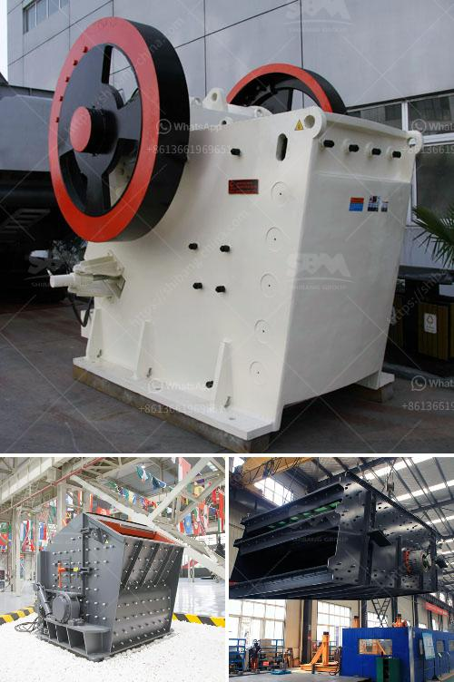

<h3>How to calculate the balls needed in a ball mill?</h3>
A ball mill is a type of grinder used to grind materials into extremely fine powder for use in mineral dressing processes, paints, pyrotechnics, and ceramics. The grinding process is often carried out in a rotating cylindrical shell which contains a certain amount of grinding media (balls). These balls are constantly subjected to impacts and frictional forces, resulting in the fine grinding of the material.

When it comes to efficient grinding in ball mills, it is crucial to operate the machine at its optimum load. In other words, the amount of material and balls in the ball mill should be kept within a suitable range to ensure that grinding is carried out effectively. Therefore, calculating the balls needed in a ball mill requires a systematic approach.

The first step in calculating the balls needed is to understand the characteristics of the material being ground. Some materials are more abrasive, requiring larger and denser balls, while others are softer and can be ground with smaller balls. It is important to have a clear understanding of the material properties in order to select the appropriate balls.

Next, the size distribution of the balls should be considered. Ball mills are available in various sizes and configurations, and the size of the balls used depends on the type of mill and the desired size reduction of the material. The size distribution of the balls in the mill affects the frequency and energy of impacts during grinding, so it is essential to have a good distribution to ensure efficient grinding.

The filling ratio of the mill, which is the volume of the grinding chamber occupied by the grinding media and the material being ground, also plays a significant role in determining the number of balls needed. A high filling ratio increases the number of impacts and the grinding efficiency, but it can also lead to excessive wear of the balls and liners. Therefore, a balance must be struck to ensure optimum filling.

Once the material properties, ball size distribution, and filling ratio have been determined, it is possible to calculate the number of balls needed. This can be done using mathematical formulas and empirical relations based on experimental data. The calculations take into account factors such as the size and density of the balls, the volume occupied by the grinding media, and the desired final particle size.

In addition to the number of balls needed, it is also important to consider the ball-to-material weight ratio. This ratio determines the energy input into the grinding process and can significantly affect the grinding efficiency. A higher ball-to-material weight ratio generally leads to more efficient grinding, but it also increases the wear rate of the balls and the mill liners.

In conclusion, calculating the balls needed in a ball mill requires considering various factors such as the material properties, ball size distribution, filling ratio, and ball-to-material weight ratio. By carefully analyzing these factors and using appropriate mathematical formulas, it is possible to determine the optimum number of balls needed for efficient grinding. This knowledge can help improve the performance of ball mills and achieve better grinding results.
<h3>Contact us</h3><ul><li><strong>Whatsapp:&nbsp;<a href="https://wa.me/8613661969651">+8613661969651</a></strong></li><li><a href="https://swt.shibang-china.com/?git&amp;zhl&amp;How to calculate the balls needed in a ball mill"><strong>Online Service(chat now)</strong></a></li></ul><h3>Related</h3><ul><li><a href='How to extract iron ore flow chart.md'>How to extract iron ore flow chart?</a></li><li><a href='How much does an iron ore crushing machine cost.md'>How much does an iron ore crushing machine cost?</a></li><li><a href='How to maintain the vibrating feeder.md'>How to maintain the vibrating feeder?</a></li><li><a href='How to crush limestone.md'>How to crush limestone?</a></li><li><a href='How to install the impact crusher .md'>How to install the impact crusher ?</a></li></ul>