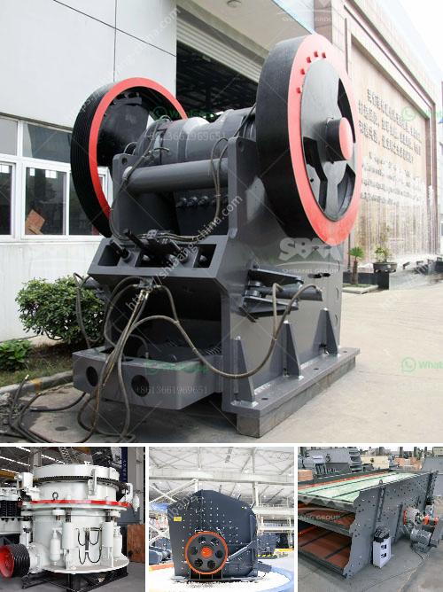

<h3>How to calculate the cemnet grinding aid requirement for cement ?</h3>
Cement grinding aids are used to improve the efficiency of cement production and reduce energy consumption. Grinding aids are chemicals added during grinding of clinker to improve the grindability and performance of the cement. The use of grinding aids has been gaining importance in various cement-producing regions around the world due to their ability to enhance cement properties and to increase the production capacity of cement plants.

Calculating the cement grinding aid requirement for a specific cement is usually determined by trial and error experiments conducted in the laboratory. However, there are some equations that can be used to estimate the dosage requirement of grinding aids. It is important to note that these equations provide an initial estimate and may need adjustment based on plant-scale trials.

One commonly used equation to estimate the grinding aid dosage requirement is based on the surface area of the cement particles. The equation is as follows:

- C is the concentration of the grinding aid in ppm (parts per million). This value can be obtained from the grinding aid manufacturer.

- R is the weight percentage of cement retained on the 80μm sieve (also known as the residue), which can be determined through sieve analysis.

- SA is the specific surface area of the cement particles in m²/kg. This value can be determined through Blaine's apparatus or a laser particle size analyzer.

In practice, the value of C is generally between 1000 and 5000 ppm, depending on the type and quality of the grinding aid. The value of R is typically between 0.1% and 1%, and the value of SA is usually between 3000 and 6000 m²/kg for ordinary Portland cement.

It is important to emphasize that the calculation of the grinding aid dosage requirement should consider the type of cement being produced, the clinker composition, the fineness of the cement, and the desired cement properties. It is recommended to consult with the grinding aid manufacturer or conduct trial experiments to determine the optimal dosage of grinding aids for specific cement compositions.

In conclusion, calculating the cement grinding aid requirement is crucial to improve cement properties and enhance the efficiency of cement production. Although there are equations available to estimate the dosage requirement, it is recommended to consult with experts or conduct laboratory and plant-scale trials to determine the optimal dosage for each specific cement composition. The use of grinding aids provides numerous benefits such as increased grinding efficiency, improved strength development, reduced energy consumption, and enhanced cement quality.
<h3>Contact us</h3><ul><li><strong>Whatsapp:&nbsp;<a href="https://wa.me/8613661969651">+8613661969651</a></strong></li><li><a href="https://swt.shibang-china.com/?git&amp;zhl&amp;How to calculate the cemnet grinding aid requirement for cement "><strong>Online Service(chat now)</strong></a></li></ul><h3>Related</h3><ul><li><a href='How to cut costs for a quarry.md'>How to cut costs for a quarry?</a></li><li><a href='how to choose mobile jaw crusher machinery ？.md'>how to choose mobile jaw crusher machinery ？</a></li><li><a href='How to choose the right grinder for the processing mineral materials.md'>How to choose the right grinder for the processing mineral materials?</a></li><li><a href='How to separate gold from sand with machine .md'>How to separate gold from sand with machine ?</a></li><li><a href='How to maintenance coal mill.md'>How to maintenance coal mill?</a></li></ul>