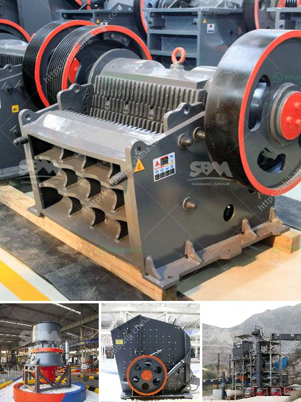

<h3>How to calculate the charge volume of a ball mill?</h3>
A ball mill is a type of grinder used to grind materials into extremely fine powder for use in mineral dressing processes, paints, pyrotechnics, ceramics and selective laser sintering. The importance of selecting a suitable ball mill cannot be understated. It is essential that the grinding media is properly charged in the ball mill, ensuring optimal grinding efficiency and throughput.

The charge volume of a ball mill or rod mill is expressed as the percentage of the volume within the liners filled with balls or rods. When the mill is stationary, the charge volume can be quickly obtained by measuring the diameter inside the liners and the distance from the top of the mill inside the liners to the top of the charge. The percentage loading or change volume can then be read directly from the graph in Fig. 3 or can be approximated from the following equation:

Where C is the charge tributary area, L is the distance from the center of the mill to the center of gravity of the charge, D is the mill diameter, and K is a constant determined by the mill characteristics and operating conditions.

To determine the charge volume, it is important to analyze the factors influencing the mill's performance. These include the milling media's size and shape, ball density, filling volume, and percent solids in the mill slurry.

The ball size influence mill throughput, power consumption, and progeny size [14], [15]. It is reported by [16] that each grain size has an optimum ball size. Energy wastage and drop in throughput are the consequence of deviation from optimum conditions [17]. 4.2.1 Optimum Ball Size:

The charge volume of a tumbling mill is given by the fraction of the total mill volume occupied by the grinding media, including empty spaces of balls and material. Therefore, the ball charge and the feed charge are calculated through a ratio, and the size of the mill is denoted as a fraction of the total space available.

Where Nc is the loading percent of the mill, D is the diameter of the mill inside liners (m), and L is the length of the mill inside liners (m).

In conclusion, calculating the charge volume of a ball mill or rod mill is important to maintain the optimal performance of the mill for the grinding process. The charge volume can be obtained by measuring the diameter inside the liners and the distance from the top of the mill inside the liners to the top of the charge. Alternatively, the charge volume can be approximated using an empirical formula. By considering factors such as milling media size and shape, ball density, filling volume, and percent solids in the mill slurry, you can determine the optimal ball charge and mill size to ensure efficient grinding and maximum throughput.
<h3>Contact us</h3><ul><li><strong>Whatsapp:&nbsp;<a href="https://wa.me/8613661969651">+8613661969651</a></strong></li><li><a href="https://swt.shibang-china.com/?git&amp;zhl&amp;How to calculate the charge volume of a ball mill"><strong>Online Service(chat now)</strong></a></li></ul><h3>Related</h3><ul><li><a href='How to separate gold from iron ore.md'>How to separate gold from iron ore?</a></li><li><a href='How to set up a stone crusher plant.md'>How to set up a stone crusher plant?</a></li><li><a href='How to select a crusher to crush different minerals.md'>How to select a crusher to crush different minerals?</a></li><li><a href='How to buy mobile crusher .md'>How to buy mobile crusher ?</a></li><li><a href='how to choose a portable crusher plant ？.md'>how to choose a portable crusher plant ？</a></li></ul>