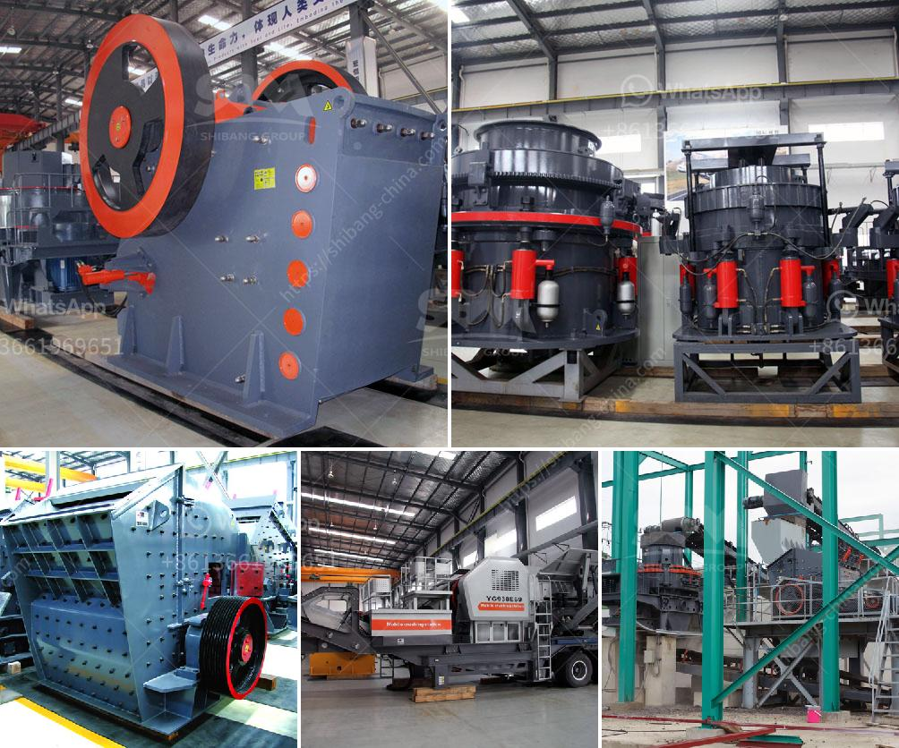

<h3>How to calculate the cost of grinding ?</h3>
Grinding is a common method used in various industries, including manufacturing, construction, and mining, to remove excess material from a workpiece's surface. It is crucial to determine the cost of grinding accurately to manage project budgets effectively. Calculating the cost of grinding involves considering several factors, such as labor, equipment, material usage, and time. In this article, we will discuss these factors and provide a step-by-step guide to calculating the cost of grinding.

Firstly, you need to determine the labor cost required for grinding. Evaluate the number of hours required to complete the grinding task and multiply it by the labor rate per hour. This will give you an estimate of the labor cost.

The second important factor to consider is the cost of equipment used for grinding. Evaluate the equipment usage in terms of hours and multiply it by the equipment's hourly rate or depreciation cost. This will help you to allocate the equipment cost per grinding task.

The cost of grinding materials used, such as grinding wheels, discs, or belts, should be considered. Evaluate the cost of these materials per unit and multiply it by the number of units used for the grinding process. This will provide an estimate of the material usage cost.

Overhead costs are indirect expenses incurred during the grinding process, such as utilities, rent, insurance, and maintenance. Calculate the overhead cost per hour and multiply it by the total hours required for grinding.

Sometimes, additional costs may arise during the grinding process, such as tooling rework or replacement, waste disposal, and transportation. These costs should be taken into account to ensure accurate calculations.

To calculate the total grinding cost, add the labor cost, equipment cost, material usage cost, overhead cost, and any additional costs mentioned above. This will give you the total cost for the grinding process.

It is essential to consider the time required for grinding. Time management plays a vital role in any project, and accurate estimation helps to allocate resources effectively.

Finally, it is crucial to gather data on the grinding process's cost and time for future reference. Tracking and analyzing these results can lead to process improvements and cost-saving measures in the long run.

In conclusion, calculating the cost of grinding involves analyzing several factors, including labor, equipment, material usage, overhead, and any additional costs. By considering these factors and following the step-by-step guide provided, you can accurately estimate the cost of grinding. Accurate cost estimation is essential for project budgeting, resource allocation, and process improvement.
<h3>Contact us</h3><ul><li><strong>Whatsapp:&nbsp;<a href="https://wa.me/8613661969651">+8613661969651</a></strong></li><li><a href="https://swt.shibang-china.com/?git&amp;zhl&amp;How to calculate the cost of grinding "><strong>Online Service(chat now)</strong></a></li></ul><h3>Related</h3><ul><li><a href='How to improve stone crusher production.md'>How to improve stone crusher production?</a></li><li><a href='How does a work of impact crusher.md'>How does a work of impact crusher?</a></li><li><a href='How to increase the output of jaw crusher ？.md'>How to increase the output of jaw crusher ？</a></li><li><a href='how to repair a vibrating Sand Washer  ？.md'>how to repair a vibrating Sand Washer  ？</a></li><li><a href='How to choose a limestone hammer mill ？.md'>How to choose a limestone hammer mill ？</a></li></ul>