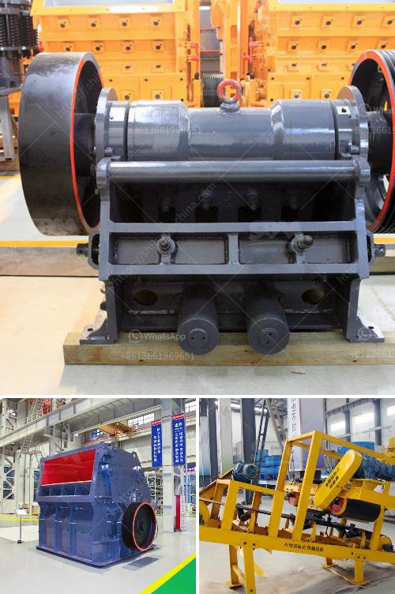

<h3>How to calculate the cost per ton of crushing and screening stone?</h3>
Calculating the cost per ton of crushing and screening stone can vary greatly depending on several factors including the type of stone being crushed, the size and shape of the particles, and the desired final product. To help you understand the process better, we will discuss various methods of calculating the cost per ton.

Firstly, let's clarify the terms 'crushing' and 'screening'. Crushing refers to the process of reducing large stone materials into smaller particles suitable for construction purposes. Screening, on the other hand, involves separating different sizes of crushed stone particles to create specific products for various applications.

To begin calculating the cost per ton, you'll need to gather the necessary information. This includes the cost of the stone, transportation costs, and any additional costs related to the crushing and screening process. It's important to understand that these costs can vary depending on the location, market demand, and other factors unique to the project.

Next, consider the type of stone being processed. Different stones have varying properties that can impact the crushing and screening process. For instance, soft and easily breakable stones will require less force and energy compared to harder stones. Therefore, the cost per ton for crushing and screening these different types of stones will differ.

Determining the size and shape of the final product is crucial. Stones that need to be crushed into smaller particles typically require more energy and effort. On the other hand, stones with a consistent size and shape might involve less processing, resulting in lower costs.

Additionally, the desired final product will influence the cost per ton. For example, if the stone needs to be finely crushed for use in asphalt or concrete production, an additional crushing stage may be required, increasing the cost per ton. Alternatively, if the stone only needs to be partially crushed for landscaping purposes, the cost per ton may be lower.

Now that you have gathered all the necessary information, you can start calculating the cost per ton. Here is a basic formula to help you:

Remember to convert all measurements into the same unit, either metric or imperial, to ensure accuracy. By plugging in the appropriate values into the formula, you can calculate the cost per ton of crushing and screening stone for your specific project.

In conclusion, calculating the cost per ton of crushing and screening stone involves considering various factors such as the type of stone, size and shape of particles, and the desired final product. By gathering the necessary information and using the appropriate formula, you can accurately estimate the cost per ton, helping you make informed decisions for your construction projects.
<h3>Contact us</h3><ul><li><strong>Whatsapp:&nbsp;<a href="https://wa.me/8613661969651">+8613661969651</a></strong></li><li><a href="https://swt.shibang-china.com/?git&amp;zhl&amp;How to calculate the cost per ton of crushing and screening stone"><strong>Online Service(chat now)</strong></a></li></ul><h3>Related</h3><ul><li><a href='How to design a ball mill for cement ？.md'>How to design a ball mill for cement ？</a></li><li><a href='how ores are classified .md'>how ores are classified ?</a></li><li><a href='how to build a concrete wash rack for heavy equipment .md'>how to build a concrete wash rack for heavy equipment ?</a></li><li><a href='how does the jaw crusher works.md'>how does the jaw crusher works</a></li><li><a href='How to maintain the stone crusher .md'>How to maintain the stone crusher ?</a></li></ul>