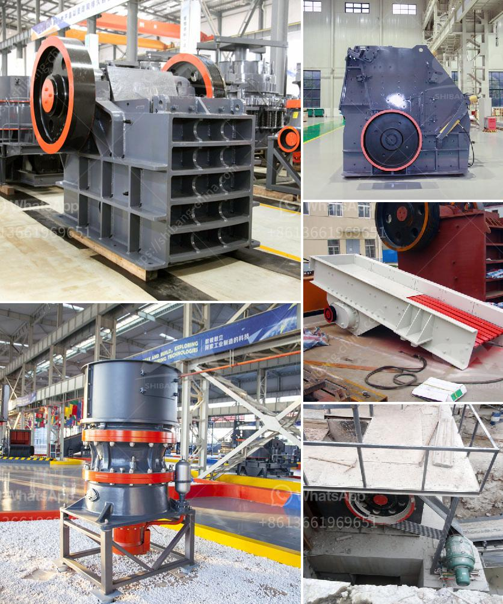

<h3>How to calculate the efficiency of a jaw crusher?</h3>
A jaw crusher is a device that reduces the size of various solid materials in many applications, including underground mining and mobile crushing applications mainly using the compressive force of the two jaws, one of which is stationary and the other is moving. The efficiency of jaw crusher is calculated by the ratio of the input to the output of the crusher. The factors affecting the efficiency of jaw crusher in crushing plant are as follows:

1. Control the feeding quantity and ensure the uniformity of the material entering the crushing chamber. To achieve the optimal performance of the jaw crusher, it is necessary to feed the materials evenly. The shape of the material entering the crusher is regular, the particle size is uniform, and the material can be fully broken, improving the crushing efficiency of the jaw crusher.

2. Control the feeding speed in a reasonable way. If the feeding speed is too fast, it will cause the blocking of the jaw crusher; if the feeding speed is too slow, it will directly affect the efficiency of the jaw crusher. Therefore, the feeding speed should be reasonably controlled to ensure the maximum crushing efficiency of the jaw crusher.

3. Check the wear of jaw plate and transmission parts regularly. When the jaw crusher is working, the two jaw plates are involved in crushing the materials, and there will be serious wear on the fixed jaw plate and the movable jaw plate. In order to prolong the service life of the jaw crusher, daily maintenance is essential. Regularly check the jaw plate and replace the worn jaw plate in time.

4. Ensure the tightness of the jaws and the fastening of the bolts. The jaw crusher is subjected to great force during operation, which not only affects the stable operation of the crusher, but also may cause accidents. Therefore, it is necessary to check the tightness of the jaw plate bolts and adjust the seat of the toggle plate to ensure the stability of the equipment.

5. Perfect the lubrication system. The lubrication system is crucial for the jaw crusher to operate normally. If the lubrication system is not in good condition, the friction between the parts will increase and the equipment will heat up. Proper lubrication can reduce friction and ensure the normal operation of the jaw crusher.

In conclusion, the efficiency of a jaw crusher can be improved by controlling the feed size, feeding speed, wear of wearing parts, and proper lubrication of the equipment. It is very important to conduct regular maintenance and repair work to ensure the normal operation of the jaw crusher and improve its crushing efficiency. Only by operating the jaw crusher correctly and reasonably can it ensure the efficient operation and create maximum value for the users.
<h3>Contact us</h3><ul><li><strong>Whatsapp:&nbsp;<a href="https://wa.me/8613661969651">+8613661969651</a></strong></li><li><a href="https://swt.shibang-china.com/?git&amp;zhl&amp;How to calculate the efficiency of a jaw crusher"><strong>Online Service(chat now)</strong></a></li></ul><h3>Related</h3><ul><li><a href='How to select a Highquality sand making machine.md'>How to select a High-quality sand making machine?</a></li><li><a href='How to start stone crusher project.md'>How to start stone crusher project?</a></li><li><a href='How does a tungsten ore crusher work.md'>How does a tungsten ore crusher work?</a></li><li><a href='How to install a crusher for quarry operation.md'>How to install a crusher for quarry operation?</a></li><li><a href='How to manufacture cement plant ball mill in Kenya.md'>How to manufacture cement plant ball mill in Kenya?</a></li></ul>