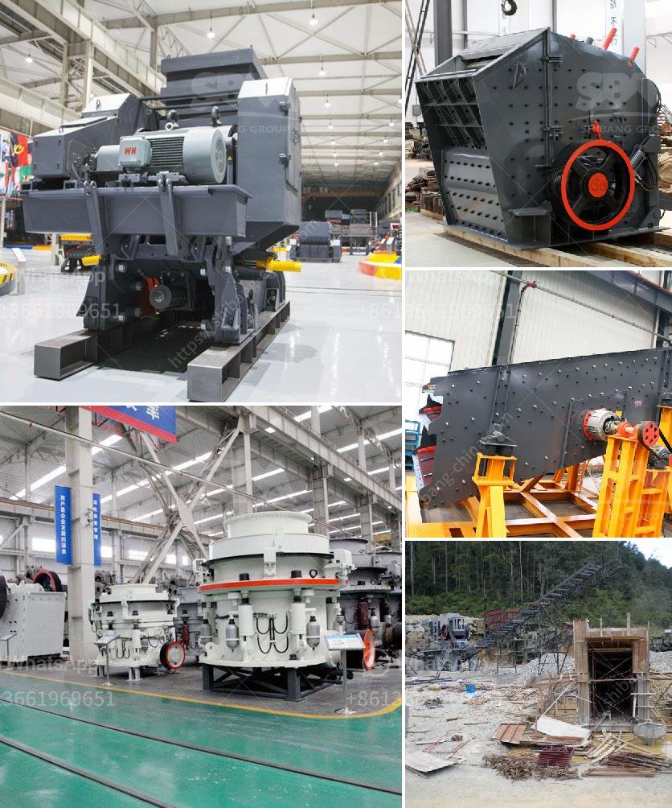

<h3>How to calculate the energy consumption of a ball mill?</h3>
A ball mill is a type of grinder used to grind materials into extremely fine powder for use in mineral dressing processes, paints, pyrotechnics, ceramics, and selective laser sintering. The ball mill is a key piece of equipment for grinding crushed materials, and it is widely used in production lines for powders such as cement, silicates, refractory material, fertilizer, glass ceramics, etc. as well as for ore dressing of ferrous and non-ferrous metals.

The ball mill can grind various ores and other materials either wet or dry. There are two kinds of ball mill, grate type and overfall type due to different ways of discharging material. There are many factors that contribute to the energy consumption of a ball mill. One of the most significant factors is the speed at which the mill rotates. A ball mill rotates with the material being fed into it and impacts the grinding media in a high energy motion.

As the ball mill rotates, the grinding media are lifted and dropped continuously by the lifting plates attached to the inner surface of the drum. Due to the constant bombardment of the grinding media, the material being ground is reduced in size by the impact and grinding action. The power consumption of a ball mill is one of the most important parameters to consider in the design of a ball mill because it determines its economic efficiency.

The power consumption is usually determined by charge fill level, lifter height, lifter number, and mill speed. However, almost all ball mills are filled with Idling balls at start-up and the power demand of these ball loads is difficult to see by simple inspection. To determine the power consumption, the ball load is usually measured by a strain gauge embedded in the mill shell, from which the power consumed can be calculated.

To calculate the power consumption of a ball mill, one must collect data on the properties of the materials to be ground and the operational parameters of the mill. The data collected includes material properties (e.g. particle size distribution, density, hardness, flowability, etc.), operational parameters (e.g. rotation speed, media filling, etc.), and mill dimensions (diameter, length, etc.). These data are used to establish mathematical models that describe the power consumption of the mill.

Once the mathematical models are established, they can be used to predict the power consumption under various operating conditions. However, it is important to note that these models are based on certain assumptions and simplifications, and the predicted power consumption may not always match the actual values obtained from experiments.

In conclusion, calculating the energy consumption of a ball mill is important for understanding the overall energy efficiency of a grinding process. Accurate determination of the power consumed by the mill is important to optimize the grinding efficiency and ultimately reduce the energy cost. Although there are well-established mathematical models available, it is always recommended to verify the predicted values against actual experimental data.
<h3>Contact us</h3><ul><li><strong>Whatsapp:&nbsp;<a href="https://wa.me/8613661969651">+8613661969651</a></strong></li><li><a href="https://swt.shibang-china.com/?git&amp;zhl&amp;How to calculate the energy consumption of a ball mill"><strong>Online Service(chat now)</strong></a></li></ul><h3>Related</h3><ul><li><a href='How to start a crusher plant in Odisha.md'>How to start a crusher plant in Odisha?</a></li><li><a href='How to crush granite into powder.md'>How to crush granite into powder?</a></li><li><a href='How to design a vibrating screen.md'>How to design a vibrating screen?</a></li><li><a href='How to do manganese mining .md'>How to do manganese mining ?</a></li><li><a href='How to choose a small rock crusher for mining ？.md'>How to choose a small rock crusher for mining ？</a></li></ul>