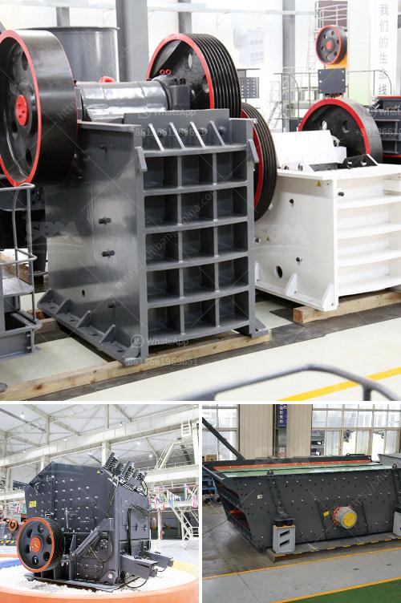

<h3>How to calculate the payback period for a coal mine?</h3>
The payback period is a vital financial metric that helps investors and business owners determine how long it will take to recoup their initial investment. When it comes to calculating the payback period for a coal mine, there are several factors to consider. This article will guide you through the process of determining the payback period for a coal mine project.

Before calculating the payback period, you need to determine the initial investment required to set up and operate the coal mine project. This includes costs for land acquisition, machinery, equipment, labor, infrastructure, legal compliance, and other necessary expenses. Make sure to include all relevant costs to get an accurate estimate of the initial investment.

The next step is to calculate the expected cash flows generated by the coal mine project over its projected lifespan. This should include revenues from coal sales, any government incentives or subsidies, and other potential income streams such as by-products or carbon credits.

It is essential to be realistic when estimating cash flows, taking into account factors like market conditions, production costs, environmental regulations, and potential risks. Consulting with experts in the coal industry can offer valuable insights and ensure more accurate cash flow projections.

Once you have estimated the cash flows, deduct the operating costs associated with running the coal mine. This includes expenses for labor, maintenance, fuel, transportation, insurance, permits, environmental compliance, and any other ongoing costs related to production and operation. Subtracting the operating costs from the projected cash flows will give you the net cash flow for each period.

To calculate the payback period, you need to determine the cumulative cash flow generated by the coal mine project. Start with the net cash flow in the first year and add it to the subsequent year's net cash flow. Repeat this process until the cumulative cash flow becomes positive, indicating that the initial investment has been recouped.

Divide the initial investment by the cumulative cash flow generated in the year when it turns positive. The result will give you the payback period, which represents the number of years it takes to recover the initial investment.

It's worth noting that the payback period provides a measure of risk but does not consider future cash flows beyond the recovery of the initial investment. As a result, it should be used in conjunction with other financial metrics like the net present value (NPV) and internal rate of return (IRR) to make informed investment decisions.

In conclusion, calculating the payback period for a coal mine project involves estimating the initial investment, projecting cash flows, deducting operating costs, determining cumulative cash flows, and dividing the initial investment by the cumulative cash flow when positive. By following these steps, investors and business owners can gain valuable insights into the profitability and timeline of their coal mine investment.
<h3>Contact us</h3><ul><li><strong>Whatsapp:&nbsp;<a href="https://wa.me/8613661969651">+8613661969651</a></strong></li><li><a href="https://swt.shibang-china.com/?git&amp;zhl&amp;How to calculate the payback period for a coal mine"><strong>Online Service(chat now)</strong></a></li></ul><h3>Related</h3><ul><li><a href='How to break down a copper ore.md'>How to break down a copper ore?</a></li><li><a href='How to Use a Hammer Mill Kenya ？.md'>How to Use a Hammer Mill Kenya ？</a></li><li><a href='How does a spring cone crusher work.md'>How does a spring cone crusher work?</a></li><li><a href='7 Factors Affecting the Price of Jaw Crusher.md'>7 Factors Affecting the Price of Jaw Crusher</a></li><li><a href='how to maintainance stone cone crusher.md'>how to maintainance stone cone crusher?</a></li></ul>