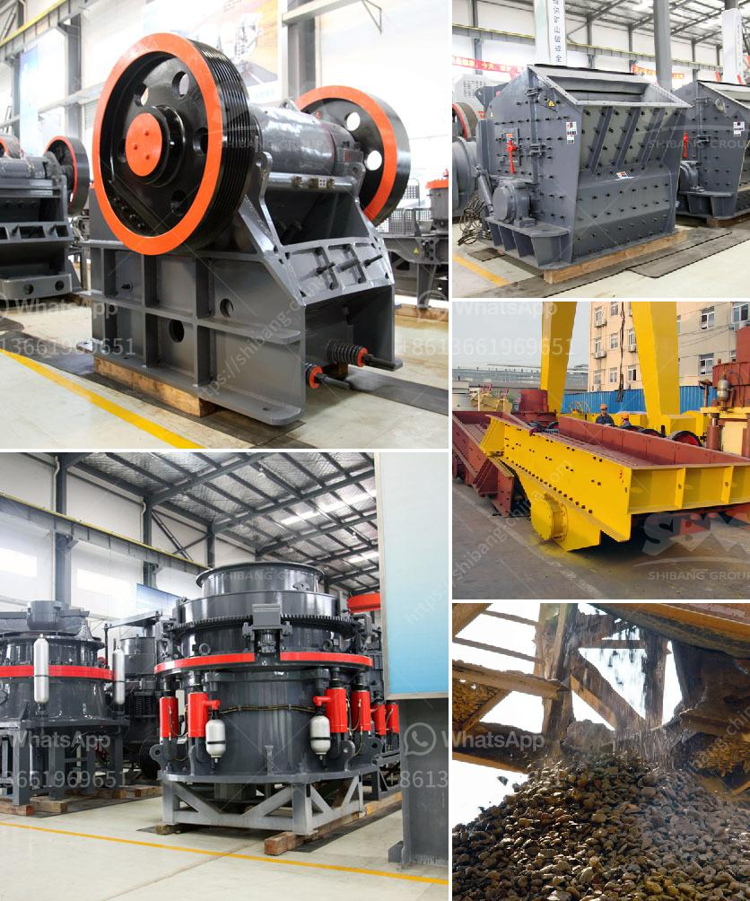

<h3>How to calculate the volume of ball mill packing ?</h3>
A ball mill is a type of grinder used to grind materials into extremely fine powder for use in mineral dressing processes, paints, pyrotechnics, ceramics, and selective laser sintering. The ball mill is a key piece of equipment for grinding crushed materials, and it is widely used in production lines for powders such as cement, silicates, refractory material, fertilizer, glass ceramics, etc. 

The volume of a ball mill packing refers to the amount of grinding media inside the mill, which directly determines the grinding efficiency and productivity. Grinding media is the working part of the mill. The grinding media consists of two parts: the grinding balls and the grinding rod. The grinding balls are mainly used for impact grinding and crushing, and the grinding rod is used for grinding and crushing. 

To calculate the volume of the ball mill packing, we need to know the bulk density of the grinding media. Bulk density refers to the weight of the grinding media in a given volume. The higher the bulk density, the higher the grinding efficiency. 

The total weight of the grinding media can be determined by weighing the empty ball mill, then adding the grinding balls until the required amount is reached. 

To determine the volume of the grinding media, we need to know the density of the material used to make the grinding balls. The density can be obtained from the manufacturer's specifications or by conducting a density test on a small sample of the grinding balls. 

It is important to note that the volume calculated using this method may not be the actual volume inside the ball mill. The grinding media can occupy different positions inside the mill, resulting in variations in the packed volume. Additionally, the volume of the empty space between the grinding balls can also affect the efficiency of the mill. 

In conclusion, calculating the volume of ball mill packing involves determining the bulk density of the grinding media and using it to calculate the volume. However, it is important to consider that this method provides an estimate and the actual volume may vary. This information is essential for optimizing the grinding process, improving efficiency, and increasing productivity in ball mill operations.
<h3>Contact us</h3><ul><li><strong>Whatsapp:&nbsp;<a href="https://wa.me/8613661969651">+8613661969651</a></strong></li><li><a href="https://swt.shibang-china.com/?git&amp;zhl&amp;How to calculate the volume of ball mill packing "><strong>Online Service(chat now)</strong></a></li></ul><h3>Related</h3><ul><li><a href='How to commission a mobile cone crusher.md'>How to commission a mobile cone crusher?</a></li><li><a href='How to crush calcite lumps.md'>How to crush calcite lumps?</a></li><li><a href='How to prevent environmental pollution in washing plants？.md'>How to prevent environmental pollution in washing plants？</a></li><li><a href='How to determine the capacity of impact crusher？.md'>How to determine the capacity of impact crusher？</a></li><li><a href='How to measure the jaw crusher bearing temperature.md'>How to measure the jaw crusher bearing temperature?</a></li></ul>