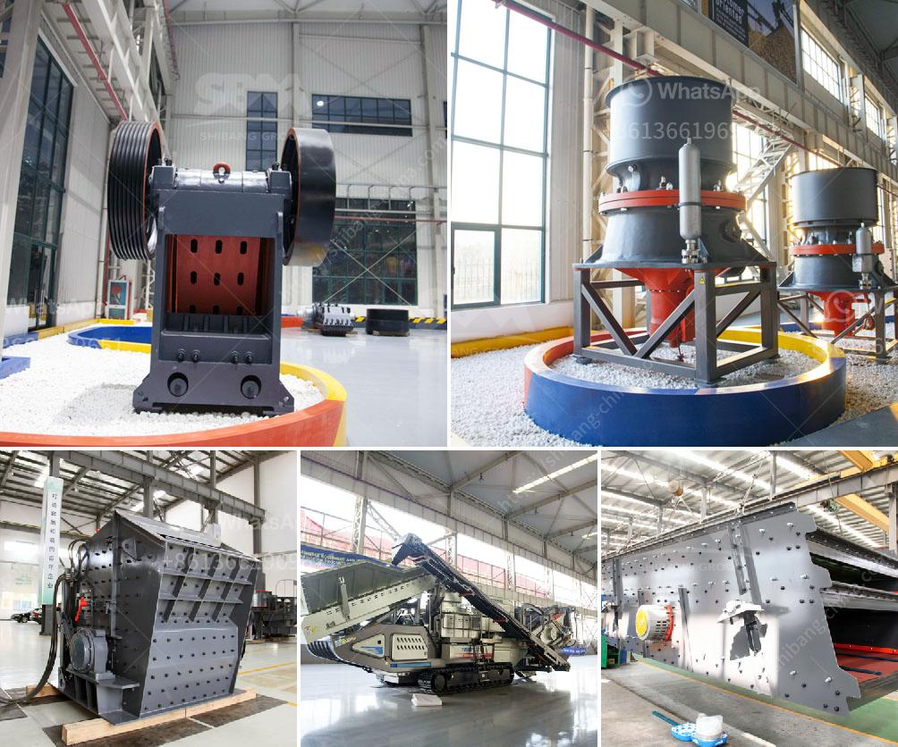

<h3>How to calibrate the belt conveyor</h3>
Calibrating a belt conveyor is a crucial process to ensure that it is functioning optimally and delivering the desired performance. Belt conveyors are widely used in industries for the efficient transportation of goods, bulk materials, or products. They rely on belts to transfer the materials from one point to another, making it essential to calibrate them regularly to maintain accuracy, prevent breakdowns, and maximize productivity. In this article, we will discuss the steps involved in calibrating a belt conveyor.

Before starting the calibration process, it is essential to understand the specific requirements of the belt conveyor. Factors such as load capacity, belt speed, and material type should be considered to determine the desired performance of the conveyor.

Begin by thoroughly inspecting the conveyor system. Check for any signs of wear, damage, or misalignment in components such as belts, rollers, pulleys, and supporting structures. If any issues are identified, they should be addressed before calibration.

Accurate belt tension is crucial for proper functioning. Use a tension gauge or dynamometer to measure the tension of the conveyor belt. Adjust the belt tension to ensure it falls within the recommended range provided by the manufacturer.

Misalignment of the belt can cause it to run off track and potentially damage the system. Use a straightedge or laser alignment tool to check the alignment of the belt along the length of the conveyor. Make any necessary adjustments to ensure the belt is properly aligned.

Accurate belt speed is important for maintaining steady material flow and preventing overloading or underloading. Use a tachometer or photoelectric sensor to measure the belt speed. Compare the measured speed with the desired speed specified for the conveyor system, and make adjustments if necessary.

Inspect and adjust the components that contribute to the performance of the conveyor system. This may include idlers, pulleys, and frames. Ensure that they are properly aligned, lubricated, and in good working condition.

Once all the necessary adjustments have been made, it is time to test the conveyor. Run several trial runs with different loads to ensure the conveyor is handling the materials as desired. Observe the operation to identify any potential issues or areas for improvement.

Calibrating the belt conveyor is not a one-time task. It is crucial to establish a regular maintenance schedule for the conveyor system to ensure ongoing optimal performance. This includes periodic inspections, lubrication, and cleaning, as well as addressing any identified issues promptly.

In conclusion, calibrating a belt conveyor is an essential process to ensure that it operates efficiently and meets the desired performance requirements. By following the steps outlined above, you can effectively calibrate a belt conveyor and maintain its accuracy, prevent breakdowns, and maximize productivity. Regular maintenance and timely adjustments are key to keeping the conveyor system in optimal working condition and extending its lifespan.
<h3>Contact us</h3><ul><li><strong>Whatsapp:&nbsp;<a href="https://wa.me/8613661969651">+8613661969651</a></strong></li><li><a href="https://swt.shibang-china.com/?git&amp;zhl&amp;How to calibrate the belt conveyor"><strong>Online Service(chat now)</strong></a></li></ul><h3>Related</h3><ul><li><a href='How to move and install a mobile rock crusher.md'>How to move and install a mobile rock crusher?</a></li><li><a href='How to do the maintenance of crushing screening plant.md'>How to do the maintenance of crushing screening plant?</a></li><li><a href='How to Design a Copper Processing Plant.md'>How to Design a Copper Processing Plant?</a></li><li><a href='How to extract copper from tailings.md'>How to extract copper from tailings?</a></li><li><a href='How to increase the output of jaw crusher .md'>How to increase the output of jaw crusher ?</a></li></ul>