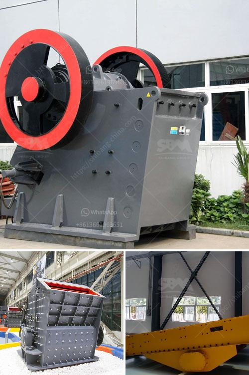

<h3>How to change the HP cone crusher mantle?</h3>
The HP cone crusher is a very important piece of equipment in a crushing plant. It can operate as a secondary, tertiary or quaternary crusher, depending on the crushing process. Since the crushing process is typically very abrasive, crushers are equipped with wear linings that must be replaced periodically to ensure the integrity of the equipment and good performance.

One of the main components of the HP cone crusher is its mantle. This mantle is fixed to the main shaft and performs the crushing process through an eccentric rotation. The mantle is subjected to a lot of wearing and abrasive forces during operation. Therefore, regular maintenance is required to ensure its optimal performance.

Before performing any maintenance on the crusher, ensure it is fully shut down. The crusher should be stopped completely before accessing the mantle area. This will prevent any accidental start-ups and avoid potential hazards.

Using an appropriate tool, carefully remove the old mantle. Take extra precautions while handling the mantle, as it can be heavy and difficult to maneuver. Check for any signs of excessive wear or damage on the old mantle.

Thoroughly clean the mantle area, ensuring that no debris or residual material is left behind. This will provide a clean surface for the installation of the new mantle and prevent any interference during the operation.

Carefully position the new mantle onto the main shaft. Ensure that it is properly aligned and rests securely on the main shaft. Use the appropriate tool to tighten the locking nut to the manufacturer's recommended torque. This will help ensure proper functioning of the crusher and prevent any loose components.

Once the new mantle is installed, run a test on the crusher to ensure its proper functioning. Start the crusher and allow it to run for a few minutes to ensure there are no abnormal vibrations or noises. Check for any leaks or other issues that may have been caused during the mantle replacement.

Regularly inspect the mantle for any signs of wear or damage. If necessary, repeat the above steps to replace the mantle. It is important to follow the manufacturer's recommendations regarding the maintenance and replacement intervals for the mantle to ensure the longevity and optimal performance of the crusher.

In conclusion, changing the mantle of an HP cone crusher is a critical task that requires attention to detail and adherence to safety guidelines. By following the steps outlined above, you can ensure the proper functioning of your crusher and prolong its lifespan. Regular maintenance and timely replacement of the mantle will help maximize the efficiency and productivity of your crushing plant.
<h3>Contact us</h3><ul><li><strong>Whatsapp:&nbsp;<a href="https://wa.me/8613661969651">+8613661969651</a></strong></li><li><a href="https://swt.shibang-china.com/?git&amp;zhl&amp;How to change the HP cone crusher mantle"><strong>Online Service(chat now)</strong></a></li></ul><h3>Related</h3><ul><li><a href='How to improve the crushing capacity of ball mill.md'>How to improve the crushing capacity of ball mill?</a></li><li><a href='How to calculate the payback period for a coal mine.md'>How to calculate the payback period for a coal mine?</a></li><li><a href='How to make a foundation for sand crusher.md'>How to make a foundation for sand crusher?</a></li><li><a href='How can I improve the grinding of a raw mill.md'>How can I improve the grinding of a raw mill?</a></li><li><a href='How to maintain the vibrating feeder.md'>How to maintain the vibrating feeder?</a></li></ul>