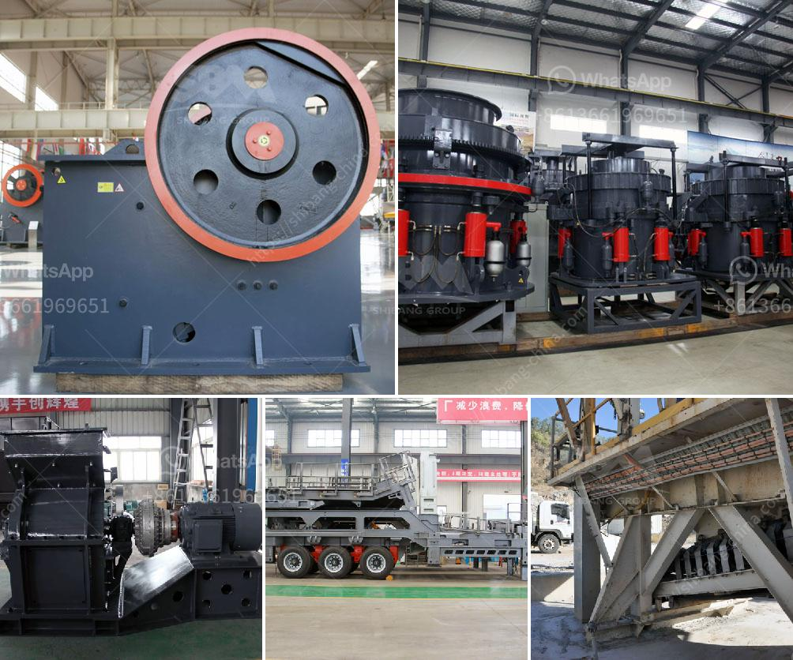

<h3>How to change the blow bars on an impact crusher?</h3>
Impact crushers are widely used in mining, metallurgy, construction, roads, railways, water conservancy, and chemical industries. These versatile machines are specifically designed to break down materials into smaller pieces by the force of an impact. One critical component in an impact crusher is the blow bar. It plays an essential role in the crushing operation by delivering the impact force efficiently to the material being crushed. Over time, blow bars wear out and need to be replaced. Here is a step-by-step guide on how to change the blow bars on an impact crusher:

1. Safety First: Before starting any maintenance or repair work on the crusher, ensure that the machine is completely shut down and the power is disconnected. This step is crucial to prevent any accidents and keep yourself safe during the process.

2. Access the Blow Bars: The blow bars are typically located on the rotor, which is the main rotating component of the crusher. Access to the blow bars can be gained by removing one or both of the side doors located near the top of the crusher. Use a wrench to loosen and remove the bolts securing the doors in place. Carefully set aside the doors in a safe area.

3. Remove the Retaining Screws: Once the side doors are removed, you will have access to the blow bars. Look for retaining screws holding the blow bars in position. These screws will vary based on the specific model and manufacturer of the impact crusher. Use the appropriate tool, such as a socket wrench or an impact driver, to remove the retaining screws and carefully set them aside.

4. Replace the Blow Bars: Gently slide out the worn blow bars from their position. Be cautious of any sharp edges or other pointed objects. Use a suitable lifting device, such as a crane or hoist, to remove the heavy blow bars from the crusher. It is always recommended to have a second person assist you during this step to ensure safety and avoid any injuries.

5. Clean the Rotor: After removing the old blow bars, take the time to inspect the rotor for any accumulated debris or residues. Use a brush or compressed air to clean the rotor thoroughly. This step ensures optimal functioning of the new blow bars and prevents any potential damage to the crusher.

6. Install the New Blow Bars: Carefully lift and position the new blow bars onto the rotor, lining them up with the retaining screws' holes. Check for any alignment issues to ensure they are correctly fitted. Once aligned, fix the new blow bars in place by tightening the retaining screws securely. Ensure proper torque is applied to prevent any loosening during operation.

7. Replace Side Doors and Test Run: After securing the new blow bars, reinstall the side doors by tightening the bolts firmly. Double-check that everything is correctly in place before starting the crusher. Conduct a complete test run to confirm the successful replacement of the blow bars and ensure proper functioning of the impact crusher.

By following these steps, you can easily change the blow bars on an impact crusher. Remember, regular maintenance and timely replacement of wear parts are crucial to ensure the efficiency and longevity of your machine.
<h3>Contact us</h3><ul><li><strong>Whatsapp:&nbsp;<a href="https://wa.me/8613661969651">+8613661969651</a></strong></li><li><a href="https://swt.shibang-china.com/?git&amp;zhl&amp;How to change the blow bars on an impact crusher"><strong>Online Service(chat now)</strong></a></li></ul><h3>Related</h3><ul><li><a href='How to separate silica sand from rock.md'>How to separate silica sand from rock?</a></li><li><a href='How to increase the output of stone milling machine？.md'>How to increase the output of stone milling machine？</a></li><li><a href='How can sulfur and copper be removed from iron ore.md'>How can sulfur and copper be removed from iron ore?</a></li><li><a href='How to set up a mine crushing station in the Philippines ？.md'>How to set up a mine crushing station in the Philippines ？</a></li><li><a href='how limestone is mined in kenya.md'>how limestone is mined in kenya</a></li></ul>