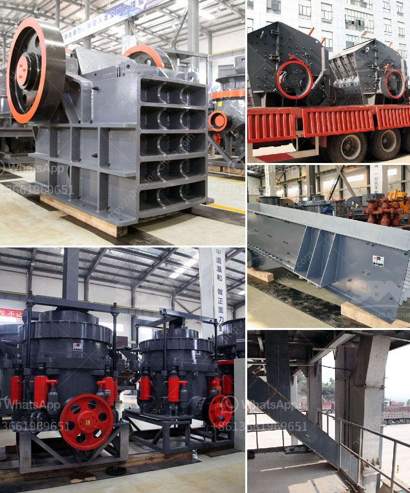

<h3>How to change the jaw crusher plates</h3>
Jaw crushers are designed to impart an impact on a rock particle placed between a fixed and a moving plate (jaw). The jaw faces are either smooth or corrugated, depending on the crushing process required and the material being crushed. These machines are considered to be primary crushers, as the material that is fed to the machine is crushed by a fixed plate and a movable one.

Over time, the surfaces of the jaw plates may wear out due to the abrasive nature of the materials being processed. When this happens, the crushing efficiency of the machine decreases, resulting in lower production rates and potentially higher costs. To maintain the optimal performance of your jaw crusher, it is important to periodically change the jaw plates.

Step 1: Turn off the power to the machine and disconnect it from the power source. This ensures that there is no electrical current flowing through the machine, making it safe to work on.

Step 2: Access the jaw crusher's eccentric shaft housing. To access this part, you will need to remove the flywheel or pulley cover.

Step 3: Next, remove the retaining nuts or bolts that hold the jaw plate to the machine. To do this, you will need an appropriate-sized wrench or socket.

Step 4: With the nuts or bolts removed, carefully lift the jaw plate out of the machine. Be cautious as the plate may be heavy, and dropping it could cause damage.

Step 5: Once the old jaw plate is removed, thoroughly clean the surface where the new plate will be installed. Check for any debris or damage that could affect the installation process.

Step 6: Place the new jaw plate into the jaw crusher's jaw cavity. Secure it by fastening the retaining nuts or bolts, ensuring that they are tightly in place.

Step 7: Reconnect the power source and turn on the machine. Test the jaw crusher's functionality to ensure that it is working properly.

Changing the jaw crusher plates is a routine maintenance task that should be done regularly to ensure the machine is operating at its peak performance. This will prolong the service life of the jaw plates and maintain the efficiency of the crusher.

It is essential to follow the above steps while changing the jaw crusher plates to avoid accidents or injuries and to ensure proper maintenance of the machine. Additionally, it is important to consult the manufacturer's manual or seek professional assistance if you are unsure about any step in the process.

In conclusion, changing the jaw crusher plates is a simple and essential task that should be done regularly to maintain the efficiency and performance of the machine. By properly following the above steps, you can ensure the jaw crusher operates smoothly and efficiently, providing reliable results for your crushing needs.
<h3>Contact us</h3><ul><li><strong>Whatsapp:&nbsp;<a href="https://wa.me/8613661969651">+8613661969651</a></strong></li><li><a href="https://swt.shibang-china.com/?git&amp;zhl&amp;How to change the jaw crusher plates"><strong>Online Service(chat now)</strong></a></li></ul><h3>Related</h3><ul><li><a href='How to calculate the cemnet grinding aid requirement for cement .md'>How to calculate the cemnet grinding aid requirement for cement ?</a></li><li><a href='How to increase the productivity of the cone crusher ？.md'>How to increase the productivity of the cone crusher ？</a></li><li><a href='How to Operate a Portable Cone Crusher.md'>How to Operate a Portable Cone Crusher?</a></li><li><a href='How to establish a powdered calcium carbonate plant .md'>How to establish a powdered calcium carbonate plant ?</a></li><li><a href='How to build a 600TPH mobile cone crusher.md'>How to build a 600TPH mobile cone crusher?</a></li></ul>